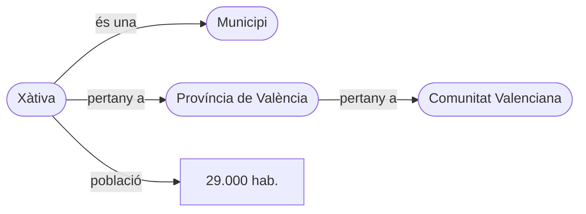

# S02 · Gestors i formats

<div class="sessio-meta" markdown>
<span><strong>Data</strong> dl 19/10/2026</span>
<span><strong>Durada</strong> 3 h 40 min</span>
<span><span class="tag p1">Jorge · dilluns</span></span>
<span><strong>RA·CA</strong> <span class="ra">RA1 c</span> <span class="ra">RA1 d</span> <span class="ra">RA1 e</span> <span class="ra">RA1 f</span></span>
</div>

!!! abstract "Què treballarem"
    Coneixerem els grans tipus de **sistemes gestors** (SQL i NoSQL) i com triar entre ells, els **formats** que usarem per a moure dades d'un lloc a un altre, el repte de les **dades no estructurades**, com Internet pot ser una font de dades «intel·ligent» gràcies a la **web semàntica**, i les dades que generen els sistemes industrials **SCADA**.

## Objectius

- **RA1.c** · Identificar les característiques de les fonts no estructurades i reconéixer Internet com a font a partir de la web semàntica i el *linked data*.
- **RA1.d** · Descriure els sistemes gestors SQL i NoSQL, les seues estructures, models i aplicacions.
- **RA1.e** · Analitzar els formats de text per a l'intercanvi de dades: fitxers plans, XML i JSON.
- **RA1.f** · Determinar el format i la utilitat de les dades de sistemes SCADA aplicats en IoT.

## 1. Sistemes gestors de dades: SQL i NoSQL

Un **sistema gestor de bases de dades** (SGBD o, en anglés, DBMS) és el programari que guarda les dades i en controla l'accés: qui pot llegir, com es consulta, com es garanteix que no es perden.

Triar-lo és una **decisió d'arquitectura crítica**. No hi ha cap sistema universalment millor: depén de l'estructura de les dades, del volum i dels requisits de consistència. Tradicionalment es distingeixen dues grans famílies: els **relacionals (SQL)** i els **no relacionals (NoSQL)**.

### 1.1 El model relacional (SQL)

Es basa en el model que va proposar **E. F. Codd** als anys 70. Les dades s'organitzen en **taules** (relacions) formades per **files** (tuples) i **columnes** (atributs). La característica principal és l'**esquema estricte**: abans d'inserir cap dada cal definir exactament quines columnes hi ha i de quin tipus és cadascuna.

La seua força és la **integritat referencial** (les claus foranes garanteixen que no hi ha referències a registres inexistents) i el compliment de les propietats **ACID**:

- **Atomicitat:** una transacció es completa sencera o no es fa gens.
- **Consistència:** la base de dades passa d'un estat vàlid a un altre estat vàlid.
- **Aïllament:** les transaccions concurrents no interfereixen entre si.
- **Durabilitat:** una vegada confirmada (*commit*), una transacció és permanent.

!!! note "Definició"
    **ACID** és el conjunt de garanties de les transaccions d'una base de dades. Allà on l'exactitud és vital (transaccions bancàries, gestió d'inventaris) el model SQL és l'estàndard de facto.

Per a emmagatzemar, els SGBD relacionals solen usar índexs **B-Tree** (arbres B), que optimitzen les cerques per rangs i les lectures i escriptures aleatòries en disc. Això els fa ideals per a consultes complexes amb **JOIN** entre moltes taules.

**Exemples:** PostgreSQL, MySQL/MariaDB, Oracle, SQL Server.

### 1.2 El model NoSQL

Els sistemes **NoSQL** (sovint interpretat com *Not only SQL*) van sorgir per a resoldre les limitacions d'escalabilitat i flexibilitat dels relacionals en l'era de la web massiva. Prioritzen l'**escalabilitat horitzontal** (afegir més nodes a un clúster) davant de la **vertical** (fer més potent un únic servidor), i solen tindre **esquemes flexibles**.

NoSQL no és un únic model, sinó una família:

| Model | Com guarda | Exemples | Ús típic |
|---|---|---|---|
| **Clau-valor** | Parells simples: una clau → un valor | Redis, DynamoDB | Memòria cau, sessions |
| **Documental** | Documents jeràrquics JSON o BSON | MongoDB, Couchbase | Catàlegs, perfils, contingut variable |
| **Columnar** | Agrupa per columnes o famílies de columnes | Cassandra, HBase | Sèries temporals, escriptura massiva, anàlisi agregada |
| **Grafs** | Entitats (nodes) i relacions explícites | Neo4j, Amazon Neptune | Xarxes socials, detecció de frau |
| **Motor de cerca** | Índex invertit sobre documents | Elasticsearch | Cerca de text, logs |

??? quote "Taula comparativa dels models NoSQL (apunts d'Alberto Aparicio Vila)"
    | Diferències | Documental | Clau-valor | Basat en columnes | Grafs |
    |---|---|---|---|---|
    | **Estructura de dades** | Documents JSON/BSON/XML | Parells clau-valor | Columnes amb famílies | Nodes i relacions |
    | **Flexibilitat** | Flexible | Variable | Menys flexible | Variable |
    | **Consultes** | Complexes, amb índexs i llenguatge de consulta avançat | Cerques directes per clau | Consultes *ad hoc* limitades | Consultes complexes de relacions |
    | **Escalabilitat** | Horitzontal | Horitzontal | Horitzontal | Horitzontal i vertical |
    | **Transaccions** | ACID | Operacions atòmiques simples | ACID | ACID |
    | **Exemples** | MongoDB, Couchbase | Redis, DynamoDB | Cassandra, HBase | Neo4j, Amazon Neptune |

    Font: [«Modelos de datos»](https://alapvi.github.io/sbd/nosql/moddatos/), *Sistemas de Big Data*, Alberto Aparicio Vila. Traducció al valencià.

### 1.3 Consistència i teorema CAP

En un **sistema consistent**, el que escriu una aplicació és visible immediatament en les consultes següents. Amb **consistència eventual**, les escriptures no són visibles a l'instant, però ho acaben sent.

Per exemple, en un control d'estoc consistent cada consulta obté l'estat real de l'inventari; amb consistència eventual, potser en un moment concret no és l'estat real, però ho serà en breu. Un exemple clàssic de sistema eventualment consistent és el **DNS**: quan registres un domini, pot tardar a propagar-se per Internet, però sempre respon, encara que siga amb una versió antiga.

El **teorema CAP** (Eric Brewer, 2000) diu que una base de dades **distribuïda** només pot garantir **dues** d'aquestes tres propietats alhora:

- **C**onsistència: totes les peticions obtenen el valor més recent, independentment del node on es facen.
- Disponibilitat (***A**vailability*): la base de dades sempre respon. A la pràctica, no hi ha temps d'aturada.
- Tolerància a ***P**articions*: el sistema continua funcionant encara que es talle la comunicació entre nodes.

Com que en un sistema distribuït la tolerància a particions és obligatòria, la tria real és entre **consistència** i **disponibilitat**:

| Tipus | Què prioritza | Exemples |
|---|---|---|
| **CP** | Consistència: si hi ha una partició, millor no respondre que respondre malament | MongoDB, HBase |
| **AP** | Disponibilitat: sempre respon, encara que siga amb dades no actualitzades | DynamoDB, Cassandra, CouchDB |
| **CA** | Consistència i disponibilitat, perquè no distribueix les dades | SGBD relacionals en un sol servidor (PostgreSQL) |

Molts sistemes es poden **configurar** per a canviar de tipus: MongoDB, per exemple, pot llegir de les còpies secundàries i passar a comportar-se com a AP.

Els sistemes que prioritzen la disponibilitat segueixen el model **BASE**, l'alternativa a ACID: ***B**asically **A**vailable* (sempre respon), ***S**oft state* (l'estat pot canviar encara que ningú no escriga, mentre es propaguen els canvis) i ***E**ventual consistency* (al final tots els nodes coincidixen).

!!! tip "Recorda"
    A diferència de SQL, molts sistemes NoSQL ofereixen **consistència eventual**: les dades poden tardar uns mil·lisegons o segons a arribar a tots els nodes. És acceptable per a una xarxa social, però **inacceptable per al saldo d'un compte bancari**.

!!! quote "Font"
    L'apartat 1.3 està traduït i adaptat de [«Consistencia»](https://alapvi.github.io/sbd/nosql/consistencia/), *Sistemas de Big Data*, Alberto Aparicio Vila, i del tema *Tipologia de fonts de dades i sistemes de gestió*.

### 1.4 Com triar: SQL o NoSQL?

| Característica | SQL (relacional) | NoSQL (no relacional) |
|---|---|---|
| **Esquema** | Rígid, predefinit | Flexible, dinàmic |
| **Escalabilitat** | Vertical (principalment) | Horitzontal (dissenyat per a això) |
| **Model de dades** | Taules, files, columnes | Documents, grafs, clau-valor, columnes |
| **Programari** | PostgreSQL, MySQL, Oracle | MongoDB, Cassandra, Neo4j, Redis |
| **Cas d'ús típic** | ERP, CRM, transaccions financeres | Catàlegs, perfils d'usuari, IoT |

La tria es basa en quatre factors:

1. **Estructura de la consulta:** si necessites JOIN complexos, SQL és més eficient. Si accedeixes per clau o per document, NoSQL és més ràpid.
2. **Volum de dades:** per a terabytes o petabytes, l'escalabilitat horitzontal de NoSQL sol ser més econòmica i senzilla.
3. **Freqüència d'escriptura:** sistemes com Cassandra estan optimitzats per a moltes escriptures per segon (logs, sensors).
4. **Necessitat de consistència:** si l'exactitud immediata és innegociable, SQL. Si la disponibilitat i la velocitat d'ingesta són prioritàries, NoSQL.

!!! example "Exemple pràctic: sensors IoT"
    Una fàbrica intel·ligent té **10.000 sensors** que envien temperatura i humitat **cada segon**.

    - **Amb SQL:** inserir 10.000 files per segon en una taula relacional pot saturar el disc i els índexs B-Tree, i crear colls de botella en l'escriptura.
    - **Amb NoSQL (columnar o de sèries temporals):** sistemes com InfluxDB o Cassandra usen estructures com els **LSM-Trees** (*Log-Structured Merge-Trees*) o l'emmagatzematge en memòria, pensats per a velocitats d'ingesta molt altes (*throughput*). Les dades s'escriuen seqüencialment en memòria i després es bolquen a disc en blocs, evitant les escriptures aleatòries costoses.

!!! warning "Atenció"
    No es tracta de triar-ne un i descartar l'altre. En les arquitectures modernes de *Big Data* és habitual usar-ne **tots dos**: NoSQL per a la ingesta massiva i l'emmagatzematge en cru, i SQL (o un *data warehouse* relacional) per a l'anàlisi estructurada posterior. Les dades d'entrenament d'un model poden vindre d'un CRM (SQL) o dels logs d'un servidor web (NoSQL): l'estratègia d'extracció canviarà radicalment segons l'origen.

En aquest mòdul treballaràs PostgreSQL, MongoDB i Elasticsearch.

## 2. Formats d'intercanvi de dades

Quan dues aplicacions s'han de passar dades, el més habitual és fer-ho amb un **fitxer** en un format que totes dues entenguen. Els formats d'intercanvi són els «idiomes comuns» que permeten que sistemes diferents parlen entre si.

### 2.1 Fitxers plans: CSV

**Què és.** Un fitxer de **text pla** on cada línia és un registre i els valors estan **separats per comes** (*Comma-Separated Values*). També es poden usar altres separadors (punt i coma, tabulador: TSV). La **primera fila** sol contindre els noms de les columnes.

```text
Any,Marca,Model,Descripció,Preu
1997,Ford,E350,"ac, ABS, moon",3000.00
1999,Chevy,Venture,Extended Edition,4900.00
1999,Chevy,Venture,"Extended Edition, Very Large",5000.00
1996,Jeep,Grand Cherokee,"MUST SELL! air, moon roof, loaded",4799.00
```

Fixa't en les **cometes**: quan un valor conté el separador (una coma dins de la descripció), cal posar-lo entre cometes perquè no es partisca en dos camps.

- **Avantatges:** lleuger i universal; quasi qualsevol eina el llig.
- **Inconvenients:** **no té metadades** (no sap de quin tipus és cada columna), **no admet estructures niades** i cal vigilar el separador decimal, la codificació (UTF-8 o Latin-1) i les cometes. Per això cal una **validació estricta** en la capa d'ingesta.

### 2.2 JSON

**Què és.** *JavaScript Object Notation*. Un fitxer de text pla amb estructura en forma d'**arbre**:

- Els **objectes** s'escriuen entre `{}` i tenen la forma `"clau": valor`.
- Els **arrays** (llistes) s'escriuen entre `[]`.
- Les **claus** sempre van entre cometes dobles `""`, i els valors de text també.
- Els **booleans** són `true` o `false`, i els **números** van sense cometes i amb punt decimal.
- No hi ha etiquetes de tancament.

```json
{
  "id_factura": 105,
  "data": "2025-04-15",
  "pagada": false,
  "proveidor": {"nom": "ACME S.L.", "cif": "B12345678"},
  "linies": [
    {"producte": "P-05", "quantitat": 3, "preu": 12.5},
    {"producte": "P-09", "quantitat": 1, "preu": 80.0}
  ]
}
```

- **Avantatges:** lleuger, llegible per persones i màquines, fàcil de llegir des de JavaScript o Python. És l'**estàndard de facto** de la web moderna, les **API REST**, els microserveis i les bases de dades **NoSQL**.
- **Inconvenients:** les dates són text (no hi ha tipus data) i cal **aplanar-lo** per a carregar-lo en una taula.

### 2.3 XML

**Què és.** *eXtensible Markup Language*. Un **metallenguatge de marques**: text pla amb **etiquetes** `<etiqueta>…</etiqueta>` i **atributs** entre cometes, organitzat en forma d'arbre.

```xml
<factura id="105" data="2025-04-15">
  <proveidor cif="B12345678">ACME S.L.</proveidor>
  <linies>
    <linia producte="P-05" quantitat="3" preu="12.50"/>
    <linia producte="P-09" quantitat="1" preu="80.00"/>
  </linies>
</factura>
```

- Conté **dades i metadades**.
- Si segueix un format definit (**DTD** o **XSD**) es pot **validar**: es diu que és un document **vàlid** (a més de **ben format**).
- Es pot consultar amb **XPath** i transformar a altres formats amb **XSLT**.
- Molts formats coneguts són XML: **HTML** (XHTML), els documents **.odt** de LibreOffice, les imatges **SVG**.
- **Avantatges:** molt potent per a validar i amb suport natiu per a metadades i *namespaces*.
- **Inconvenients:** molt verbós; repeteix les etiquetes d'obertura i tancament.
- Encara és habitual en integracions empresarials antigues, documents legals, banca, administració pública i facturació electrònica.

### 2.4 Formats binaris: Parquet i altres

**Parquet** és el format de referència en *Big Data*:

- Prové de l'ecosistema **Hadoop** i és compatible amb **pandas** i Spark.
- És **orientat a columnes**: guarda junts tots els valors d'una columna, de manera que una consulta pot llegir **només les columnes que necessita**.
- És **més eficient que CSV** i **comprimeix** les dades.
- És **autodescriptiu**: integra dades i metadades (l'esquema va dins del fitxer).
- **No es pot obrir amb un editor de text.**
- Es recomana per a ***data lakes***.

Altres formats binaris que trobaràs: **Avro** (per files, molt usat en *streaming*), **PDF** (pensat per a visualitzar, no per a dades), **imatges** (de mapa de bits i vectorials), **vídeo**, **àudio** i els fitxers d'**Excel** o **Word** (que, per dins, són XML comprimits).

### 2.5 Comparativa

| Format | Estructura | Llegibilitat | Ús principal | Metadades |
|---|---|---|---|---|
| **CSV** | Taula plana | Alta (simple) | Exportació massiva, fulls de càlcul | Cap |
| **JSON** | Jeràrquica (clau-valor) | Alta | API web, NoSQL, microserveis | Implícites (claus) |
| **XML** | Jeràrquica (etiquetes) | Baixa (verbós) | Integració empresarial, documents legals | Natives (atributs, XSD) |
| **RDF** | Graf (subjecte-predicat-objecte) | Variable | Web semàntica, *linked data* | Natives (ontologies) |
| **Parquet** | Columnar binari | No llegible | *Data lakes*, analítica | Natives (esquema) |

La tria depén del context: **CSV** per a grans volums de dades tabulars simples, **JSON** per a API i aplicacions web, **XML** quan cal validació estricta i *namespaces*, i **Parquet** per a analítica massiva.

### 2.6 Aplanar JSON i XML

JSON i XML tenen **estructura d'arbre**. Si necessitem les dades en **files i columnes** (per a una base de dades relacional o un model d'aprenentatge automàtic), cal **aplanar-les**:

- Els objectes niats es converteixen en columnes amb noms compostos: `proveidor.nom`, `proveidor.cif`.
- Si contenen **arrays**, cal **normalitzar-los**: cada element de l'array es converteix en una fila (repetint les dades del pare) o en una taula a part.

Es pot fer amb un script (en Python, `pandas.json_normalize`) o amb les eines ETL, que ja tenen processadors per a simplificar la tasca. Ho practicaràs amb NiFi a [D05](../p2/d05-json-xml.md).

## 3. Dades no estructurades i web semàntica

### 3.1 El repte de l'àudio, la imatge i el text social

Una gran part de la informació digital és **no estructurada**: àudios, imatges, vídeos i textos de xarxes socials. No tenen cap esquema predefinit, i això en dificulta la cerca i l'anàlisi directa.

La seua **diversitat organitzativa** obliga a usar tècniques avançades de preprocessament abans de poder-les usar en aprenentatge automàtic:

- El **text de xarxes socials** necessita **NLP** (processament del llenguatge natural) per a llevar soroll, corregir errors i extraure entitats.
- Les **imatges i vídeos** necessiten **visió per computador** per a detectar objectes, cares o moviments.
- L'**àudio** necessita **transcripció** (*speech-to-text*).

Sense aquestes transformacions, les dades no estructurades no serveixen per a la majoria d'algorismes clàssics de classificació o regressió.

!!! warning "Atenció"
    Les dades no estructurades solen ocupar **molt més espai** que les estructurades i necessiten **més potència de càlcul**. Planifica sempre l'emmagatzematge i la infraestructura tenint en compte aquesta sobrecàrrega.

### 3.2 Web semàntica i *linked data*

La major part d'Internet està pensada per a ser llegida per persones (pàgines HTML, PDF, vídeos), no per programes. La **web semàntica** proposa que les dades no només siguen **llegibles** per persones, sinó també **interpretables per màquines**.

La idea clau és el **triple**: *subjecte – predicat – objecte*.



- **RDF** (*Resource Description Framework*) és el model que expressa les dades com a triples.
- **OWL** (*Web Ontology Language*) defineix **ontologies**: el vocabulari i les regles d'un domini («un municipi pertany a una província»).
- Cada concepte s'identifica amb una **URI** (Identificador Uniforme de Recursos).
- ***Linked data*** (dades enllaçades) connecta dades de **fonts diferents** amb referències creuades. Per exemple, la URI que identifica un municipi pot enllaçar amb dades de població, clima o transport, i així un algorisme «entén» el context sense que ningú li explique cada relació.
- **SPARQL** és el llenguatge per a consultar-les, com SQL per a triples. El practicaràs a [D14](../p2/d14-sparql.md).

Aquesta interconnexió és clau per a **enriquir datasets** d'entrenament, sobretot quan s'integren fonts externes. Wikidata, DBpedia o el portal de dades obertes de l'Estat publiquen així.

## 4. Dades de sistemes SCADA i IoT

Els sistemes **IoT** (Internet de les coses) i **SCADA** (*Supervisory Control And Data Acquisition*) són fonts primàries d'informació en entorns industrials i urbans. Un SCADA supervisa una instal·lació industrial (una depuradora, una fàbrica, una xarxa elèctrica): recull les lectures de sensors i autòmats (PLC) i les mostra en panells.

Generen fluxos de dades amb una **alta freqüència de mostreig**, un **volum xicotet per missatge**, però un **volum agregat massiu**. Sovint es transmeten en formats **binaris** eficients o en **JSON compacte** per a estalviar ample de banda.

Cada lectura sol tindre aquesta forma, anomenada **etiqueta** o *tag*:

| Camp | Exemple | Significat |
|---|---|---|
| `tag` | `Nau2.Forn1.Temperatura` | Identificador jeràrquic del punt de mesura |
| `valor` | `182.4` | La mesura |
| `timestamp` | `2026-10-19T10:15:02.120Z` | Moment exacte de la lectura |
| `qualitat` | `Good` / `Bad` / `Uncertain` | Si el sensor és fiable en aquell moment |
| `unitat` | `°C` | Unitat de mesura |

El model de dades SCADA/IoT és de tipus **sèrie temporal**: un sensor que llig cada segon genera 86.400 valors al dia.

**Per a què serveixen?** Manteniment predictiu (anticipar una avaria), control de qualitat, eficiència energètica…

**Com s'hi accedeix?** Amb protocols industrials com **OPC UA** o **Modbus**, o amb protocols IoT com **MQTT**, on cada sensor *publica* les lectures en un *topic* i els consumidors s'hi *subscriuen*. Ho practicaràs amb la sensòrica del centre a [D12](../p2/d12-iot.md).

## Material

- :material-file-document-outline: *Tipologia de fonts de dades i sistemes de gestió* (tema complet, a Aules)
- :material-file-document-outline: *Tipus de dades.pdf* i *Presentacio_Intro_noSQL.pptx* (Aules)
- :material-web: [NoSQL](https://alapvi.github.io/sbd/nosql/nosql/), [Modelos de datos](https://alapvi.github.io/sbd/nosql/moddatos/) i [Consistencia](https://alapvi.github.io/sbd/nosql/consistencia/) (Alberto Aparicio Vila)

## Exercicis

### Exercici 1 · Un mateix conjunt, tres formats

**Durada:** 45 min aprox.

1. A partir d'aquest JSON de dues comandes (cada comanda té un client i diverses línies), escriu-ne a mà la versió **XML** i la versió **CSV**.

    ```json
    [
      {"comanda": 1, "client": {"nom": "Anna", "ciutat": "Xàtiva"},
       "linies": [{"article": "Teclat", "q": 1}, {"article": "Ratolí", "q": 2}]},
      {"comanda": 2, "client": {"nom": "Pau", "ciutat": "Alzira"},
       "linies": [{"article": "Monitor", "q": 1}]}
    ]
    ```

2. Respon: quantes **files** té el CSV? Què has hagut de **repetir**? Quina informació **es perdria** si el CSV no tinguera una columna `comanda`?
3. Obri el [Wikidata Query Service](https://query.wikidata.org/) i executa l'exemple *Cats*. Identifica'n el subjecte, el predicat i l'objecte.
4. Mira una lectura real d'un sensor del centre (te la donarà Jorge) i identifica'n els camps de la taula de l'apartat 4.

!!! success "Què has de lliurar"
    Els fitxers `comandes.xml` i `comandes.csv` i les respostes de l'apartat 2.

### Exercici 2 · Base de dades per a una aplicació de missatgeria

Estàs dissenyant l'arquitectura de dades d'una aplicació de missatgeria instantània semblant a WhatsApp o Telegram. Tindrà milions d'usuaris actius alhora i generarà milers de milions de missatges al dia. Cada missatge té: `sender_id`, `receiver_id`, `timestamp`, `text_content`, `media_url` (opcional) i `read_status`.

L'equip dubta entre una base de dades SQL (PostgreSQL) o NoSQL (Cassandra o MongoDB).

**Tasca:**

1. Identifica els requisits clau de l'aplicació pel que fa a volum de dades, velocitat d'escriptura i estructura.
2. Justifica per què una base de dades NoSQL orientada a columnes o a documents és, en general, més adequada que una SQL relacional en aquest cas.
3. Indica un desavantatge potencial d'usar NoSQL en aquest context.

??? tip "Orientació"
    Pensa en el teorema CAP i en l'escalabilitat horitzontal davant de la vertical. Les bases de dades relacionals brillen en transaccions ACID i consultes complexes amb JOIN, però poden patir colls de botella amb escriptures massives. Les NoSQL solen prioritzar la disponibilitat i el particionament de les dades.

??? success "Solució"
    **1. Requisits clau**

    - **Volum:** altíssim (petabytes d'històric).
    - **Velocitat d'escriptura:** molt alta (milers de missatges per segon).
    - **Estructura:** semiestructurada (uns missatges tenen fitxers adjunts i altres no) i l'accés principal és per clau (`user_id` + `timestamp`).
    - **Escalabilitat:** cal escalar horitzontalment (afegir nodes) per a créixer.

    **2. Per què NoSQL**

    - **Escalabilitat horitzontal:** les bases de dades SQL tradicionals solen escalar verticalment (millorar el maquinari d'un sol servidor), cosa que té un límit físic i de cost. Les NoSQL estan dissenyades per a repartir les dades en molts servidors (*sharding*) de manera nativa.
    - **Model flexible:** l'esquema d'un missatge pot variar (amb adjunts o sense). En SQL, canviar l'esquema d'una taula amb milers de milions de files és costós i lent.
    - **Rendiment en escriptura:** l'operació més freqüent és **inserir** un missatge. Les bases de dades orientades a columnes o clau-valor estan optimitzades per a escriptures ràpides i lectures per clau, sense el cost d'índexs secundaris complexos ni transaccions ACID estrictes.

    **3. Desavantatge**

    La falta de **garanties ACID estrictes** en moltes configuracions (consistència eventual): un missatge pot tardar un poc a ser visible per al receptor en tots els nodes. A més, les **consultes analítiques complexes** («quants missatges amb imatge ha enviat cada usuari l'últim mes») són més difícils i menys eficients que en SQL.

    **Conclusió:** per a una aplicació de missatgeria massiva es prioritza la **disponibilitat i l'escalabilitat** (NoSQL) davant de la consistència transaccional estricta i les consultes *ad hoc* complexes (SQL).

### Exercici 3 · Conversió de format

Una aplicació mòbil en JavaScript ha de consumir dades d'una API de transport públic que torna la informació en XML:

```xml
<Linea>
  <Id>3</Id>
  <Nombre>Tranvía</Nombre>
  <Paradas>
    <Parada>
      <Nombre>Plaza del Ayuntamiento</Nombre>
      <Hora>10:15</Hora>
    </Parada>
    <Parada>
      <Nombre>Colón</Nombre>
      <Hora>10:20</Hora>
    </Parada>
  </Paradas>
</Linea>
```

**Tasca:**

1. Escriu l'equivalent exacte en JSON.
2. Explica dos avantatges concrets de JSON davant d'XML per al desenvolupament d'aplicacions web modernes (JavaScript).

??? tip "Orientació"
    En JSON els objectes es defineixen amb claus `{}` i els arrays amb claudàtors `[]`. Les claus han d'anar entre cometes dobles. No hi ha etiquetes de tancament. Pensa en com es correspon la jerarquia XML amb l'estructura d'objectes de JavaScript.

??? success "Solució"
    **1. Conversió a JSON**

    Perquè siga **exacta** respecte de l'XML, cal conservar l'element arrel `<Linea>` com a clau `"Linea"`, els fills `<Id>` i `<Nombre>` com a claus, el contenidor `<Paradas>` com a objecte, i els elements repetits `<Parada>` com un **array**. Els valors són **text**, perquè XML no declara tipus.

    ```json
    {
      "Linea": {
        "Id": "3",
        "Nombre": "Tranvía",
        "Paradas": {
          "Parada": [
            {"Nombre": "Plaza del Ayuntamiento", "Hora": "10:15"},
            {"Nombre": "Colón", "Hora": "10:20"}
          ]
        }
      }
    }
    ```

    **2. Dos avantatges de JSON en JavaScript**

    1. **Compatibilitat nativa:** `JSON.parse()` el converteix directament en objectes JavaScript i `JSON.stringify()` fa el contrari. XML necessita `DOMParser` o llibreries externes.
    2. **Menys verbositat i mida:** JSON no repeteix etiquetes d'obertura i tancament. `<Parada>…</Parada>` es converteix simplement en `{…}` dins d'un array. Es transmeten menys dades, cosa important en mòbils amb connexions limitades.

### Exercici 4 · Dades SCADA en una planta industrial

Una fàbrica de ceràmica de Castelló usa un SCADA per a monitorar els forns. Registra **cada segon** la temperatura de **50 forns**. Les dades es guarden en fitxers **binaris propietaris** del fabricant del PLC, amb registres fixos de 64 bytes.

L'equip d'enginyeria vol usar l'històric dels **últims 2 anys** per a entrenar un model que prediga fallades en les resistències elèctriques.

**Tasca:**

1. Identifica la naturalesa d'aquestes dades i el seu format probable.
2. Explica per què no es poden inserir directament en una base de dades relacional sense un procés previ.
3. Proposa una estratègia d'ingesta (ETL) per a preparar-les per al model.

??? tip "Orientació"
    Les dades SCADA solen ser sèries temporals d'alta freqüència. El format binari propietari necessita un «diccionari» o especificació del fabricant per a descodificar-lo. Les bases de dades SQL esperen tipus de dades clars (int, float, date) i esquemes definits.

??? success "Solució"
    **1. Naturalesa i format**

    - **Naturalesa:** estructurades. Encara que estan en binari, tenen una estructura fixa definida pel fabricant (registres de 64 bytes amb camps per a temperatura, hora, identificador del forn…).
    - **Format:** binari propietari. No és text llegible (com CSV o JSON) i necessita un *driver* o llibreria del fabricant per a interpretar els bytes.

    **2. Per què no van directament a SQL**

    Una base de dades SQL no pot interpretar fitxers binaris arbitraris. Cal:

    - **Descodificar** els bytes en números (*floats*) i dates (*timestamps*).
    - Definir un **esquema** (`horno_id`, `timestamp`, `temperatura`).
    - Tindre en compte el **volum**: 50 forns × 1 registre/s × 2 anys = 50 × 60 × 60 × 24 × 365 × 2 ≈ **3.154 milions de registres**. Inserir-los fila a fila en un SGBD relacional seria extremadament lent i, a més, aquests SGBD no estan optimitzats per a sèries temporals massives d'alta freqüència.

    **3. Estratègia ETL**

    1. **Extracció:** usar el programari del fabricant o una llibreria de Python (`struct`, o pandas amb un *parser* binari) per a llegir els fitxers, i convertir els bytes en un DataFrame o en fitxers intermedis **Parquet** (columnar i eficient, ideal per a ML) o CSV comprimit.
    2. **Transformació:** eliminar duplicats i valors fora de rang (temperatures negatives), unificar unitats (Celsius) i **agregar**: per a predir fallades potser no cal cada segon, sinó la mitjana, la desviació estàndard i el màxim per minut o per hora. Així es redueix molt el volum sense perdre informació rellevant.
    3. **Càrrega:** si l'objectiu és només entrenar, carregar els Parquet en un emmagatzematge d'objectes (S3, Azure Blob) o en un sistema de fitxers perquè el model els llija directament. Si cal consultar-les, carregar-les en una base de dades de **sèries temporals** (InfluxDB, TimescaleDB) en lloc d'una SQL genèrica.

### Exercici 5 · Pipeline per a dades de xarxes socials

Una *startup* vol entrenar un model de classificació de sentiment per a valorar opinions sobre productes a X (abans Twitter). Té milions de tuits en JSON.

**Tasca:**

1. Descriu les característiques d'aquestes dades com a font no estructurada.
2. Proposa un pipeline ETL que convertisca els tuits en un dataset estructurat (taula amb les columnes `id_tweet`, `texto_limpio`, `etiqueta_sentimiento`, `fecha`).
3. Indica almenys dues tècniques de NLP o de web semàntica que aplicaries en la fase de transformació.

??? tip "Orientació"
    Els tuits són text lliure amb soroll (emojis, mencions, *hashtags*). La transformació implica neteja i etiquetatge. Per a la web semàntica, pensa en com connectar el text amb entitats conegudes.

??? success "Solució"
    **1. Característiques:** són dades **no estructurades** (text lliure), **no formals** (llenguatge col·loquial, abreviatures), **heterogènies** (text, URL, emojis) i **voluminoses**. La seua diversitat organitzativa és alta i no tenen un esquema fix.

    **2. Pipeline ETL**

    - **Extracció:** API de X per a descarregar els tuits en JSON.
    - **Transformació:**
        - Neteja: eliminar URL, mencions (`@usuari`) i emojis no informatius.
        - Normalització: passar a minúscules i eliminar *stopwords* (paraules buides).
        - Etiquetatge: assignar `etiqueta_sentimiento` (positiu, negatiu o neutre) amb un model preentrenat o amb anotació manual.
        - Estructuració: passar els camps del JSON a columnes d'una taula o DataFrame.
    - **Càrrega:** inserir el dataset en una base de dades (PostgreSQL) o en un fitxer CSV o Parquet.

    **3. Tècniques**

    - **Tokenització i *stemming* o lematització:** reduir les paraules a la seua arrel per a unificar termes («corrent» → «córrer»).
    - **Reconeixement d'entitats (NER):** identificar marques o productes mencionats i **enllaçar-los amb ontologies** (web semàntica / *linked data*, com Wikidata) per a enriquir el context.

## Per a repassar

??? question "Per què PostgreSQL és «CA» si és tan fiable?"
    Perquè, en la seua configuració habitual, **no distribueix les dades** entre nodes: si no hi ha particions de xarxa, pot ser consistent i disponible alhora. Quan el distribuïm (rèpliques, clústers), també haurà de triar.

??? question "Un fitxer Excel és un format de text?"
    No. Un `.xlsx` és un **ZIP** que conté diversos fitxers XML. No el pots llegir directament amb un editor de text, i per això en una ETL se sol exportar a CSV o llegir amb una llibreria (pandas, openpyxl).
