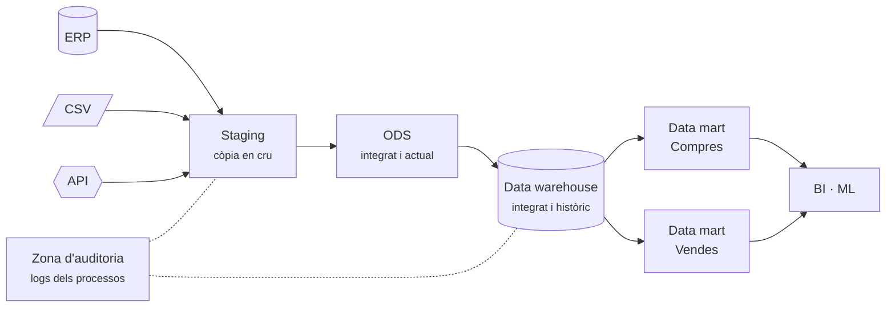
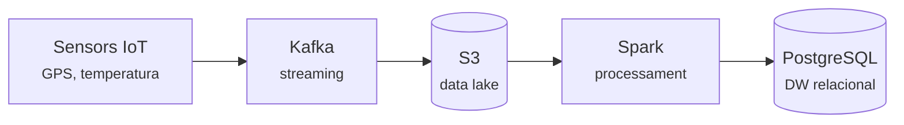

# S03 · Entorns i arquitectures

<div class="sessio-meta" markdown>
<span><strong>Data</strong> dl 26/10/2026</span>
<span><strong>Durada</strong> 3 h 40 min</span>
<span><span class="tag p1">Jorge · dilluns</span></span>
<span><strong>RA·CA</strong> <span class="ra">RA1 g</span> <span class="ra">RA1 h</span> <span class="ra">RA3 c</span></span>
</div>

!!! abstract "Què treballarem"
    On viuen les dades al llarg del seu viatge: dels **sistemes operacionals** (OLTP) als **sistemes d'anàlisi** (OLAP), passant per les capes d'una arquitectura de dades (*staging*, DW, *data mart*, *data lake*). També veurem com es processen grans volums repartint la feina entre diverses CPU o diversos servidors (**SMP** i **MPP**) i per què de vegades convé processar **al costat de la font** (*edge computing*).

## Objectius

- **RA1.g** · Descriure plataformes locals o al núvol, monolítiques i distribuïdes, que faciliten el processament massiu amb paral·lelització (SMP, MPP).
- **RA1.h** · Descriure procediments per a manejar dades massives i millorar els temps de procés, com processar prop de les fonts.
- **RA3.c** · Descriure models de dades destí segons l'objectiu d'ús, diferenciant bases de dades OLTP i OLAP.

## 1. OLTP i OLAP: dos objectius, dos dissenys

Imagina el programa de **compres** d'una empresa. Cada vegada que arriba una factura, algú l'introdueix: es fa un `INSERT` en la capçalera i un altre per cada línia. Això és un sistema **OLTP**.

Ara la directora pregunta: *«Quant hem gastat per categoria de producte i proveïdor durant 2025?»*. Per a respondre cal llegir **milers de línies** i agregar-les. Això és una consulta **OLAP**.

### 1.1 OLTP: processament de transaccions

Cada vegada que paguem amb targeta, reservem un bitllet d'avió o traiem diners d'un caixer usem un sistema **OLTP** (*Online Transaction Processing*). Està dissenyat per a gestionar **moltes transaccions curtes i simultànies en temps real**: inserir, actualitzar o esborrar registres.

Els sistemes OLTP segueixen un enfocament de **«tot o res»**: una transacció es completa o falla, però mai no es queda a mitges. Qualsevol problema (dades corruptes o inconsistents) tindria conseqüències greus, per això implementen les propietats **ACID** que vam veure a [S02](s02-gestors-formats.md#11-el-model-relacional-sql).

### 1.2 OLAP: processament analític

**OLAP** (*Online Analytical Processing*) està pensat per a **analitzar** grans volums de dades històriques, procedents de magatzems de dades o d'altres fonts, i és la base de la intel·ligència de negoci (BI) i la mineria de dades.

Si l'empresa vol llançar la nova versió d'un producte, necessitarà analitzar les vendes històriques, les tendències del mercat i el comportament dels clients. Aquestes dades probablement ja existeixen en l'ERP i el CRM, però **separades**, no unificades en una única font fiable.

Els principis d'OLAP són:

- **Vistes multidimensionals:** analitzar les dades des de diverses perspectives (temps, geografia, producte…), com si les girarem i tallarem igual que un **cub**.
- Fa de **capa intermèdia** entre el magatzem de dades i l'usuari: tradueix les preguntes en consultes optimitzades.
- Usa representacions com cubs (producte × regió × temps), taules dinàmiques i taules creuades.

### 1.3 Comparativa

| | OLTP (operacional) | OLAP (analític) |
|---|---|---|
| **Objectiu** | Registrar operacions | Analitzar i decidir |
| **Operacions** | Moltes transaccions curtes: `INSERT`, `UPDATE`, `DELETE` | Poques consultes, però complexes i sobre molts registres |
| **Model** | Normalitzat (3FN): moltes taules, sense redundància | Desnormalitzat: estrella o floc de neu |
| **Dades** | Actuals | Històriques |
| **Usuaris** | Aplicació, personal administratiu, caixers | Analistes de negoci, enginyeria de dades, models de ML |
| **Temps de resposta** | Mil·lisegons | De segons a minuts |
| **Exemple de consulta** | `INSERT` d'una factura | `SUM(import) GROUP BY categoria, any` |

OLTP i OLAP **no competeixen: es complementen**. Les dades naixen en els sistemes OLTP i, amb processos **ETL**, es porten als magatzems on les analitza OLAP.

!!! warning "Per què no analitzem directament sobre l'OLTP?"
    1. Les consultes d'anàlisi **alenteixen** l'aplicació que usa tothom.
    2. El model normalitzat obliga a fer **molts JOIN** (ho mesuraràs a la pràctica: 7 JOIN en OLTP davant de 5 en OLAP).
    3. L'OLTP sol guardar només l'**estat actual**, no l'històric.
    4. Les dades estan **repartides en diversos sistemes** que cal integrar.

!!! quote "Font"
    Els apartats 1.1 i 1.2 estan traduïts i adaptats de [«Big Data» › Almacenando los datos](https://alapvi.github.io/sbd/ingenieria-datos/bigdata/), *Sistemas de Big Data*, Alberto Aparicio Vila (que al seu torn es basa en els apunts d'Aitor Medrano).

## 2. On es guarden les dades per a analitzar-les

### 2.1 Data warehouse

Un ***data warehouse*** (DW, magatzem de dades) **centralitza** totes les dades de l'empresa en una base de dades OLAP per a obtindre informació contrastada i prendre decisions basades en l'històric.

- Només admet **dades estructurades** amb esquemes ben definits: l'esquema s'aplica en escriure (***schema-on-write***).
- Les seues funcions són **extraure, netejar, transformar i carregar** dades.
- Les dades del DW són de **només lectura**: les operacions CRUD es fan en l'origen (OLTP) i al DW arriben amb processos per lots (*batch*).

| Avantatges | Inconvenients |
|---|---|
| Accés ràpid a dades i metadades crítiques | No pot guardar dades no estructurades |
| Integra dades de moltes fonts | És difícil canviar tipus de dades i esquemes |
| Redueix el temps de resposta de l'anàlisi | No és adequat per a temps real (es carrega per lots) |
| Permet analitzar diferents períodes per a fer prediccions | |

**Exemples:** Amazon Redshift, Azure Synapse Analytics, Google BigQuery, Snowflake, Oracle.

### 2.2 Data mart

Un ***data mart*** és un DW **més xicotet i especialitzat** en una àrea o departament (vendes, màrqueting, finances, **compres**). Pot ser **dependent** (s'alimenta del DW principal), **independent** (té els seus propis processos ETL) o **híbrid**. A la pràctica construiràs el **data mart de compres**.

### 2.3 Data lake

Amb el *Big Data* va sorgir la necessitat de guardar moltes més dades, i moltes **sense estructura clara**. Un ***data lake*** (llac de dades) guarda les dades **en cru**, en el seu format original (JSON, imatges, àudios, vídeos, correus, PDF…), i sobre elles es fan transformacions que es tornen a guardar en el mateix llac. L'esquema s'aplica en llegir (***schema-on-read***).

Necessita emmagatzematge **distribuït i fàcilment escalable**: abans **HDFS** (Hadoop) en local, i ara cada vegada més l'emmagatzematge d'objectes al núvol (**Amazon S3**, **Azure Blob Storage**).

Quan s'uneixen les dues idees, *data lake* + *data warehouse*, s'obté un ***data lakehouse*** (Databricks, Snowflake).

!!! quote "Font"
    L'apartat 2 està traduït i adaptat de [«Big Data» › Data Warehouse, Data Mart i Data Lake](https://alapvi.github.io/sbd/ingenieria-datos/bigdata/), *Sistemas de Big Data*, Alberto Aparicio Vila.

## 3. Entorns i capes d'una arquitectura de dades

Els entorns es classifiquen tant per la seua **ubicació física** (on s'instal·len) com per les **capes lògiques** que gestionen el flux i la qualitat de les dades.

### 3.1 On s'instal·la: on-premise o núvol

| Entorn | Característiques |
|---|---|
| **On-premise** | **Instal·lació local**. Requereix una infraestructura complicada, un cost alt i manteniment constant. Dona control total. |
| **Núvol** (*cloud*) | **Instal·lació remota**. Redueix costos, automatitza el manteniment i s'escala en minuts. En les plataformes modernes se **separa l'emmagatzematge del còmput**: les dades estan en un *object storage* i els motors de càlcul s'engeguen només quan cal. |

### 3.2 Capes lògiques



Staging area
:   Zona **temporal** on es deixa la informació extreta. **No s'hi fa cap transformació**, i es buida i es torna a omplir contínuament. Permet repetir la transformació sense tornar a molestar l'origen.

ODS (*Operational Data Store*)
:   Zona on la informació es **prepara en un model multidimensional**, amb taules mestres i estrelles. Conté les dades **actuals**.

Data warehouse (DW)
:   **Combinació de taules de diferents capes** (staging, ODS). Pot incloure capes agregades amb **dades precalculades**.

Data mart (DM)
:   **Conjunt de taules multidimensionals** amb un **subconjunt** de les dades de l'empresa (per exemple, recursos humans o secretaria).

Zona d'auditoria (*audit zone*)
:   Zona on es guarden els **logs dels processos i execucions**, per a tindre un control més robust de la solució.

### 3.3 L'arquitectura *medallion* al núvol

En entorns al núvol (Databricks, Azure, AWS) les zones es defineixen segons la **qualitat i l'estat** de la informació:

<div class="grid cards" markdown>

-   :material-medal:{ .lg style="color:#b45309" } __Bronze__

    ---

    ***Temp landing zone*** (05). Zona temporal amb les extraccions **sense cap transformació** (equivalent a l'staging).

-   :material-medal:{ .lg style="color:#64748b" } __Silver__

    ---

    ***History zone*** (10): còpia històrica de cada extracció.
    ***Current zone*** (15): últim estat de les dades, ja **netes i transformades**, en un model *data lake* o *delta lake*.

-   :material-medal:{ .lg style="color:#ca8a04" } __Gold__

    ---

    ***Consume zone*** (30). Model de base de dades **preparat per a l'anàlisi** amb eines de BI (Power BI, MicroStrategy) o per a entrenar models.

</div>

!!! quote "Font"
    L'apartat 3 està traduït i adaptat de [«Tipos de entornos y arquitectura de datos»](https://alapvi.github.io/sbd/ingenieria-datos/tipos-entornos-arquitecturas/), *Sistemas de Big Data*, Alberto Aparicio Vila.

## 4. Processar moltes dades: SMP i MPP

En aprenentatge automàtic no n'hi ha prou amb tindre dades: cal entendre com es **generen, transporten i processen**. Quan una consulta ha de recórrer milions de files, una sola CPU no és suficient, i l'arquitectura de maquinari i programari és determinant. Hi ha dues maneres de repartir la feina:

=== "SMP · un servidor, moltes CPU"

    **Symmetric Multi-Processing.** Un sol servidor amb diverses CPU (o nuclis) que **comparteixen una única memòria central i el mateix disc**.

    ```mermaid
    flowchart TB
        subgraph Servidor
          C1[CPU 1] --- M[(Memòria compartida)]
          C2[CPU 2] --- M
          C3[CPU 3] --- M
          C4[CPU 4] --- M
          M --- D[(Disc)]
        end
    ```

    - És **senzill de programar** i mantindre la coherència de les dades és fàcil.
    - **Límit:** l'escalabilitat és limitada. Afegir més processadors no millora el rendiment indefinidament, perquè la **memòria compartida es converteix en un coll de botella** (escalat **vertical**).
    - **Exemple:** PostgreSQL amb *parallel query*. A la pràctica veuràs en el pla d'execució la línia `Workers Launched`.

=== "MPP · molts servidors"

    **Massively Parallel Processing.** Arquitectura **distribuïda** on molts nodes independents, **cadascun amb la seua CPU, memòria i disc**, processen les dades localment i es comuniquen per la xarxa. No comparteixen res (*shared-nothing*), i així s'evita el coll de botella de la memòria compartida.

    ```mermaid
    flowchart TB
        Q[Coordinador] --> N1 & N2 & N3
        subgraph N1[Node 1]
          A1[CPU+RAM] --- B1[(2024)]
        end
        subgraph N2[Node 2]
          A2[CPU+RAM] --- B2[(2025)]
        end
        subgraph N3[Node 3]
          A3[CPU+RAM] --- B3[(2026)]
        end
    ```

    - Permet l'escalat **horitzontal**: en lloc de comprar un servidor més potent, s'hi afigen servidors més econòmics. Cada node processa una **partició** de les dades i al final s'ajunten els resultats.
    - És la base del *Big Data*: permet processar terabytes o petabytes en temps raonables.
    - **Exemples:** Hadoop, Spark, Hive, Amazon Redshift, Greenplum, Snowflake.

| Característica | SMP (simètric) | MPP (massivament paral·lel) |
|---|---|---|
| **Memòria** | Compartida | Distribuïda (local a cada node) |
| **Escalabilitat** | Vertical (limitada) | Horitzontal (alta) |
| **Complexitat** | Baixa | Alta (gestió de la xarxa) |
| **Ús típic** | Servidors monolítics | Big Data, Hadoop, Spark |

## 5. Millorar els temps de procés

### 5.1 Processar prop de les dades

Moure dades per la xarxa és lent i car. Per això els sistemes distribuïts fan el contrari: **envien el càlcul on són les dades** (*data locality*). Hadoop executa cada tasca en el node que ja té el bloc de fitxer. Una ETL ben dissenyada aplica el mateix principi:

- **Filtrar en origen:** demana a la base de dades només les files i columnes que necessites (`WHERE`, projecció), en lloc de portar-ho tot i filtrar després.
- **Agregar en origen** quan només cal el resum.

### 5.2 *Edge computing*: processar al costat de la font

Enviar totes les dades en cru de milers de sensors IoT a un magatzem centralitzat (al núvol) pot ser ineficient per la **latència** i el **cost de transmissió**. L'***edge computing*** (computació a la vora) consisteix a fer un **preprocessament, filtratge o agregació** en el mateix dispositiu IoT o en una passarel·la (*gateway*) local, abans d'enviar res.

!!! example "Exemple resolt"
    Una xarxa de sensors de temperatura d'una fàbrica genera **10.000 lectures per segon**. En lloc d'enviar-les totes al núvol, el *gateway* local calcula la **mitjana de cada minut** i només envia aquest valor agregat. Com que un minut té 60 segons, el volum transmés es redueix en un **factor de 60** per sensor[^1], millora la latència i baixen els costos d'ample de banda.

[^1]: El tema original parla d'un factor de 600. Si cada sensor envia una lectura per segon i el *gateway* envia una mitjana per minut, la reducció és de 60 vegades per sensor. Arribaríem a 600 si, a més, s'agregaren les lectures de 10 sensors en un sol valor.

### 5.3 Tècniques per als sistemes MPP

- **Particionament:** dividir les dades grans en fragments més xicotets que es poden processar en paral·lel (per data, per regió).
- **Compressió:** reduir la mida de les dades emmagatzemades i transmeses (per exemple, amb Parquet).
- **Paral·lelització:** executar tasques simultàniament en diferents nodes.

!!! tip "Recorda"
    El model de dades SCADA/IoT sol ser de **sèrie temporal**. L'eficiència depén d'equilibrar la potència de càlcul a la **vora** (*edge*) amb la capacitat d'emmagatzematge i anàlisi històrica al **centre** (*cloud*). No és una cosa o l'altra: l'*edge* s'encarrega de la resposta en temps real i del filtratge, i l'arquitectura MPP al núvol permet entrenar models amb l'històric complet.

## Material

- :material-file-document-outline: *Tipologia de fonts de dades i sistemes de gestió* (tema complet, a Aules)
- :material-file-document-outline: *Entorns i model de dades.pdf* i *1.1 Introducció a Big Data.pptx* (Aules)
- :material-web: [Tipos de entornos y arquitectura de datos](https://alapvi.github.io/sbd/ingenieria-datos/tipos-entornos-arquitecturas/), [Big Data](https://alapvi.github.io/sbd/ingenieria-datos/bigdata/) i [Ingeniería de datos](https://alapvi.github.io/sbd/ingenieria-datos/ingenieria-datos/) (Alberto Aparicio Vila)

## Exercicis

### Exercici 1 · Quina arquitectura triaries?

**Durada:** 1 h aprox. · **En grups de tres**

Per a cada cas, decidiu el tipus de sistema (OLTP, DW o *data lake*), si seria local o al núvol, i si caldria SMP o MPP. Justifiqueu-ho en dues línies.

1. Una botiga de bicicletes de Xàtiva vol saber quins productes ven més cada mes. Té 2.000 factures l'any.
2. Una cadena de supermercats amb 300 botigues vol analitzar els tiquets de caixa dels últims cinc anys (2.000 milions de línies).
3. Una empresa vol guardar les lectures de 5.000 sensors cada segon per a entrenar un model de manteniment predictiu.
4. Un hospital vol integrar dades de tres programes diferents per a fer informes mensuals, però les dades no poden eixir del centre.

!!! success "Què has de lliurar"
    La taula de decisions amb la justificació. La posarem en comú al final de la sessió.

### Exercici 2 · Vertader o fals: arquitectures de processament

Indica si cada afirmació és vertadera (V) o falsa (F) i, si és falsa, corregeix-la.

1. Una arquitectura SMP és ideal per a processar grans volums de dades no estructurades perquè permet afegir nodes de manera il·limitada sense perdre rendiment.
2. En una arquitectura MPP, cada node té la seua pròpia CPU, memòria i emmagatzematge local, i les dades es distribueixen entre ells per a processar-se en paral·lel.
3. L'*edge computing* consisteix a enviar totes les dades en cru des dels sensors IoT directament al núvol per a emmagatzemar-les i analitzar-les després, evitant el processament local.
4. El principal avantatge de processar prop de la font (*edge*) davant del processament centralitzat al núvol és la reducció de la latència i de l'ample de banda.
5. Els sistemes MPP són monolítics per definició, ja que tots els processos s'executen en un únic servidor físic de gran potència.

??? tip "Orientació"
    Recorda la diferència fonamental entre **compartir** recursos (SMP) i **distribuir-los** (MPP). Per al punt 3, pensa què vol dir literalment *edge* (vora) en xarxes. Per al punt 5, analitza si «monolític» i «distribuït» són conceptes oposats.

??? success "Solució"
    1. **Fals.** SMP vol dir diversos processadors que comparteixen la mateixa memòria i sistema operatiu. No escala indefinidament per a *Big Data*: per a això s'usen arquitectures distribuïdes com MPP o Hadoop/Spark.
    2. **Vertader.** És la definició de MPP: arquitectura *shared-nothing*, on cada node és autònom i les dades es particionen per a processar-se en paral·lel.
    3. **Fals.** L'*edge computing* processa les dades tan a prop com siga possible d'on es generen (en el dispositiu o en un *gateway* local), filtrant o agregant abans d'enviar-les al núvol.
    4. **Vertader.** En processar localment, s'evita el viatge d'anada i tornada al núvol (latència) i només es transmeten els resultats rellevants (ample de banda).
    5. **Fals.** MPP és una arquitectura distribuïda, no monolítica. Un sistema monolític viu en un sol servidor; MPP reparteix la càrrega entre molts servidors independents.

### Exercici 3 · Interpretació d'un diagrama d'ingesta

Una empresa de logística té aquesta arquitectura de dades:



Respon indicant el tipus de sistema o font, la naturalesa de les dades i la ubicació típica:

1. Quin tipus de font representen els *Sensors IoT* i quina és la seua ubicació física típica en aquest context?
2. Quina funció compleix *Kafka* en la cadena i quina naturalesa tenen les dades que transporta?
3. Per què s'usa *S3* abans de *PostgreSQL*? Classifica tots dos segons el seu model de gestió i la seua ubicació.
4. Quin paper té *Spark* i quina arquitectura de processament suggereix?

??? tip "Orientació"
    Pensa en el flux de dades: origen → transport → emmagatzematge en cru → processament → emmagatzematge estructurat. S3 és un magatzem d'objectes; PostgreSQL és relacional. Spark sol repartir la càrrega.

??? success "Solució"
    1. **Sensors IoT:** fonts d'origen **IoT** que generen dades en temps real. La seua ubicació és **local**: en el dispositiu o en un *gateway* a la vora de la xarxa.
    2. **Kafka:** plataforma de **missatgeria i *streaming***. Transporta esdeveniments en temps real, normalment **semiestructurats** (missatges JSON o Avro).
    3. **S3 i PostgreSQL:** S3 és un ***data lake*** (emmagatzematge d'objectes, **no relacional**, al **núvol**) que guarda dades en cru a baix cost. PostgreSQL és un ***data warehouse*** relacional (**SQL**, al núvol o en local) que guarda dades estructurades per a consultes analítiques. S'usa primer S3 per a la ingesta massiva; després les dades es transformen per a carregar-les en SQL.
    4. **Spark:** motor de **processament distribuït**. Suggereix una arquitectura **MPP**: processa grans volums en memòria i en paral·lel abans de carregar-los en la base de dades final.

### Exercici 4 · Optimització dels temps de procés

Una fàbrica intel·ligent té **500 sensors IoT** que generen **100 missatges per segon** cadascun. Ara mateix tots els missatges s'envien a un servidor al núvol que només es queda amb les anomalies. La latència d'anada i tornada és de 200 ms i l'ample de banda està saturat.

1. Calcula el volum total de missatges per segon que s'envien al núvol.
2. Proposa una solució basada en *edge computing* per a reduir la càrrega.
3. Explica com millora el temps de procés i l'ús de recursos, i estima la reducció de trànsit si només s'envien les anomalies (l'1 % dels casos).

??? tip "Orientació"
    Usa la fórmula: total de missatges = nombre de sensors × freqüència. Per a la solució, pensa **on filtrar** les dades abans que isquen de la fàbrica. La millora principal és no enviar dades inútils.

??? success "Solució"
    1. **Volum total:** 500 sensors × 100 missatges/s = **50.000 missatges per segon**.
    2. **Solució *edge*:** instal·lar un *gateway* d'*edge computing* dins de la fàbrica que reba les dades dels sensors i execute **localment** l'algorisme de detecció d'anomalies. Només les anomalies s'envien al núvol per a guardar-ne l'històric.
    3. **Millora:**
        - **Temps de procés:** la detecció es fa en local (latència < 10 ms) i s'eviten els 200 ms d'anada i tornada per cada missatge.
        - **Reducció del trànsit:** si només l'1 % són anomalies, s'envien 50.000 × 0,01 = **500 missatges/s**. L'ample de banda consumit baixa un **99 %** i s'acaba la saturació.

## Per a repassar

??? question "Un data lake substitueix el data warehouse?"
    No necessàriament. El *data lake* guarda de tot i en cru, a baix cost; el DW guarda dades netes i estructurades, ràpides de consultar. Moltes empreses tenen tots dos, o els combinen en un *lakehouse*.

??? question "PostgreSQL és SMP o MPP?"
    Un PostgreSQL normal és **SMP**: un sol servidor que pot usar diversos nuclis en paral·lel. Hi ha extensions i productes derivats (Citus, Greenplum) que el converteixen en **MPP**.
