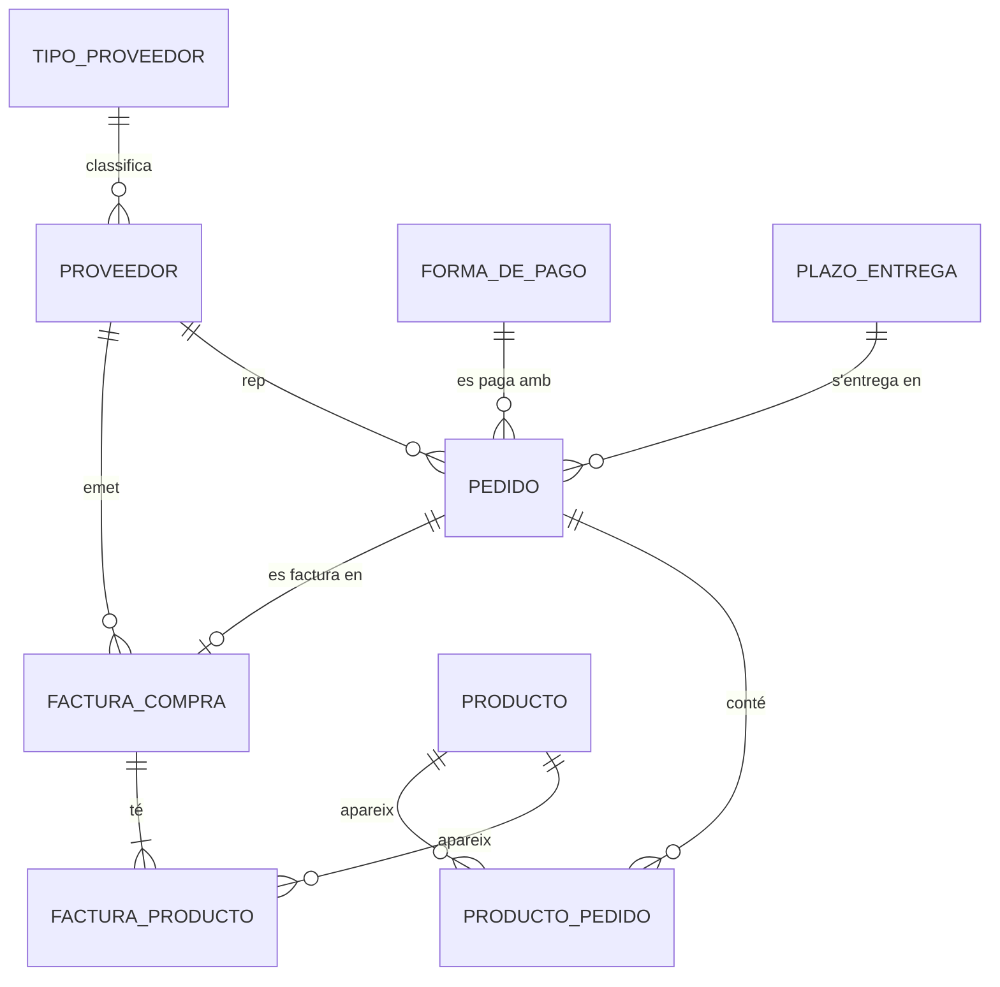
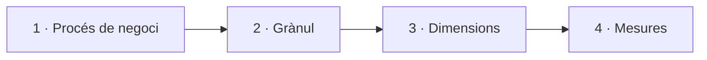
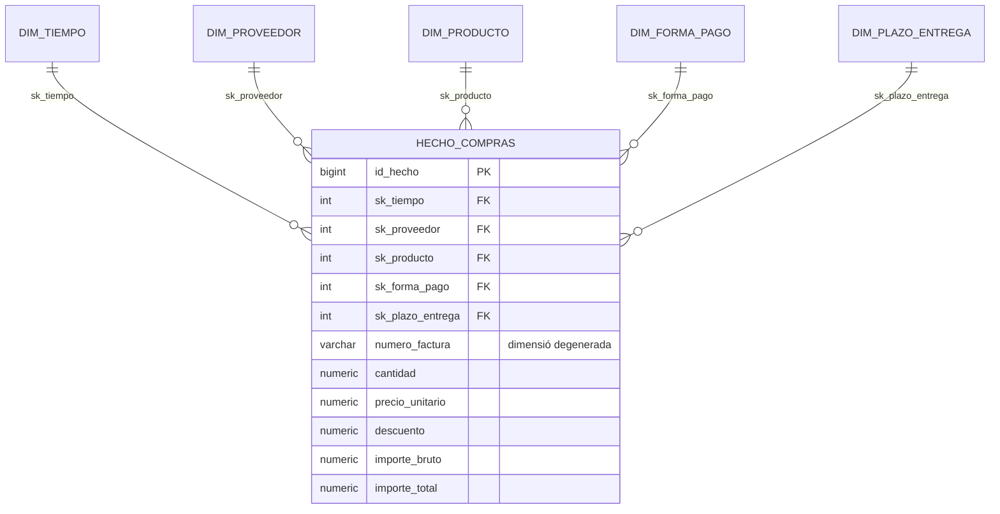

# S04 · Model multidimensional

<div class="sessio-meta" markdown>
<span><strong>Data</strong> dl 02/11/2026</span>
<span><strong>Durada</strong> 3 h 40 min</span>
<span><span class="tag p1">Jorge · dilluns</span></span>
<span><strong>RA·CA</strong> <span class="ra">RA3 c</span></span>
</div>

!!! abstract "Què treballarem"
    Començarem amb la **prova curta del RA1** (30 min). Després aprendrem a dissenyar el **model en estrella** d'un data mart a partir d'un OLTP. És el pas previ a la pràctica de les pròximes cinc sessions, on el construirem de veritat en PostgreSQL.

## Objectiu

- **RA3.c** · Descriure models de dades destí en funció de l'objectiu d'ús, diferenciant bases de dades OLTP i OLAP.

## 1. Què és el model multidimensional

El **model multidimensional** és la base del disseny dels **magatzems de dades** (*data warehouses*), que tenen com a objectiu donar suport a l'anàlisi per a la presa de decisions. A diferència dels models transaccionals (OLTP), busca que les consultes siguen **ràpides i senzilles**.

El disseny consisteix a transformar les **preguntes del negoci** en dos components: **fets** i **dimensions**.

Taula de fets (*fact table*)
:   És la **taula central** del model. Registra els **esdeveniments del negoci** que es volen analitzar (les compres, les vendes) i conté les **mètriques o indicadors**: valors **numèrics, mesurables i quantitatius**, normalment **agregables** (es poden sumar, fer-ne la mitjana…). Els fets es registren amb la màxima **atomicitat** o mínima expressió: això és la **granularitat** (el **grànul**).

Taules de dimensions (*dimension tables*)
:   Donen el **context** o la **perspectiva d'anàlisi** del fet: són els atributs que descriuen les dades del fet. Tenen menys registres que la taula de fets, però cada registre pot tindre molts atributs descriptius. Exemples típics: el temps (data, mes, any), la geografia (país, província, ciutat), els productes o els proveïdors. Sovint contenen **jerarquies**: d'una data es deriven el trimestre, el mes, l'any i la dècada.

### Terminologia

| Concepte | Descripció |
|---|---|
| **Fet** | Element d'informació del negoci que es pot mesurar. |
| **Indicador** | Fórmula matemàtica aplicada a un conjunt de fets. |
| **Dimensió / eix d'anàlisi** | Perspectiva des de la qual s'accedeix als fets i s'analitzen. |
| **Atribut** | Característica concreta d'una dimensió. |
| **Jerarquia** | Relació pare/fill que agrupa els atributs d'una dimensió (dia → mes → any). |
| **Agregació** | Agrupar les dades per a crear una taula de fets concreta. |
| **Sumarització** | Canviar les dades a un nivell de granularitat diferent. |
| **Desnormalització** | Introduir redundància en les taules per a millorar el rendiment. |
| **Data mart** | Subconjunt departamental d'un *data warehouse* centrat en una àrea concreta. |
| ***Drill down / up*** | Navegar per la informació des de nivells més alts (any) a més baixos (dia) o al revés. |
| ***Data mining*** | Buscar patrons de comportament en les dades. |

!!! quote "Font"
    L'apartat 1 està traduït i adaptat de [«Modelos multidimensionales»](https://alapvi.github.io/sbd/ingenieria-datos/modelos-multidimensionales/) i de la terminologia d'[«Introducción a BI»](https://alapvi.github.io/sbd/ingenieria-datos/ud1-introduccion/), *Sistemas de Big Data*, Alberto Aparicio Vila.

## 2. El punt de partida: l'OLTP de compres

L'empresa té un programa de compres amb aquest model **normalitzat**:



Per a respondre *«quant hem gastat per tipus de proveïdor, categoria i forma de pagament en 2025?»* cal creuar **set taules**. El model multidimensional reorganitza aquestes dades al voltant del que volem **mesurar**.

## 3. Els quatre passos del disseny



### Pas 1 · Triar el procés de negoci

Què volem analitzar? Ací, les **compres facturades**. Un altre procés (les comandes, els pagaments) seria un altre fet.

### Pas 2 · Declarar el grànul

El **grànul** diu què representa **exactament una fila** de la taula de fets. És la decisió més important i es pren **abans** de crear cap taula.

!!! example "Grànul del data mart de compres"
    **Una fila de `hecho_compras` = una línia de producte d'una factura de compra.**

    Si triàrem «una factura», no podríem analitzar per producte. Si triàrem «un producte per mes», perdríem el detall per proveïdor i dia. **Com més fi és el grànul, més preguntes es poden respondre**, però la taula és més gran.

### Pas 3 · Identificar les dimensions

Les **dimensions** responen al *qui, què, quan, com* de cada fila del fet:

| Pregunta | Dimensió | Atributs |
|---|---|---|
| Quan? | `dim_tiempo` | data, dia, mes, nom del mes, trimestre, any, dia de la setmana |
| A qui? | `dim_proveedor` | codi, denominació, **tipus de proveïdor**, ciutat, província, país, situació fiscal |
| Què? | `dim_producto` | codi, descripció, categoria, subcategoria, unitat |
| Com es paga? | `dim_forma_pago` | codi, descripció |
| En quant de temps? | `dim_plazo_entrega` | codi, descripció, dies |

Fixa't que `tipo_proveedor` era **una taula** a l'OLTP i ara és **una columna** de `dim_proveedor`. Això és **desnormalitzar**: acceptem repetir el text per a estalviar un JOIN en cada consulta.

Les dimensions solen tindre **jerarquies**: dia → mes → trimestre → any, o producte → subcategoria → categoria. Permeten agregar a diferents nivells (*drill-down* i *roll-up*).

### Pas 4 · Identificar les mesures

Les **mesures** són els valors numèrics que se sumen, es fan mitjanes, etc.

| Mesura | Càlcul | Additiva? |
|---|---|---|
| `cantidad` | origen | Sí |
| `precio_unitario` | origen | **No** (sumar preus no té sentit) |
| `descuento` | origen | Sí |
| `importe_bruto` | `cantidad * precio_unitario` | Sí |
| `importe_total` | `importe_bruto - descuento` | Sí |

`numero_factura` es queda en el fet sense taula pròpia: és una **dimensió degenerada**.

## 4. El resultat: l'estrella



## 5. Claus subrogades

Cada dimensió té una **clau subrogada (SK)**: un número que genera el DW (`SERIAL`) i que **no té res a veure** amb la clau de l'OLTP. La clau de l'origen es guarda en una altra columna (`id_proveedor_oltp`) per a poder fer la correspondència durant la càrrega.

```text
OLTP:  proveedor.id_proveedor = 7
          ↓ lookup
DW:    dim_proveedor.id_proveedor_oltp = 7  →  sk_proveedor = 23
          ↓
       hecho_compras.sk_proveedor = 23   (no 7!)
```

Per què no reutilitzem la clau de l'origen?

- Si integrem **dues fonts**, totes dues poden tindre un proveïdor amb `id = 7`.
- Si l'origen **reutilitza** o **canvia** una clau, el DW no es trenca.
- Permet guardar l'**històric** d'un mateix proveïdor amb diverses files (SCD tipus 2).

## 6. Estrella o floc de neu?

| | Estrella | Floc de neu |
|---|---|---|
| Dimensions | Desnormalitzades | Normalitzades en diverses taules |
| JOIN per consulta | Menys | Més |
| Espai | Una mica més | Menys |
| Simplicitat per a BI | :material-check-all: | :material-check: |

En la majoria de casos es tria **l'estrella**: l'espai és barat i la simplicitat i la velocitat de consulta valen més.

## Material

- :material-web: [Modelos multidimensionales](https://alapvi.github.io/sbd/ingenieria-datos/modelos-multidimensionales/) (Alberto Aparicio Vila): inclou l'exercici del model de compres
- :material-file-document-outline: *Exercici_ Model Multidimensional Compres.docx* (Aules)
- :material-flask-outline: [Pràctica: del model OLTP al model OLAP](../practiques/oltp-olap/index.md)

## Exercicis

### Exercici 1 · Disseny del model multidimensional de compres

**Durada:** 1 h 45 min · **En parelles**

A partir del model transaccional de compres de l'apartat 2, segueix la metodologia per a construir el **model multidimensional de compres**: identifica el fet, els indicadors i les dimensions que permeten respondre les preguntes de la gerència.

1. **Identifica la taula de fets** i declara'n el **grànul** amb una frase.
2. **Identifica els indicadors (mesures)** que la gerència voldria analitzar sobre l'esdeveniment «compra» i indica si són additius. Classifica'ls:

    | Criteri | Indicadors |
    |---|---|
    | **Quantificació** (quantitats) | |
    | **Financer** (imports) | |
    | **Comptable** (impostos, descomptes) | |

3. **Identifica les dimensions** (el *qui*, *què*, *quan* i *on*) i els seus atributs descriptius. Assenyala les **jerarquies**.

    | Dimensió | Atributs descriptius |
    |---|---|
    | | |

4. **Construeix el model** en estrella (paper, [draw.io](https://app.diagrams.net/) o Mermaid).
5. **Descriu el model** amb un paràgraf: què conté, quines anàlisis permet i quin benefici aporta.
6. **Analitza altres possibilitats de disseny:** un altre grànul, diversos ***data marts*** o **capes agregades** (taules amb dades ja resumides per mes o per proveïdor). Explica quines preguntes guanyaries i quines perdries.

!!! success "Què has de lliurar"
    Un document amb tots els punts i el diagrama, a Aules. A la sessió següent el compararem amb el model que implementarem.

!!! quote "Font"
    Exercici adaptat de [«Modelos multidimensionales» › Ejercicio](https://alapvi.github.io/sbd/ingenieria-datos/modelos-multidimensionales/), Alberto Aparicio Vila.

??? tip "Recursos addicionals"
    - [Bases de datos: Diseño de un cubo OLAP (Ejemplo 1)](https://www.youtube.com/watch?v=jJG0INtiOa8)
    - [Bases de datos: Diseño de un cubo OLAP (Ejemplo 2)](https://www.youtube.com/watch?v=vGYCo59QNQQ)

