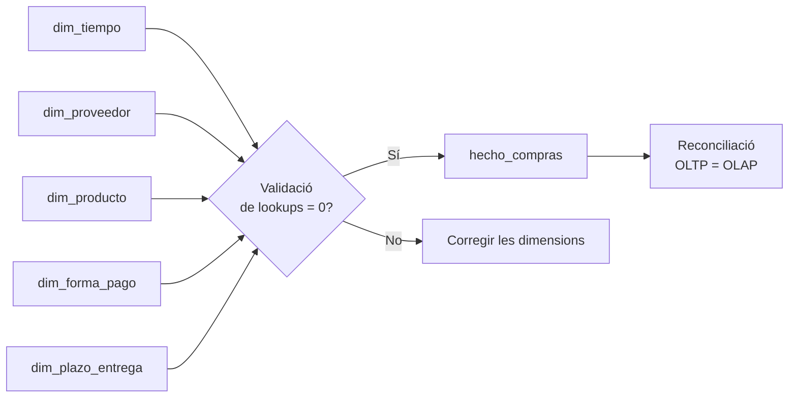

# S06 · Pràctica: càrrega del DW

<div class="sessio-meta" markdown>
<span><strong>Data</strong> dl 16/11/2026</span>
<span><strong>Durada</strong> 3 h 40 min</span>
<span><span class="tag p1">Jorge · dilluns</span></span>
<span><strong>RA·CA</strong> <span class="ra">RA3 b</span> <span class="ra">RA3 d</span></span>
<span><strong>Pràctica</strong> [OLTP → OLAP, part 2](../practiques/oltp-olap/index.md)</span>
</div>

!!! abstract "Què treballarem"
    Carregarem el data mart amb SQL: primer les dimensions, després una **validació**, i al final el fet. Com que origen i destí estan en la mateixa base de dades, la transformació la fa el mateix PostgreSQL amb `INSERT … SELECT`: és un procés **ELT**.

## Objectius

- **RA3.b** · Usar DML per a la càrrega, l'actualització i l'esborrat de dades.
- **RA3.d** · Combinar instruccions de consulta, transformació i càrrega per a fonts i destins en una mateixa base de dades.

## 1. L'ordre importa



El fet té FK cap a totes les dimensions: si carregues el fet primer, **no tindràs SK a les quals apuntar**.

## 2. Carregar les dimensions

Obri `04_load_olap.sql` i executa'n **només** els apartats 1 a 4. Analitza'ls un a un:

=== "dim_tiempo"

    ```sql
    INSERT INTO dw_compras.dim_tiempo (fecha, dia, mes, ...)
    SELECT f::date, EXTRACT(DAY FROM f)::smallint, ...
    FROM generate_series(
           (SELECT MIN(fecha_factura) FROM compras.factura_compra),
           (SELECT MAX(fecha_factura) FROM compras.factura_compra),
           INTERVAL '1 day') AS f
    ON CONFLICT (fecha) DO NOTHING;
    ```

    La dimensió temps **no ve de cap taula**: es **genera**, un dia per fila, entre la primera i l'última factura. Així també hi ha els dies sense compres.

=== "dim_proveedor"

    ```sql
    INSERT INTO dw_compras.dim_proveedor (id_proveedor_oltp, ..., tipo_proveedor, ...)
    SELECT p.id_proveedor, ..., tp.descripcion, ...
    FROM compras.proveedor p
    LEFT JOIN compras.tipo_proveedor tp ON tp.id_tipo_proveedor = p.id_tipo_proveedor
    ON CONFLICT (id_proveedor_oltp) DO NOTHING;
    ```

    Ací es **desnormalitza**: el JOIN amb `tipo_proveedor` es fa **una vegada** durant la càrrega, i no en cada consulta. Per què `LEFT JOIN` i no `JOIN`?

=== "ON CONFLICT DO NOTHING"

    Fa l'script **re-executable** (idempotent): si el proveïdor ja existeix (mateixa clau de negoci), no s'insereix de nou.

    **Però compte:** si el proveïdor ha **canviat** a l'OLTP (s'ha mudat de ciutat), el canvi **no arriba** al DW. Ho resoldrem a [S07](s07-practica-scd-dcl.md) amb una SCD tipus 1.

## 3. Validar els *lookups*

Abans de carregar el fet, comprova que **cada línia de l'OLTP trobarà la seua SK** en totes les dimensions (apartat 5 de l'script). El resultat ha de ser **0**.

!!! danger "Experiment: trenca-ho a propòsit"
    1. Esborra un proveïdor de la dimensió: `DELETE FROM dw_compras.dim_proveedor WHERE id_proveedor_oltp = 3;` (si ja havies carregat el fet, buida'l abans amb `TRUNCATE dw_compras.hecho_compras;`, perquè la clau forana no et deixaria esborrar-lo).
    2. Torna a executar la validació. Quantes línies són problemàtiques?
    3. Executa la càrrega del fet (apartat 6). **No dona cap error**, però quantes files s'han carregat? Per què? (Pista: `JOIN` vs `LEFT JOIN`.)
    4. Torna a carregar la dimensió i el fet.

    **Conclusió:** una càrrega que no falla no és una càrrega correcta. Per això es valida.

## 4. Carregar el fet

```sql
INSERT INTO dw_compras.hecho_compras (sk_tiempo, sk_proveedor, ..., importe_total)
SELECT dt.sk_tiempo, dpr.sk_proveedor, ...,
       ROUND(fp.cantidad * fp.precio_unitario - fp.descuento, 2)
FROM compras.factura_producto fp
JOIN compras.factura_compra fc   ON fc.id_factura = fp.id_factura
JOIN dw_compras.dim_tiempo dt    ON dt.fecha = fc.fecha_factura          -- lookup
JOIN dw_compras.dim_proveedor dpr ON dpr.id_proveedor_oltp = fc.id_proveedor
...
```

Cada `JOIN` amb una dimensió és un ***lookup***: tradueix la clau de l'OLTP en la SK del DW. Al mateix temps es calculen les **mesures derivades** (`importe_bruto`, `importe_total`).

## 5. Reconciliar

L'apartat 7 compara les dues bases de dades. Has d'obtindre:

| model | línies | import brut | descompte | import total |
|---|---:|---:|---:|---:|
| OLTP | 1260 | 11060120.21 | 351528.85 | 10708591.36 |
| OLAP | 1260 | 11060120.21 | 351528.85 | 10708591.36 |

!!! question "Per què hi ha factures del 2027?"
    La consulta per anys mostra 12 línies del 2027. Busca-les a l'OLTP i explica d'on ixen. (Pista: compara `fecha_pedido` i `fecha_factura`.)

## 6. Primeres consultes analítiques

Ara respon amb el DW:

1. Import total per **tipus de proveïdor** i **any**.
2. Els 5 **productes** amb més unitats comprades en 2025.
3. Import total per **dia de la setmana**. Hi ha compres en cap de setmana?
4. La mateixa consulta 1 escrita sobre l'**OLTP**. Quants JOIN necessites en cada cas?

## 7. Abans d'eixir

- [ ] La validació de *lookups* torna 0.
- [ ] La reconciliació quadra.
- [ ] He fet l'experiment de trencar la càrrega i n'he guardat les conclusions.
- [ ] He guardat les quatre consultes en `06_consultes.sql`.
