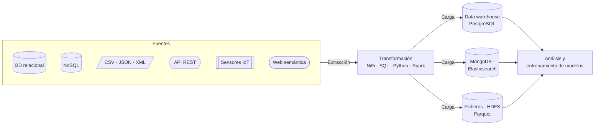

---
hide:
  - navigation
  - toc
---

# Extracción, transformación y carga de datos desde fuentes múltiples

Módulo 5104 del Curso de Especialización en **Aprendizaje automático: gestión de datos y entrenamiento**. Aquí encontrarás la teoría, las prácticas, el calendario y todo lo que necesitas para llevar datos de cualquier fuente hasta donde se puedan analizar o servir para entrenar un modelo.

[Empieza por el calendario :material-calendar-month:](curs/calendari.md){ .md-button .md-button--primary }
[Qué aprenderás :material-target:](curs/ra-ca.md){ .md-button }

:material-database-export: Extracción<i></i>
:material-swap-horizontal: Transformación<i></i>
:material-database-import: Carga

<b data-n="33">33</b>sesiones

<b data-n="121">121</b>horas de clase

<b data-n="8">8</b>resultados de aprendizaje

<b data-n="51">51</b>criterios de evaluación

## ¿Adónde quieres ir?

-   :material-school-outline:{ .lg .middle } __El módulo__

    ---

    Qué es una ETL, cómo se organiza el curso, cómo se evalúa y quién lo imparte.

    [:octicons-arrow-right-24: Presentación](curs/index.md)

-   :material-calendar-month-outline:{ .lg .middle } __Calendario__

    ---

    Las 33 sesiones, semana a semana, con un filtro por profesor y el progreso del curso.

    [:octicons-arrow-right-24: Calendario](curs/calendari.md)

-   :material-database-cog-outline:{ .lg .middle } __Lunes · Jorge Penalba Mateu__

    ---

    Fuentes y tipos de datos, el modelo relacional y el data warehouse, MongoDB, Elasticsearch y visualización.

    [:octicons-arrow-right-24: Sesiones de los lunes](p1/index.md)

-   :material-transit-connection-variant:{ .lg .middle } __Miércoles · Rafa Vidal Semper__

    ---

    Apache NiFi, ficheros, API REST, IoT, web semántica y Big Data con HDFS y Spark.

    [:octicons-arrow-right-24: Sesiones de los miércoles](p2/index.md)

-   :material-flask-outline:{ .lg .middle } __Prácticas__

    ---

    Enunciados, scripts para descargar y qué tienes que entregar en cada práctica.

    [:octicons-arrow-right-24: Prácticas](practiques/index.md)

-   :material-docker:{ .lg .middle } __Entorno de trabajo__

    ---

    Docker, PostgreSQL, NiFi y el resto de herramientas. Cómo montarlo y los errores conocidos.

    [:octicons-arrow-right-24: Entorno](curs/entorn.md)

## El viaje de un dato en este curso

!!! tip "Cómo aprovechar esta web"
    - Cada sesión tiene una **ficha** con los criterios que se trabajan, la teoría, la práctica y el material.
    - Las palabras técnicas subrayadas con puntos muestran una **definición** si pasas el ratón por encima. Las tienes todas en el [glosario](recursos/glossari.md).
    - Usa el **buscador** (tecla ++s++) para encontrar cualquier concepto.
    - Puedes cambiar a la **versión en valenciano** desde el icono de idioma de la cabecera.
