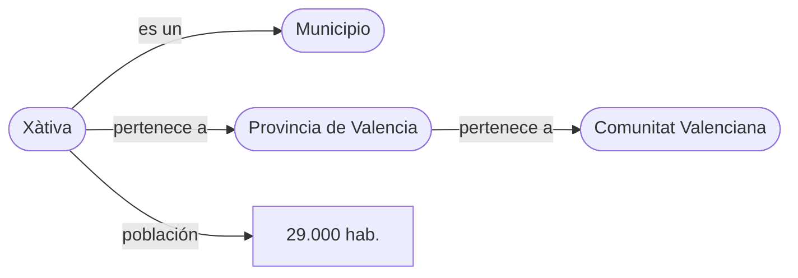

# S02 · Gestores y formatos

<div class="sessio-meta" markdown>
<span><strong>Fecha</strong> lu 19/10/2026</span>
<span><strong>Duración</strong> 3 h 40 min</span>
<span><span class="tag p1">Jorge · lunes</span></span>
<span><strong>RA·CA</strong> <span class="ra">RA1 c</span> <span class="ra">RA1 d</span> <span class="ra">RA1 e</span> <span class="ra">RA1 f</span></span>
</div>

!!! abstract "Qué trabajaremos"
    Conoceremos los grandes tipos de **sistemas gestores** (SQL y NoSQL) y cómo elegir entre ellos, los **formatos** que usaremos para mover datos de un sitio a otro, el reto de los **datos no estructurados**, cómo Internet puede ser una fuente de datos «inteligente» gracias a la **web semántica**, y los datos que generan los sistemas industriales **SCADA**.

## Objetivos

- **RA1.c** · Identificar las características de las fuentes no estructuradas y reconocer Internet como fuente a partir de la web semántica y el *linked data*.
- **RA1.d** · Describir los sistemas gestores SQL y NoSQL, sus estructuras, modelos y aplicaciones.
- **RA1.e** · Analizar los formatos de texto para el intercambio de datos: ficheros planos, XML y JSON.
- **RA1.f** · Determinar el formato y la utilidad de los datos de sistemas SCADA aplicados en IoT.

## 1. Sistemas gestores de datos: SQL y NoSQL

Un **sistema gestor de bases de datos** (SGBD o, en inglés, DBMS) es el software que guarda los datos y controla su acceso: quién puede leer, cómo se consulta, cómo se garantiza que no se pierden.

Elegirlo es una **decisión de arquitectura crítica**. No existe ningún sistema universalmente mejor: depende de la estructura de los datos, del volumen y de los requisitos de consistencia. Tradicionalmente se distinguen dos grandes familias: los **relacionales (SQL)** y los **no relacionales (NoSQL)**.

### 1.1 El modelo relacional (SQL)

Se basa en el modelo propuesto por **E. F. Codd** en los años 70. Los datos se organizan en **tablas** (relaciones) formadas por **filas** (tuplas) y **columnas** (atributos). La característica principal es el **esquema estricto**: antes de insertar ningún dato hay que definir exactamente qué columnas existen y de qué tipo es cada una.

Su fortaleza es la **integridad referencial** (las claves foráneas garantizan que no hay referencias a registros inexistentes) y el cumplimiento de las propiedades **ACID**:

- **Atomicidad:** una transacción se completa entera o no se realiza en absoluto.
- **Consistencia:** la base de datos pasa de un estado válido a otro estado válido.
- **Aislamiento:** las transacciones concurrentes no interfieren entre sí.
- **Durabilidad:** una vez confirmada (*commit*), una transacción es permanente.

!!! note "Definición"
    **ACID** es el conjunto de garantías de las transacciones de una base de datos. Donde la exactitud es vital (transacciones bancarias, gestión de inventarios) el modelo SQL es el estándar de facto.

Para almacenar, los SGBD relacionales suelen usar índices **B-Tree** (árboles B), que optimizan las búsquedas por rangos y las lecturas y escrituras aleatorias en disco. Esto los hace ideales para consultas complejas con **JOIN** entre muchas tablas.

**Ejemplos:** PostgreSQL, MySQL/MariaDB, Oracle, SQL Server.

### 1.2 El modelo NoSQL

Los sistemas **NoSQL** (a menudo interpretado como *Not only SQL*) surgieron para abordar las limitaciones de escalabilidad y flexibilidad de los relacionales en la era de la web masiva. Priorizan la **escalabilidad horizontal** (añadir más nodos a un clúster) frente a la **vertical** (hacer más potente un único servidor), y suelen tener **esquemas flexibles**.

NoSQL no es un único modelo, sino una familia:

| Modelo | Cómo guarda | Ejemplos | Uso típico |
|---|---|---|---|
| **Clave-valor** | Pares simples: una clave → un valor | Redis, DynamoDB | Caché, sesiones |
| **Documental** | Documentos jerárquicos JSON o BSON | MongoDB, Couchbase | Catálogos, perfiles, contenido variable |
| **Columnar** | Agrupa por columnas o familias de columnas | Cassandra, HBase | Series temporales, escritura masiva, análisis agregado |
| **Grafos** | Entidades (nodos) y relaciones explícitas | Neo4j, Amazon Neptune | Redes sociales, detección de fraude |
| **Motor de búsqueda** | Índice invertido sobre documentos | Elasticsearch | Búsqueda de texto, logs |

??? quote "Tabla comparativa de los modelos NoSQL (apuntes de Alberto Aparicio Vila)"
    | Diferencias entre modelos | Documental | Clave-valor | Basado en columnas | Grafos |
    |---|---|---|---|---|
    | **Estructura de datos** | Documentos JSON/BSON/XML | Pares de clave-valor | Columnas con familias | Nodos y relaciones |
    | **Flexibilidad** | Flexible | Variable | Menos flexible | Variable |
    | **Consultas** | Complejas, con índices y lenguaje de consulta avanzado | Búsquedas directas por clave | Consultas *ad hoc* limitadas | Consultas complejas de relaciones |
    | **Escalabilidad** | Horizontal | Horizontal | Horizontal | Horizontal y vertical |
    | **Transacciones** | ACID | Operaciones atómicas simples | ACID | ACID |
    | **Ejemplos** | MongoDB, Couchbase | Redis, DynamoDB | Cassandra, HBase | Neo4j, Amazon Neptune |

    Fuente: [«Modelos de datos»](https://alapvi.github.io/sbd/nosql/moddatos/), *Sistemas de Big Data*, Alberto Aparicio Vila.

### 1.3 Consistencia y teorema CAP

En un **sistema consistente**, las escrituras de una aplicación son visibles inmediatamente en las consultas siguientes. Con **consistencia eventual**, las escrituras no son visibles al instante, pero acaban siéndolo.

Por ejemplo, en un control de stock consistente cada consulta obtiene el estado real del inventario; con consistencia eventual, quizá en un momento concreto no sea el estado real, pero lo será en breve. Un ejemplo clásico de sistema eventualmente consistente es el **DNS**: al registrar un dominio, puede tardar en propagarse por Internet, pero siempre responde, aunque sea con una versión antigua.

El **teorema CAP** (Eric Brewer, 2000) dice que una base de datos **distribuida** solo puede garantizar **dos** de estas tres propiedades a la vez:

- **C**onsistencia: todas las peticiones obtienen el valor más reciente, independientemente del nodo en el que se hagan.
- Disponibilidad (***A**vailability*): la base de datos siempre responde. En la práctica, no hay tiempo de parada.
- Tolerancia a ***P**articiones*: el sistema sigue funcionando aunque se corte la comunicación entre nodos.

Como en un sistema distribuido la tolerancia a particiones es obligatoria, la elección real es entre **consistencia** y **disponibilidad**:

| Tipo | Qué prioriza | Ejemplos |
|---|---|---|
| **CP** | Consistencia: si hay una partición, mejor no responder que responder mal | MongoDB, HBase |
| **AP** | Disponibilidad: siempre responde, aunque sea con datos no actualizados | DynamoDB, Cassandra, CouchDB |
| **CA** | Consistencia y disponibilidad, porque no distribuye los datos | SGBD relacionales en un solo servidor (PostgreSQL) |

Muchos sistemas se pueden **configurar** para cambiar de tipo: MongoDB, por ejemplo, puede leer de las copias secundarias y pasar a comportarse como AP.

Los sistemas que priorizan la disponibilidad siguen el modelo **BASE**, la alternativa a ACID: ***B**asically **A**vailable* (siempre responde), ***S**oft state* (el estado puede cambiar aunque nadie escriba, mientras se propagan los cambios) y ***E**ventual consistency* (al final todos los nodos coinciden).

!!! tip "Recuerda"
    A diferencia de SQL, muchos sistemas NoSQL ofrecen **consistencia eventual**: los datos pueden tardar unos milisegundos o segundos en llegar a todos los nodos. Es aceptable para una red social, pero **inaceptable para el saldo de una cuenta bancaria**.

!!! quote "Fuente"
    El apartado 1.3 está tomado y adaptado de [«Consistencia»](https://alapvi.github.io/sbd/nosql/consistencia/), *Sistemas de Big Data*, Alberto Aparicio Vila, y del tema *Tipología de fuentes de datos y sistemas de gestión*.

### 1.4 Cómo elegir: ¿SQL o NoSQL?

| Característica | SQL (relacional) | NoSQL (no relacional) |
|---|---|---|
| **Esquema** | Rígido, predefinido | Flexible, dinámico |
| **Escalabilidad** | Vertical (principalmente) | Horizontal (diseñado para ello) |
| **Modelo de datos** | Tablas, filas, columnas | Documentos, grafos, clave-valor, columnas |
| **Software** | PostgreSQL, MySQL, Oracle | MongoDB, Cassandra, Neo4j, Redis |
| **Caso de uso típico** | ERP, CRM, transacciones financieras | Catálogos, perfiles de usuario, IoT |

La elección se basa en cuatro factores:

1. **Estructura de la consulta:** si necesitas JOIN complejos, SQL es más eficiente. Si accedes por clave o por documento, NoSQL es más rápido.
2. **Volumen de datos:** para terabytes o petabytes, la escalabilidad horizontal de NoSQL suele ser más económica y sencilla.
3. **Frecuencia de escritura:** sistemas como Cassandra están optimizados para muchas escrituras por segundo (logs, sensores).
4. **Necesidad de consistencia:** si la exactitud inmediata es innegociable, SQL. Si la disponibilidad y la velocidad de ingesta son prioritarias, NoSQL.

!!! example "Ejemplo práctico: sensores IoT"
    Una fábrica inteligente tiene **10.000 sensores** que envían temperatura y humedad **cada segundo**.

    - **Con SQL:** insertar 10.000 filas por segundo en una tabla relacional puede saturar el disco y los índices B-Tree, y generar cuellos de botella en la escritura.
    - **Con NoSQL (columnar o de series temporales):** sistemas como InfluxDB o Cassandra usan estructuras como los **LSM-Trees** (*Log-Structured Merge-Trees*) o el almacenamiento en memoria, diseñados para velocidades de ingesta muy altas (*throughput*). Los datos se escriben secuencialmente en memoria y después se vuelcan a disco en bloques, evitando las costosas escrituras aleatorias.

!!! warning "Atención"
    No se trata de elegir uno y descartar el otro. En las arquitecturas modernas de *Big Data* es habitual usar **ambos**: NoSQL para la ingesta masiva y el almacenamiento en crudo, y SQL (o un *data warehouse* relacional) para el análisis estructurado posterior. Los datos de entrenamiento de un modelo pueden venir de un CRM (SQL) o de los logs de un servidor web (NoSQL): la estrategia de extracción cambiará radicalmente según el origen.

En este módulo trabajarás PostgreSQL, MongoDB y Elasticsearch.

## 2. Formatos de intercambio de datos

Cuando dos aplicaciones tienen que pasarse datos, lo más habitual es hacerlo con un **fichero** en un formato que ambas entiendan. Los formatos de intercambio son los «idiomas comunes» que permiten que sistemas diferentes hablen entre sí.

### 2.1 Ficheros planos: CSV

**Qué es.** Un fichero de **texto plano** en el que cada línea es un registro y los valores están **separados por comas** (*Comma-Separated Values*). También se pueden usar otros separadores (punto y coma, tabulador: TSV). La **primera fila** suele contener los nombres de las columnas.

```text
Año,Marca,Modelo,Descripción,Precio
1997,Ford,E350,"ac, ABS, moon",3000.00
1999,Chevy,Venture,Extended Edition,4900.00
1999,Chevy,Venture,"Extended Edition, Very Large",5000.00
1996,Jeep,Grand Cherokee,"MUST SELL! air, moon roof, loaded",4799.00
```

Fíjate en las **comillas**: cuando un valor contiene el separador (una coma dentro de la descripción), hay que ponerlo entre comillas para que no se parta en dos campos.

- **Ventajas:** ligero y universal; casi cualquier herramienta lo lee.
- **Desventajas:** **no tiene metadatos** (no sabe de qué tipo es cada columna), **no admite estructuras anidadas** y hay que vigilar el separador decimal, la codificación (UTF-8 o Latin-1) y las comillas. Por eso hace falta una **validación estricta** en la capa de ingesta.

### 2.2 JSON

**Qué es.** *JavaScript Object Notation*. Un fichero de texto plano con estructura en forma de **árbol**:

- Los **objetos** se escriben entre `{}` y tienen la forma `"clave": valor`.
- Los **arrays** (listas) se escriben entre `[]`.
- Las **claves** siempre van entre comillas dobles `""`, y los valores de texto también.
- Los **booleanos** son `true` o `false`, y los **números** van sin comillas y con punto decimal.
- No hay etiquetas de cierre.

```json
{
  "id_factura": 105,
  "fecha": "2025-04-15",
  "pagada": false,
  "proveedor": {"nombre": "ACME S.L.", "cif": "B12345678"},
  "lineas": [
    {"producto": "P-05", "cantidad": 3, "precio": 12.5},
    {"producto": "P-09", "cantidad": 1, "precio": 80.0}
  ]
}
```

- **Ventajas:** ligero, legible por personas y máquinas, fácil de leer desde JavaScript o Python. Es el **estándar de facto** de la web moderna, las **API REST**, los microservicios y las bases de datos **NoSQL**.
- **Desventajas:** las fechas son texto (no hay tipo fecha) y hay que **aplanarlo** para cargarlo en una tabla.

### 2.3 XML

**Qué es.** *eXtensible Markup Language*. Un **metalenguaje de marcas**: texto plano con **etiquetas** `<etiqueta>…</etiqueta>` y **atributos** entre comillas, organizado en forma de árbol.

```xml
<factura id="105" fecha="2025-04-15">
  <proveedor cif="B12345678">ACME S.L.</proveedor>
  <lineas>
    <linea producto="P-05" cantidad="3" precio="12.50"/>
    <linea producto="P-09" cantidad="1" precio="80.00"/>
  </lineas>
</factura>
```

- Contiene **datos y metadatos**.
- Si sigue un formato definido (**DTD** o **XSD**) se puede **validar**: se dice que es un documento **válido** (además de **bien formado**).
- Se puede consultar con **XPath** y transformar a otros formatos con **XSLT**.
- Muchos formatos conocidos son XML: **HTML** (XHTML), los documentos **.odt** de LibreOffice, las imágenes **SVG**.
- **Ventajas:** muy potente para validar y con soporte nativo para metadatos y *namespaces*.
- **Desventajas:** muy verboso; repite las etiquetas de apertura y cierre.
- Todavía es habitual en integraciones empresariales antiguas, documentos legales, banca, administración pública y facturación electrónica.

### 2.4 Formatos binarios: Parquet y otros

**Parquet** es el formato de referencia en *Big Data*:

- Proviene del ecosistema **Hadoop** y es compatible con **pandas** y Spark.
- Está **orientado a columnas**: guarda juntos todos los valores de una columna, de modo que una consulta puede leer **solo las columnas que necesita**.
- Es **más eficiente que CSV** y **comprime** los datos.
- Es **autodescriptivo**: integra datos y metadatos (el esquema va dentro del fichero).
- **No se puede abrir con un editor de texto.**
- Se recomienda para ***data lakes***.

Otros formatos binarios que encontrarás: **Avro** (por filas, muy usado en *streaming*), **PDF** (pensado para visualizar, no para datos), **imágenes** (de mapa de bits y vectoriales), **vídeo**, **audio** y los ficheros de **Excel** o **Word** (que, por dentro, son XML comprimidos).

### 2.5 Comparativa

| Formato | Estructura | Legibilidad | Uso principal | Metadatos |
|---|---|---|---|---|
| **CSV** | Tabla plana | Alta (simple) | Exportación masiva, hojas de cálculo | Ninguno |
| **JSON** | Jerárquica (clave-valor) | Alta | API web, NoSQL, microservicios | Implícitos (claves) |
| **XML** | Jerárquica (etiquetas) | Baja (verboso) | Integración empresarial, documentos legales | Nativos (atributos, XSD) |
| **RDF** | Grafo (sujeto-predicado-objeto) | Variable | Web semántica, *linked data* | Nativos (ontologías) |
| **Parquet** | Columnar binario | No legible | *Data lakes*, analítica | Nativos (esquema) |

La elección depende del contexto: **CSV** para grandes volúmenes de datos tabulares simples, **JSON** para API y aplicaciones web, **XML** cuando hace falta validación estricta y *namespaces*, y **Parquet** para analítica masiva.

### 2.6 Aplanar JSON y XML

JSON y XML tienen **estructura de árbol**. Si necesitamos los datos en **filas y columnas** (para una base de datos relacional o un modelo de aprendizaje automático), hay que **aplanarlos**:

- Los objetos anidados se convierten en columnas con nombres compuestos: `proveedor.nombre`, `proveedor.cif`.
- Si contienen **arrays**, hay que **normalizarlos**: cada elemento del array se convierte en una fila (repitiendo los datos del padre) o en una tabla aparte.

Se puede hacer con un script (en Python, `pandas.json_normalize`) o con las herramientas ETL, que ya tienen procesadores para simplificar la tarea. Lo practicarás con NiFi en [D05](../p2/d05-json-xml.md).

## 3. Datos no estructurados y web semántica

### 3.1 El reto del audio, la imagen y el texto social

Una gran parte de la información digital es **no estructurada**: audios, imágenes, vídeos y textos de redes sociales. No tienen ningún esquema predefinido, y eso dificulta su búsqueda y análisis directo.

Su **diversidad organizativa** obliga a usar técnicas avanzadas de preprocesamiento antes de poder usarlos en aprendizaje automático:

- El **texto de redes sociales** requiere **NLP** (procesamiento del lenguaje natural) para limpiar ruido, corregir errores y extraer entidades.
- Las **imágenes y vídeos** necesitan **visión por computador** para detectar objetos, caras o movimientos.
- El **audio** necesita **transcripción** (*speech-to-text*).

Sin estas transformaciones, los datos no estructurados no sirven para la mayoría de algoritmos clásicos de clasificación o regresión.

!!! warning "Atención"
    Los datos no estructurados suelen ocupar **mucho más espacio** que los estructurados y requieren **más potencia de cómputo**. Planifica siempre el almacenamiento y la infraestructura teniendo en cuenta esta sobrecarga.

### 3.2 Web semántica y *linked data*

La mayor parte de Internet está pensada para ser leída por personas (páginas HTML, PDF, vídeos), no por programas. La **web semántica** propone que los datos no solo sean **legibles** por personas, sino también **interpretables por máquinas**.

La idea clave es la **tripleta**: *sujeto – predicado – objeto*.



- **RDF** (*Resource Description Framework*) es el modelo que expresa los datos como tripletas.
- **OWL** (*Web Ontology Language*) define **ontologías**: el vocabulario y las reglas de un dominio («un municipio pertenece a una provincia»).
- Cada concepto se identifica con una **URI** (Identificador Uniforme de Recursos).
- ***Linked data*** (datos enlazados) conecta datos de **fuentes diferentes** mediante referencias cruzadas. Por ejemplo, la URI que identifica un municipio puede enlazar con datos de población, clima o transporte, y así un algoritmo «entiende» el contexto sin que nadie le explique cada relación.
- **SPARQL** es el lenguaje para consultarlas, como SQL para tripletas. Lo practicarás en [D14](../p2/d14-sparql.md).

Esta interconexión es clave para **enriquecer datasets** de entrenamiento, sobre todo cuando se integran fuentes externas. Wikidata, DBpedia o el portal de datos abiertos del Estado publican así.

## 4. Datos de sistemas SCADA e IoT

Los sistemas **IoT** (Internet de las cosas) y **SCADA** (*Supervisory Control And Data Acquisition*) son fuentes primarias de información en entornos industriales y urbanos. Un SCADA supervisa una instalación industrial (una depuradora, una fábrica, una red eléctrica): recoge las lecturas de sensores y autómatas (PLC) y las muestra en paneles.

Generan flujos de datos con una **alta frecuencia de muestreo**, un **volumen pequeño por mensaje**, pero un **volumen agregado masivo**. A menudo se transmiten en formatos **binarios** eficientes o en **JSON compacto** para ahorrar ancho de banda.

Cada lectura suele tener esta forma, llamada **etiqueta** o *tag*:

| Campo | Ejemplo | Significado |
|---|---|---|
| `tag` | `Nave2.Horno1.Temperatura` | Identificador jerárquico del punto de medida |
| `valor` | `182.4` | La medida |
| `timestamp` | `2026-10-19T10:15:02.120Z` | Momento exacto de la lectura |
| `calidad` | `Good` / `Bad` / `Uncertain` | Si el sensor es fiable en ese momento |
| `unidad` | `°C` | Unidad de medida |

El modelo de datos SCADA/IoT es de tipo **serie temporal**: un sensor que lee cada segundo genera 86.400 valores al día.

**¿Para qué sirven?** Mantenimiento predictivo (anticipar una avería), control de calidad, eficiencia energética…

**¿Cómo se accede?** Con protocolos industriales como **OPC UA** o **Modbus**, o con protocolos IoT como **MQTT**, donde cada sensor *publica* sus lecturas en un *topic* y los consumidores se *suscriben*. Lo practicarás con la sensórica del centro en [D12](../p2/d12-iot.md).

## Material

- :material-file-document-outline: *Tipología de fuentes de datos y sistemas de gestión* (tema completo, en Aules)
- :material-file-document-outline: *Tipus de dades.pdf* y *Presentacio_Intro_noSQL.pptx* (Aules)
- :material-web: [NoSQL](https://alapvi.github.io/sbd/nosql/nosql/), [Modelos de datos](https://alapvi.github.io/sbd/nosql/moddatos/) y [Consistencia](https://alapvi.github.io/sbd/nosql/consistencia/) (Alberto Aparicio Vila)

## Ejercicios

### Ejercicio 1 · Un mismo conjunto, tres formatos

**Duración:** 45 min aprox.

1. A partir de este JSON de dos pedidos (cada pedido tiene un cliente y varias líneas), escribe a mano su versión **XML** y su versión **CSV**.

    ```json
    [
      {"pedido": 1, "cliente": {"nombre": "Anna", "ciudad": "Xàtiva"},
       "lineas": [{"articulo": "Teclado", "q": 1}, {"articulo": "Ratón", "q": 2}]},
      {"pedido": 2, "cliente": {"nombre": "Pau", "ciudad": "Alzira"},
       "lineas": [{"articulo": "Monitor", "q": 1}]}
    ]
    ```

2. Responde: ¿cuántas **filas** tiene el CSV? ¿Qué has tenido que **repetir**? ¿Qué información **se perdería** si el CSV no tuviera una columna `pedido`?
3. Abre el [Wikidata Query Service](https://query.wikidata.org/) y ejecuta el ejemplo *Cats*. Identifica el sujeto, el predicado y el objeto.
4. Mira una lectura real de un sensor del centro (te la dará Jorge) e identifica los campos de la tabla del apartado 4.

!!! success "Qué tienes que entregar"
    Los ficheros `pedidos.xml` y `pedidos.csv` y las respuestas del apartado 2.

### Ejercicio 2 · Base de datos para una aplicación de mensajería

Estás diseñando la arquitectura de datos de una nueva aplicación de mensajería instantánea similar a WhatsApp o Telegram. Tendrá millones de usuarios activos simultáneos y generará miles de millones de mensajes al día. Cada mensaje tiene: `sender_id`, `receiver_id`, `timestamp`, `text_content`, `media_url` (opcional) y `read_status`.

El equipo duda entre una base de datos SQL (PostgreSQL) o NoSQL (Cassandra o MongoDB).

**Tarea:**

1. Identifica los requisitos clave de la aplicación en cuanto a volumen de datos, velocidad de escritura y estructura.
2. Justifica por qué una base de datos NoSQL orientada a columnas o a documentos es, en general, más adecuada que una SQL relacional en este caso.
3. Menciona una desventaja potencial de usar NoSQL en este contexto.

??? tip "Orientación"
    Piensa en el teorema CAP y en la escalabilidad horizontal frente a la vertical. Las bases de datos relacionales brillan en transacciones ACID y consultas complejas con JOIN, pero pueden sufrir cuellos de botella con escrituras masivas. Las NoSQL suelen priorizar la disponibilidad y la partición de los datos.

??? success "Solución"
    **1. Requisitos clave**

    - **Volumen:** altísimo (petabytes de histórico).
    - **Velocidad de escritura:** muy alta (miles de mensajes por segundo).
    - **Estructura:** semiestructurada (unos mensajes tienen adjuntos y otros no) y el acceso principal es por clave (`user_id` + `timestamp`).
    - **Escalabilidad:** hay que escalar horizontalmente (añadir nodos) para crecer.

    **2. Por qué NoSQL**

    - **Escalabilidad horizontal:** las bases de datos SQL tradicionales suelen escalar verticalmente (mejorar el hardware de un solo servidor), lo que tiene un límite físico y de coste. Las NoSQL están diseñadas para repartir los datos en muchos servidores (*sharding*) de forma nativa.
    - **Modelo flexible:** el esquema de un mensaje puede variar (con o sin adjuntos). En SQL, cambiar el esquema de una tabla con miles de millones de filas es costoso y lento.
    - **Rendimiento en escritura:** la operación más frecuente es **insertar** un mensaje. Las bases de datos orientadas a columnas o clave-valor están optimizadas para escrituras rápidas y lecturas por clave, sin el coste de índices secundarios complejos ni transacciones ACID estrictas.

    **3. Desventaja**

    La falta de **garantías ACID estrictas** en muchas configuraciones (consistencia eventual): un mensaje puede tardar un poco en ser visible para el receptor en todos los nodos. Además, las **consultas analíticas complejas** («cuántos mensajes con imagen ha enviado cada usuario el último mes») son más difíciles y menos eficientes que en SQL.

    **Conclusión:** para una aplicación de mensajería masiva se prioriza la **disponibilidad y la escalabilidad** (NoSQL) frente a la consistencia transaccional estricta y las consultas *ad hoc* complejas (SQL).

### Ejercicio 3 · Conversión de formato

Una aplicación móvil en JavaScript necesita consumir datos de una API de transporte público que devuelve la información en XML:

```xml
<Linea>
  <Id>3</Id>
  <Nombre>Tranvía</Nombre>
  <Paradas>
    <Parada>
      <Nombre>Plaza del Ayuntamiento</Nombre>
      <Hora>10:15</Hora>
    </Parada>
    <Parada>
      <Nombre>Colón</Nombre>
      <Hora>10:20</Hora>
    </Parada>
  </Paradas>
</Linea>
```

**Tarea:**

1. Escribe el equivalente exacto en JSON.
2. Explica dos ventajas concretas de JSON frente a XML para el desarrollo de aplicaciones web modernas (JavaScript).

??? tip "Orientación"
    En JSON los objetos se definen con llaves `{}` y los arrays con corchetes `[]`. Las claves deben ir entre comillas dobles. No hay etiquetas de cierre. Piensa en cómo se corresponde la jerarquía XML con la estructura de objetos de JavaScript.

??? success "Solución"
    **1. Conversión a JSON**

    Para que sea **exacta** respecto al XML, hay que conservar el elemento raíz `<Linea>` como clave `"Linea"`, los hijos `<Id>` y `<Nombre>` como claves, el contenedor `<Paradas>` como objeto, y los elementos repetidos `<Parada>` como un **array**. Los valores son **texto**, porque XML no declara tipos.

    ```json
    {
      "Linea": {
        "Id": "3",
        "Nombre": "Tranvía",
        "Paradas": {
          "Parada": [
            {"Nombre": "Plaza del Ayuntamiento", "Hora": "10:15"},
            {"Nombre": "Colón", "Hora": "10:20"}
          ]
        }
      }
    }
    ```

    **2. Dos ventajas de JSON en JavaScript**

    1. **Compatibilidad nativa:** `JSON.parse()` lo convierte directamente en objetos JavaScript y `JSON.stringify()` hace lo contrario. XML necesita `DOMParser` o librerías externas.
    2. **Menor verbosidad y tamaño:** JSON no repite etiquetas de apertura y cierre. `<Parada>…</Parada>` se convierte simplemente en `{…}` dentro de un array. Se transmiten menos datos, algo importante en móviles con conexiones limitadas.

### Ejercicio 4 · Datos SCADA en una planta industrial

Una fábrica de cerámica de Castellón usa un SCADA para monitorizar los hornos. Registra **cada segundo** la temperatura de **50 hornos**. Los datos se guardan en ficheros **binarios propietarios** del fabricante del PLC, con registros fijos de 64 bytes.

El equipo de ingeniería quiere usar el histórico de los **últimos 2 años** para entrenar un modelo que prediga fallos en las resistencias eléctricas.

**Tarea:**

1. Identifica la naturaleza de estos datos y su formato probable.
2. Explica por qué no pueden insertarse directamente en una base de datos relacional sin un proceso previo.
3. Propón una estrategia de ingesta (ETL) para prepararlos para el modelo.

??? tip "Orientación"
    Los datos SCADA suelen ser series temporales de alta frecuencia. El formato binario propietario requiere un «diccionario» o especificación del fabricante para decodificarse. Las bases de datos SQL esperan tipos de datos claros (int, float, date) y esquemas definidos.

??? success "Solución"
    **1. Naturaleza y formato**

    - **Naturaleza:** estructurados. Aunque están en binario, tienen una estructura fija definida por el fabricante (registros de 64 bytes con campos para temperatura, hora, identificador del horno…).
    - **Formato:** binario propietario. No es texto legible (como CSV o JSON) y necesita un *driver* o librería del fabricante para interpretar los bytes.

    **2. Por qué no van directamente a SQL**

    Una base de datos SQL no puede interpretar ficheros binarios arbitrarios. Hace falta:

    - **Decodificar** los bytes en números (*floats*) y fechas (*timestamps*).
    - Definir un **esquema** (`horno_id`, `timestamp`, `temperatura`).
    - Tener en cuenta el **volumen**: 50 hornos × 1 registro/s × 2 años = 50 × 60 × 60 × 24 × 365 × 2 ≈ **3.154 millones de registros**. Insertarlos fila a fila en un SGBD relacional sería extremadamente lento y, además, estos SGBD no están optimizados para series temporales masivas de alta frecuencia.

    **3. Estrategia ETL**

    1. **Extracción:** usar el software del fabricante o una librería de Python (`struct`, o pandas con un *parser* binario) para leer los ficheros, y convertir los bytes en un DataFrame o en ficheros intermedios **Parquet** (columnar y eficiente, ideal para ML) o CSV comprimido.
    2. **Transformación:** eliminar duplicados y valores fuera de rango (temperaturas negativas), unificar unidades (Celsius) y **agregar**: para predecir fallos quizá no hace falta cada segundo, sino la media, la desviación estándar y el máximo por minuto o por hora. Así se reduce mucho el volumen sin perder información relevante.
    3. **Carga:** si el objetivo es solo entrenar, cargar los Parquet en un almacenamiento de objetos (S3, Azure Blob) o en un sistema de ficheros para que el modelo los lea directamente. Si hace falta consultarlos, cargarlos en una base de datos de **series temporales** (InfluxDB, TimescaleDB) en lugar de una SQL genérica.

### Ejercicio 5 · Pipeline para datos de redes sociales

Una *startup* quiere entrenar un modelo de clasificación de sentimiento para valorar opiniones sobre productos en X (antes Twitter). Dispone de millones de tuits en JSON.

**Tarea:**

1. Describe las características de estos datos como fuente no estructurada.
2. Propón un pipeline ETL que convierta los tuits en un dataset estructurado (tabla con las columnas `id_tweet`, `texto_limpio`, `etiqueta_sentimiento`, `fecha`).
3. Menciona al menos dos técnicas de NLP o de web semántica que aplicarías en la fase de transformación.

??? tip "Orientación"
    Los tuits son texto libre con ruido (emojis, menciones, *hashtags*). La transformación implica limpieza y etiquetado. Para la web semántica, piensa en cómo conectar el texto con entidades conocidas.

??? success "Solución"
    **1. Características:** son datos **no estructurados** (texto libre), **no formales** (lenguaje coloquial, abreviaturas), **heterogéneos** (texto, URL, emojis) y **voluminosos**. Su diversidad organizativa es alta y no tienen un esquema fijo.

    **2. Pipeline ETL**

    - **Extracción:** API de X para descargar los tuits en JSON.
    - **Transformación:**
        - Limpieza: eliminar URL, menciones (`@usuario`) y emojis no informativos.
        - Normalización: pasar a minúsculas y eliminar *stopwords* (palabras vacías).
        - Etiquetado: asignar `etiqueta_sentimiento` (positivo, negativo o neutro) con un modelo preentrenado o con anotación manual.
        - Estructuración: pasar los campos del JSON a columnas de una tabla o DataFrame.
    - **Carga:** insertar el dataset en una base de datos (PostgreSQL) o en un fichero CSV o Parquet.

    **3. Técnicas**

    - **Tokenización y *stemming* o lematización:** reducir las palabras a su raíz para unificar términos («corriendo» → «correr»).
    - **Reconocimiento de entidades (NER):** identificar marcas o productos mencionados y **enlazarlos con ontologías** (web semántica / *linked data*, como Wikidata) para enriquecer el contexto.

## Para repasar

??? question "¿Por qué PostgreSQL es «CA» si es tan fiable?"
    Porque, en su configuración habitual, **no distribuye los datos** entre nodos: si no hay particiones de red, puede ser consistente y disponible a la vez. Cuando lo distribuimos (réplicas, clústeres), también tendrá que elegir.

??? question "¿Un fichero Excel es un formato de texto?"
    No. Un `.xlsx` es un **ZIP** que contiene varios ficheros XML. No puedes leerlo directamente con un editor de texto, y por eso en una ETL se suele exportar a CSV o leer con una librería (pandas, openpyxl).
