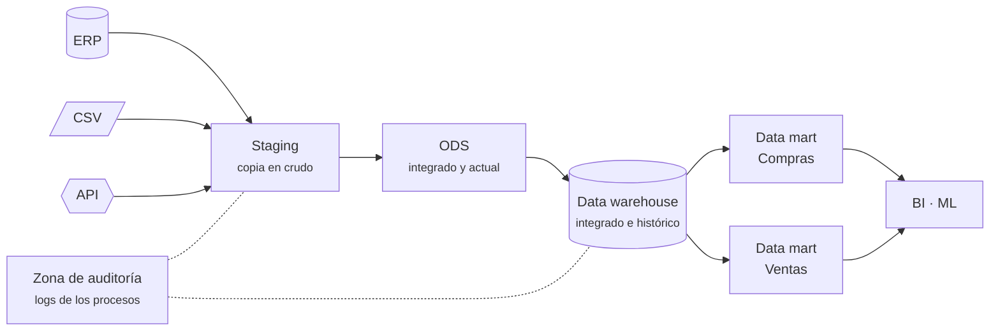
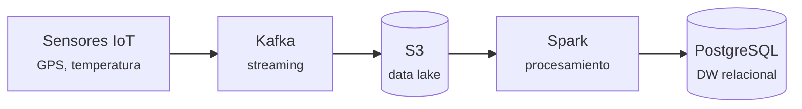

# S03 · Entornos y arquitecturas

<div class="sessio-meta" markdown>
<span><strong>Fecha</strong> lu 26/10/2026</span>
<span><strong>Duración</strong> 3 h 40 min</span>
<span><span class="tag p1">Jorge · lunes</span></span>
<span><strong>RA·CA</strong> <span class="ra">RA1 g</span> <span class="ra">RA1 h</span> <span class="ra">RA3 c</span></span>
</div>

!!! abstract "Qué trabajaremos"
    Dónde viven los datos a lo largo de su viaje: de los **sistemas operacionales** (OLTP) a los **sistemas de análisis** (OLAP), pasando por las capas de una arquitectura de datos (*staging*, DW, *data mart*, *data lake*). También veremos cómo se procesan grandes volúmenes repartiendo el trabajo entre varias CPU o varios servidores (**SMP** y **MPP**) y por qué a veces conviene procesar **junto a la fuente** (*edge computing*).

## Objetivos

- **RA1.g** · Describir plataformas locales o en la nube, monolíticas y distribuidas, que facilitan el procesamiento masivo mediante paralelización (SMP, MPP).
- **RA1.h** · Describir procedimientos de manejo de datos masivos y de mejora de los tiempos de proceso, como procesar cerca de las fuentes.
- **RA3.c** · Describir modelos de datos destino según el objetivo de uso, diferenciando bases de datos OLTP y OLAP.

## 1. OLTP y OLAP: dos objetivos, dos diseños

Imagina el programa de **compras** de una empresa. Cada vez que llega una factura, alguien la introduce: se hace un `INSERT` en la cabecera y otro por cada línea. Esto es un sistema **OLTP**.

Ahora la directora pregunta: *«¿Cuánto hemos gastado por categoría de producto y proveedor durante 2025?»*. Para responder hay que leer **miles de líneas** y agregarlas. Esto es una consulta **OLAP**.

### 1.1 OLTP: procesamiento de transacciones

Cada vez que pagamos con tarjeta en una tienda, reservamos un billete de avión o sacamos dinero de un cajero usamos un sistema **OLTP** (*Online Transaction Processing*). Está diseñado para gestionar **muchas transacciones cortas y simultáneas en tiempo real**: insertar, actualizar o eliminar registros.

Los sistemas OLTP siguen un enfoque de **«todo o nada»**: una transacción se completa o fracasa, pero nunca se queda a medias. Cualquier problema (datos corruptos o inconsistentes) tendría consecuencias graves, por eso implementan las propiedades **ACID** que vimos en [S02](s02-gestors-formats.md#11-el-modelo-relacional-sql).

### 1.2 OLAP: procesamiento analítico

**OLAP** (*Online Analytical Processing*) está pensado para **analizar** grandes volúmenes de datos históricos, procedentes de almacenes de datos o de otras fuentes, y es la base de la inteligencia de negocio (BI) y la minería de datos.

Si la empresa quiere lanzar la nueva versión de un producto, necesitará analizar las ventas históricas, las tendencias del mercado y el comportamiento de los clientes. Esos datos probablemente ya existen en el ERP y el CRM, pero **por separado**, no unificados en una única fuente fiable.

Los principios de OLAP son:

- **Vistas multidimensionales:** analizar los datos desde varias perspectivas (tiempo, geografía, producto…), como si los giráramos y cortáramos igual que un **cubo**.
- Hace de **capa intermedia** entre el almacén de datos y el usuario: traduce las preguntas en consultas optimizadas.
- Usa representaciones como cubos (producto × región × tiempo), tablas dinámicas y tablas cruzadas.

### 1.3 Comparativa

| | OLTP (operacional) | OLAP (analítico) |
|---|---|---|
| **Objetivo** | Registrar operaciones | Analizar y decidir |
| **Operaciones** | Muchas transacciones cortas: `INSERT`, `UPDATE`, `DELETE` | Pocas consultas, pero complejas y sobre muchos registros |
| **Modelo** | Normalizado (3FN): muchas tablas, sin redundancia | Desnormalizado: estrella o copo de nieve |
| **Datos** | Actuales | Históricos |
| **Usuarios** | Aplicación, personal administrativo, cajeros | Analistas de negocio, ingeniería de datos, modelos de ML |
| **Tiempo de respuesta** | Milisegundos | De segundos a minutos |
| **Ejemplo de consulta** | `INSERT` de una factura | `SUM(importe) GROUP BY categoria, anio` |

OLTP y OLAP **no compiten: se complementan**. Los datos nacen en los sistemas OLTP y, con procesos **ETL**, se llevan a los almacenes donde los analiza OLAP.

!!! warning "¿Por qué no analizamos directamente sobre el OLTP?"
    1. Las consultas de análisis **ralentizan** la aplicación que usa todo el mundo.
    2. El modelo normalizado obliga a hacer **muchos JOIN** (lo medirás en la práctica: 7 JOIN en OLTP frente a 5 en OLAP).
    3. El OLTP suele guardar solo el **estado actual**, no el histórico.
    4. Los datos están **repartidos en varios sistemas** que hay que integrar.

!!! quote "Fuente"
    Los apartados 1.1 y 1.2 están tomados y adaptados de [«Big Data» › Almacenando los datos](https://alapvi.github.io/sbd/ingenieria-datos/bigdata/), *Sistemas de Big Data*, Alberto Aparicio Vila (que a su vez se basa en los apuntes de Aitor Medrano).

## 2. Dónde se guardan los datos para analizarlos

### 2.1 Data warehouse

Un ***data warehouse*** (DW, almacén de datos) **centraliza** todos los datos de la empresa en una base de datos OLAP para obtener información contrastada y tomar decisiones basadas en el histórico.

- Solo admite **datos estructurados** con esquemas bien definidos: el esquema se aplica al escribir (***schema-on-write***).
- Sus funciones son **extraer, limpiar, transformar y cargar** datos.
- Los datos del DW son de **solo lectura**: las operaciones CRUD se hacen en el origen (OLTP) y al DW llegan con procesos por lotes (*batch*).

| Ventajas | Desventajas |
|---|---|
| Acceso rápido a datos y metadatos críticos | No puede guardar datos no estructurados |
| Integra datos de muchas fuentes | Es difícil cambiar tipos de datos y esquemas |
| Reduce el tiempo de respuesta del análisis | No es adecuado para tiempo real (se carga por lotes) |
| Permite analizar diferentes periodos para hacer predicciones | |

**Ejemplos:** Amazon Redshift, Azure Synapse Analytics, Google BigQuery, Snowflake, Oracle.

### 2.2 Data mart

Un ***data mart*** es un DW **más pequeño y especializado** en un área o departamento (ventas, marketing, finanzas, **compras**). Puede ser **dependiente** (se alimenta del DW principal), **independiente** (tiene sus propios procesos ETL) o **híbrido**. En la práctica construirás el **data mart de compras**.

### 2.3 Data lake

Con el *Big Data* surgió la necesidad de guardar muchos más datos, y muchos **sin estructura clara**. Un ***data lake*** (lago de datos) guarda los datos **en crudo**, en su formato original (JSON, imágenes, audios, vídeos, correos, PDF…), y sobre ellos se hacen transformaciones que se vuelven a guardar en el mismo lago. El esquema se aplica al leer (***schema-on-read***).

Necesita almacenamiento **distribuido y fácilmente escalable**: antes **HDFS** (Hadoop) en local, y ahora cada vez más el almacenamiento de objetos en la nube (**Amazon S3**, **Azure Blob Storage**).

Cuando se unen las dos ideas, *data lake* + *data warehouse*, se obtiene un ***data lakehouse*** (Databricks, Snowflake).

!!! quote "Fuente"
    El apartado 2 está tomado y adaptado de [«Big Data» › Data Warehouse, Data Mart y Data Lake](https://alapvi.github.io/sbd/ingenieria-datos/bigdata/), *Sistemas de Big Data*, Alberto Aparicio Vila.

## 3. Entornos y capas de una arquitectura de datos

Los entornos se clasifican tanto por su **ubicación física** (dónde se instalan) como por las **capas lógicas** que gestionan el flujo y la calidad de los datos.

### 3.1 Dónde se instala: on-premise o nube

| Entorno | Características |
|---|---|
| **On-premise** | **Instalación local**. Requiere una infraestructura complicada, un alto coste y mantenimiento constante. Da control total. |
| **Nube** (*cloud*) | **Instalación remota**. Reduce costes, automatiza el mantenimiento y se escala en minutos. En las plataformas modernas se **separa el almacenamiento del cómputo**: los datos están en un *object storage* y los motores de cálculo se encienden solo cuando hace falta. |

### 3.2 Capas lógicas



Staging area
:   Zona **temporal** donde se deja la información extraída. **No se hace ninguna transformación**, y se vacía y se vuelve a llenar continuamente. Permite repetir la transformación sin volver a molestar al origen.

ODS (*Operational Data Store*)
:   Zona donde la información se **prepara en un modelo multidimensional**, con tablas maestras y estrellas. Contiene los datos **actuales**.

Data warehouse (DW)
:   **Combinación de tablas de diferentes capas** (staging, ODS). Puede incluir capas agregadas con **datos precalculados**.

Data mart (DM)
:   **Conjunto de tablas multidimensionales** con un **subconjunto** de los datos de la empresa (por ejemplo, recursos humanos o secretaría).

Zona de auditoría (*audit zone*)
:   Zona donde se guardan los **logs de los procesos y ejecuciones**, para tener un control más robusto de la solución.

### 3.3 La arquitectura *medallion* en la nube

En entornos en la nube (Databricks, Azure, AWS) las zonas se definen según la **calidad y el estado** de la información:

<div class="grid cards" markdown>

-   :material-medal:{ .lg style="color:#b45309" } __Bronce__

    ---

    ***Temp landing zone*** (05). Zona temporal con las extracciones **sin ninguna transformación** (equivalente al staging).

-   :material-medal:{ .lg style="color:#64748b" } __Silver__

    ---

    ***History zone*** (10): copia histórica de cada extracción.
    ***Current zone*** (15): último estado de los datos, ya **limpios y transformados**, en un modelo *data lake* o *delta lake*.

-   :material-medal:{ .lg style="color:#ca8a04" } __Gold__

    ---

    ***Consume zone*** (30). Modelo de base de datos **preparado para el análisis** con herramientas de BI (Power BI, MicroStrategy) o para entrenar modelos.

</div>

!!! quote "Fuente"
    El apartado 3 está tomado y adaptado de [«Tipos de entornos y arquitectura de datos»](https://alapvi.github.io/sbd/ingenieria-datos/tipos-entornos-arquitecturas/), *Sistemas de Big Data*, Alberto Aparicio Vila.

## 4. Procesar muchos datos: SMP y MPP

En aprendizaje automático no basta con tener datos: hay que entender cómo se **generan, transportan y procesan**. Cuando una consulta tiene que recorrer millones de filas, una sola CPU no es suficiente, y la arquitectura de hardware y software es determinante. Hay dos formas de repartir el trabajo:

=== "SMP · un servidor, muchas CPU"

    **Symmetric Multi-Processing.** Un solo servidor con varias CPU (o núcleos) que **comparten una única memoria central y el mismo disco**.

    ```mermaid
    flowchart TB
        subgraph Servidor
          C1[CPU 1] --- M[(Memoria compartida)]
          C2[CPU 2] --- M
          C3[CPU 3] --- M
          C4[CPU 4] --- M
          M --- D[(Disco)]
        end
    ```

    - Es **sencillo de programar** y mantener la coherencia de los datos es fácil.
    - **Límite:** la escalabilidad es limitada. Añadir más procesadores no mejora el rendimiento indefinidamente, porque la **memoria compartida se convierte en un cuello de botella** (escalado **vertical**).
    - **Ejemplo:** PostgreSQL con *parallel query*. En la práctica verás en el plan de ejecución la línea `Workers Launched`.

=== "MPP · muchos servidores"

    **Massively Parallel Processing.** Arquitectura **distribuida** donde muchos nodos independientes, **cada uno con su CPU, memoria y disco**, procesan los datos localmente y se comunican por la red. No comparten nada (*shared-nothing*), y así se evita el cuello de botella de la memoria compartida.

    ```mermaid
    flowchart TB
        Q[Coordinador] --> N1 & N2 & N3
        subgraph N1[Nodo 1]
          A1[CPU+RAM] --- B1[(2024)]
        end
        subgraph N2[Nodo 2]
          A2[CPU+RAM] --- B2[(2025)]
        end
        subgraph N3[Nodo 3]
          A3[CPU+RAM] --- B3[(2026)]
        end
    ```

    - Permite el escalado **horizontal**: en lugar de comprar un servidor más potente, se añaden servidores más económicos. Cada nodo procesa una **partición** de los datos y al final se juntan los resultados.
    - Es la base del *Big Data*: permite procesar terabytes o petabytes en tiempos razonables.
    - **Ejemplos:** Hadoop, Spark, Hive, Amazon Redshift, Greenplum, Snowflake.

| Característica | SMP (simétrico) | MPP (masivamente paralelo) |
|---|---|---|
| **Memoria** | Compartida | Distribuida (local a cada nodo) |
| **Escalabilidad** | Vertical (limitada) | Horizontal (alta) |
| **Complejidad** | Baja | Alta (gestión de la red) |
| **Uso típico** | Servidores monolíticos | Big Data, Hadoop, Spark |

## 5. Mejorar los tiempos de proceso

### 5.1 Procesar cerca de los datos

Mover datos por la red es lento y caro. Por eso los sistemas distribuidos hacen lo contrario: **envían el cálculo donde están los datos** (*data locality*). Hadoop ejecuta cada tarea en el nodo que ya tiene el bloque de fichero. Una ETL bien diseñada aplica el mismo principio:

- **Filtrar en origen:** pide a la base de datos solo las filas y columnas que necesitas (`WHERE`, proyección), en lugar de traerlo todo y filtrar después.
- **Agregar en origen** cuando solo hace falta el resumen.

### 5.2 *Edge computing*: procesar junto a la fuente

Enviar todos los datos en crudo de miles de sensores IoT a un almacén centralizado (en la nube) puede ser ineficiente por la **latencia** y el **coste de transmisión**. El ***edge computing*** (computación en el borde) consiste en hacer un **preprocesamiento, filtrado o agregación** en el propio dispositivo IoT o en una pasarela (*gateway*) local, antes de enviar nada.

!!! example "Ejemplo resuelto"
    Una red de sensores de temperatura de una fábrica genera **10.000 lecturas por segundo**. En lugar de enviarlas todas a la nube, el *gateway* local calcula la **media de cada minuto** y solo envía ese valor agregado. Como un minuto tiene 60 segundos, el volumen transmitido se reduce en un **factor de 60** por sensor[^1], mejora la latencia y bajan los costes de ancho de banda.

[^1]: El tema original habla de un factor de 600. Si cada sensor envía una lectura por segundo y el *gateway* envía una media por minuto, la reducción es de 60 veces por sensor. Llegaríamos a 600 si, además, se agregaran las lecturas de 10 sensores en un solo valor.

### 5.3 Técnicas para los sistemas MPP

- **Particionamiento:** dividir los datos grandes en fragmentos más pequeños que se pueden procesar en paralelo (por fecha, por región).
- **Compresión:** reducir el tamaño de los datos almacenados y transmitidos (por ejemplo, con Parquet).
- **Paralelización:** ejecutar tareas simultáneamente en diferentes nodos.

!!! tip "Recuerda"
    El modelo de datos SCADA/IoT suele ser de **serie temporal**. La eficiencia depende de equilibrar la potencia de cálculo en el **borde** (*edge*) con la capacidad de almacenamiento y análisis histórico en el **centro** (*cloud*). No es una cosa o la otra: el *edge* se encarga de la respuesta en tiempo real y del filtrado, y la arquitectura MPP en la nube permite entrenar modelos con el histórico completo.

## Material

- :material-file-document-outline: *Tipología de fuentes de datos y sistemas de gestión* (tema completo, en Aules)
- :material-file-document-outline: *Entorns i model de dades.pdf* y *1.1 Introducció a Big Data.pptx* (Aules)
- :material-web: [Tipos de entornos y arquitectura de datos](https://alapvi.github.io/sbd/ingenieria-datos/tipos-entornos-arquitecturas/), [Big Data](https://alapvi.github.io/sbd/ingenieria-datos/bigdata/) e [Ingeniería de datos](https://alapvi.github.io/sbd/ingenieria-datos/ingenieria-datos/) (Alberto Aparicio Vila)

## Ejercicios

### Ejercicio 1 · ¿Qué arquitectura elegirías?

**Duración:** 1 h aprox. · **En grupos de tres**

Para cada caso, decidid el tipo de sistema (OLTP, DW o *data lake*), si sería local o en la nube, y si haría falta SMP o MPP. Justificadlo en dos líneas.

1. Una tienda de bicicletas de Xàtiva quiere saber qué productos vende más cada mes. Tiene 2.000 facturas al año.
2. Una cadena de supermercados con 300 tiendas quiere analizar los tiques de caja de los últimos cinco años (2.000 millones de líneas).
3. Una empresa quiere guardar las lecturas de 5.000 sensores cada segundo para entrenar un modelo de mantenimiento predictivo.
4. Un hospital quiere integrar datos de tres programas diferentes para hacer informes mensuales, pero los datos no pueden salir del centro.

!!! success "Qué tienes que entregar"
    La tabla de decisiones con la justificación. La pondremos en común al final de la sesión.

### Ejercicio 2 · Verdadero o falso: arquitecturas de procesamiento

Indica si cada afirmación es verdadera (V) o falsa (F) y, si es falsa, corrígela.

1. Una arquitectura SMP es ideal para procesar grandes volúmenes de datos no estructurados porque permite añadir nodos de forma ilimitada sin perder rendimiento.
2. En una arquitectura MPP, cada nodo tiene su propia CPU, memoria y almacenamiento local, y los datos se distribuyen entre ellos para procesarse en paralelo.
3. El *edge computing* consiste en enviar todos los datos en crudo desde los sensores IoT directamente a la nube para almacenarlos y analizarlos después, evitando el procesamiento local.
4. La principal ventaja de procesar cerca de la fuente (*edge*) frente al procesamiento centralizado en la nube es la reducción de la latencia y del ancho de banda.
5. Los sistemas MPP son monolíticos por definición, ya que todos los procesos se ejecutan en un único servidor físico de gran potencia.

??? tip "Orientación"
    Recuerda la diferencia fundamental entre **compartir** recursos (SMP) y **distribuirlos** (MPP). Para el punto 3, piensa qué significa literalmente *edge* (borde) en redes. Para el punto 5, analiza si «monolítico» y «distribuido» son conceptos opuestos.

??? success "Solución"
    1. **Falso.** SMP implica varios procesadores que comparten la misma memoria y sistema operativo. No escala indefinidamente para *Big Data*: para eso se usan arquitecturas distribuidas como MPP o Hadoop/Spark.
    2. **Verdadero.** Es la definición de MPP: arquitectura *shared-nothing*, donde cada nodo es autónomo y los datos se particionan para procesarse en paralelo.
    3. **Falso.** El *edge computing* procesa los datos lo más cerca posible de donde se generan (en el dispositivo o en un *gateway* local), filtrando o agregando antes de enviarlos a la nube.
    4. **Verdadero.** Al procesar localmente, se evita el viaje de ida y vuelta a la nube (latencia) y solo se transmiten los resultados relevantes (ancho de banda).
    5. **Falso.** MPP es una arquitectura distribuida, no monolítica. Un sistema monolítico reside en un solo servidor; MPP reparte la carga entre muchos servidores independientes.

### Ejercicio 3 · Interpretación de un diagrama de ingesta

Una empresa de logística tiene esta arquitectura de datos:



Responde indicando el tipo de sistema o fuente, la naturaleza de los datos y la ubicación típica:

1. ¿Qué tipo de fuente representan los *Sensores IoT* y cuál es su ubicación física típica en este contexto?
2. ¿Qué función cumple *Kafka* en la cadena y qué naturaleza tienen los datos que transporta?
3. ¿Por qué se usa *S3* antes de *PostgreSQL*? Clasifica ambos según su modelo de gestión y su ubicación.
4. ¿Qué papel juega *Spark* y qué arquitectura de procesamiento sugiere?

??? tip "Orientación"
    Piensa en el flujo de datos: origen → transporte → almacenamiento en crudo → procesamiento → almacenamiento estructurado. S3 es un almacén de objetos; PostgreSQL es relacional. Spark suele distribuir la carga.

??? success "Solución"
    1. **Sensores IoT:** fuentes de origen **IoT** que generan datos en tiempo real. Su ubicación es **local**: en el dispositivo o en un *gateway* en el borde de la red.
    2. **Kafka:** plataforma de **mensajería y *streaming***. Transporta eventos en tiempo real, normalmente **semiestructurados** (mensajes JSON o Avro).
    3. **S3 y PostgreSQL:** S3 es un ***data lake*** (almacenamiento de objetos, **no relacional**, en la **nube**) que guarda datos en crudo a bajo coste. PostgreSQL es un ***data warehouse*** relacional (**SQL**, en la nube o en local) que guarda datos estructurados para consultas analíticas. Se usa primero S3 para la ingesta masiva; después los datos se transforman para cargarlos en SQL.
    4. **Spark:** motor de **procesamiento distribuido**. Sugiere una arquitectura **MPP**: procesa grandes volúmenes en memoria y en paralelo antes de cargarlos en la base de datos final.

### Ejercicio 4 · Optimización de los tiempos de proceso

Una fábrica inteligente tiene **500 sensores IoT** que generan **100 mensajes por segundo** cada uno. Ahora mismo todos los mensajes se envían a un servidor en la nube que solo se queda con las anomalías. La latencia de ida y vuelta es de 200 ms y el ancho de banda está saturado.

1. Calcula el volumen total de mensajes por segundo que se envían a la nube.
2. Propón una solución basada en *edge computing* para reducir la carga.
3. Explica cómo mejora el tiempo de proceso y el uso de recursos, y estima la reducción de tráfico si solo se envían las anomalías (el 1 % de los casos).

??? tip "Orientación"
    Usa la fórmula: total de mensajes = número de sensores × frecuencia. Para la solución, piensa **dónde filtrar** los datos antes de que salgan de la fábrica. La mejora principal es no enviar datos inútiles.

??? success "Solución"
    1. **Volumen total:** 500 sensores × 100 mensajes/s = **50.000 mensajes por segundo**.
    2. **Solución *edge*:** instalar un *gateway* de *edge computing* dentro de la fábrica que reciba los datos de los sensores y ejecute **localmente** el algoritmo de detección de anomalías. Solo las anomalías se envían a la nube para guardar el histórico.
    3. **Mejora:**
        - **Tiempo de proceso:** la detección se hace en local (latencia < 10 ms) y se evitan los 200 ms de ida y vuelta por cada mensaje.
        - **Reducción del tráfico:** si solo el 1 % son anomalías, se envían 50.000 × 0,01 = **500 mensajes/s**. El ancho de banda consumido baja un **99 %** y se acaba la saturación.

## Para repasar

??? question "¿Un data lake sustituye al data warehouse?"
    No necesariamente. El *data lake* guarda de todo y en crudo, a bajo coste; el DW guarda datos limpios y estructurados, rápidos de consultar. Muchas empresas tienen ambos, o los combinan en un *lakehouse*.

??? question "¿PostgreSQL es SMP o MPP?"
    Un PostgreSQL normal es **SMP**: un solo servidor que puede usar varios núcleos en paralelo. Hay extensiones y productos derivados (Citus, Greenplum) que lo convierten en **MPP**.
