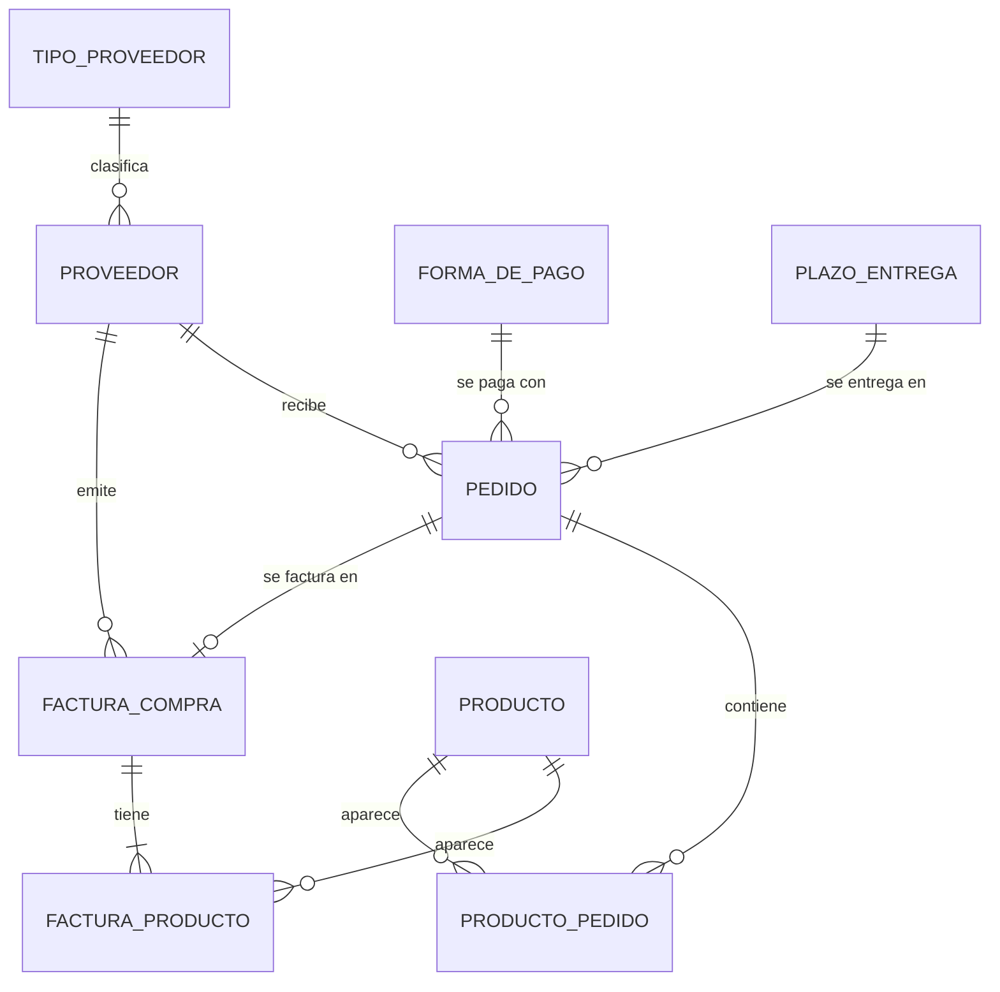
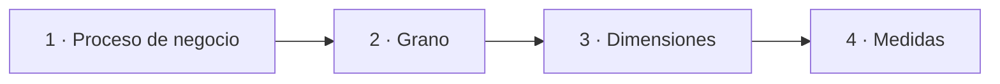
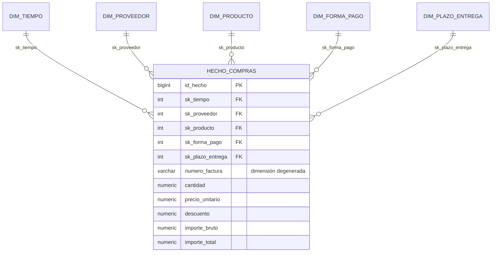

# S04 · Modelo multidimensional

<div class="sessio-meta" markdown>
<span><strong>Fecha</strong> lu 02/11/2026</span>
<span><strong>Duración</strong> 3 h 40 min</span>
<span><span class="tag p1">Jorge · lunes</span></span>
<span><strong>RA·CA</strong> <span class="ra">RA3 c</span></span>
</div>

!!! abstract "Qué trabajaremos"
    Empezaremos con la **prueba corta del RA1** (30 min). Después aprenderemos a diseñar el **modelo en estrella** de un data mart a partir de un OLTP. Es el paso previo a la práctica de las próximas cinco sesiones, donde lo construiremos de verdad en PostgreSQL.

## Objetivo

- **RA3.c** · Describir modelos de datos destino en función del objetivo de uso, diferenciando bases de datos OLTP y OLAP.

## 1. Qué es el modelo multidimensional

El **modelo multidimensional** es la base del diseño de los **almacenes de datos** (*data warehouses*), cuyo objetivo es soportar el análisis de información para la toma de decisiones. A diferencia de los modelos transaccionales (OLTP), busca optimizar la **rapidez y simplicidad** de las consultas.

El diseño consiste en transformar las **preguntas del negocio** en dos componentes: **hechos** y **dimensiones**.

Tabla de hechos (*fact table*)
:   Es la **tabla principal o central** del modelo. Registra los **eventos del negocio** que se desean analizar (las compras, las ventas) y contiene las **métricas o indicadores**: valores **numéricos, medibles y cuantitativos**, generalmente **agregables**. Los hechos se registran con un alto nivel de **atomicidad** o mínima expresión: esto es la **granularidad** (el **grano**).

Tablas de dimensiones (*dimension tables*)
:   Proporcionan el **contexto** o la **perspectiva de análisis** del hecho: son atributos que describen los datos indicados en los hechos. Suelen tener menos registros que la tabla de hechos, pero cada registro puede tener un gran número de atributos descriptivos. Ejemplos típicos: el tiempo (fecha, mes, año), la geografía (país, provincia, ciudad), los productos o los proveedores. A menudo contienen **jerarquías**: de una fecha se derivan el trimestre, el mes, el año y la década.

### Terminología

| Concepto | Descripción |
|---|---|
| **Hecho** | Elemento de información del negocio, es decir, algo que se puede medir. |
| **Indicador** | Fórmula matemática aplicada a un conjunto de hechos. |
| **Dimensión / eje de análisis** | Aspecto o perspectiva mediante la cual se puede acceder y analizar los hechos. |
| **Atributo** | Característica específica de una dimensión. |
| **Jerarquía** | Relación padre/hijo utilizada para agrupar los atributos de una dimensión (día → mes → año). |
| **Agregación** | Método por el cual los datos son agrupados para crear una tabla de hechos específica. |
| **Sumarización** | Método por el cual los datos se cambian a un nivel diferente de granularidad. |
| **Desnormalización** | Introducir redundancias en las tablas para mejorar el rendimiento. |
| **Data mart** | Subconjunto departamental de un *data warehouse* enfocado en un área específica. |
| ***Drill down / up*** | Navegar por la información desde niveles más altos (año) a más bajos (día) o viceversa. |
| ***Data mining*** | Búsqueda de patrones de comportamiento en los datos. |

!!! quote "Fuente"
    El apartado 1 está tomado y adaptado de [«Modelos multidimensionales»](https://alapvi.github.io/sbd/ingenieria-datos/modelos-multidimensionales/) y de la terminología de [«Introducción a BI»](https://alapvi.github.io/sbd/ingenieria-datos/ud1-introduccion/), *Sistemas de Big Data*, Alberto Aparicio Vila.

## 2. El punto de partida: el OLTP de compras

La empresa tiene un programa de compras con este modelo **normalizado**:



Para responder *«¿cuánto hemos gastado por tipo de proveedor, categoría y forma de pago en 2025?»* hay que cruzar **siete tablas**. El modelo multidimensional reorganiza estos datos alrededor de lo que queremos **medir**.

## 3. Los cuatro pasos del diseño



### Paso 1 · Elegir el proceso de negocio

¿Qué queremos analizar? Aquí, las **compras facturadas**. Otro proceso (los pedidos, los pagos) sería otro hecho.

### Paso 2 · Declarar el grano

El **grano** dice qué representa **exactamente una fila** de la tabla de hechos. Es la decisión más importante y se toma **antes** de crear ninguna tabla.

!!! example "Grano del data mart de compras"
    **Una fila de `hecho_compras` = una línea de producto de una factura de compra.**

    Si eligiéramos «una factura», no podríamos analizar por producto. Si eligiéramos «un producto por mes», perderíamos el detalle por proveedor y día. **Cuanto más fino es el grano, más preguntas se pueden responder**, pero la tabla es más grande.

### Paso 3 · Identificar las dimensiones

Las **dimensiones** responden al *quién, qué, cuándo, cómo* de cada fila del hecho:

| Pregunta | Dimensión | Atributos |
|---|---|---|
| ¿Cuándo? | `dim_tiempo` | fecha, día, mes, nombre del mes, trimestre, año, día de la semana |
| ¿A quién? | `dim_proveedor` | código, denominación, **tipo de proveedor**, ciudad, provincia, país, situación fiscal |
| ¿Qué? | `dim_producto` | código, descripción, categoría, subcategoría, unidad |
| ¿Cómo se paga? | `dim_forma_pago` | código, descripción |
| ¿En cuánto tiempo? | `dim_plazo_entrega` | código, descripción, días |

Fíjate en que `tipo_proveedor` era **una tabla** en el OLTP y ahora es **una columna** de `dim_proveedor`. Esto es **desnormalizar**: aceptamos repetir el texto para ahorrar un JOIN en cada consulta.

Las dimensiones suelen tener **jerarquías**: día → mes → trimestre → año, o producto → subcategoría → categoría. Permiten agregar a diferentes niveles (*drill-down* y *roll-up*).

### Paso 4 · Identificar las medidas

Las **medidas** son los valores numéricos que se suman, se promedian, etc.

| Medida | Cálculo | ¿Aditiva? |
|---|---|---|
| `cantidad` | origen | Sí |
| `precio_unitario` | origen | **No** (sumar precios no tiene sentido) |
| `descuento` | origen | Sí |
| `importe_bruto` | `cantidad * precio_unitario` | Sí |
| `importe_total` | `importe_bruto - descuento` | Sí |

`numero_factura` se queda en el hecho sin tabla propia: es una **dimensión degenerada**.

## 4. El resultado: la estrella



## 5. Claves subrogadas

Cada dimensión tiene una **clave subrogada (SK)**: un número que genera el DW (`SERIAL`) y que **no tiene nada que ver** con la clave del OLTP. La clave del origen se guarda en otra columna (`id_proveedor_oltp`) para poder hacer la correspondencia durante la carga.

```text
OLTP:  proveedor.id_proveedor = 7
          ↓ lookup
DW:    dim_proveedor.id_proveedor_oltp = 7  →  sk_proveedor = 23
          ↓
       hecho_compras.sk_proveedor = 23   (¡no 7!)
```

¿Por qué no reutilizamos la clave del origen?

- Si integramos **dos fuentes**, ambas pueden tener un proveedor con `id = 7`.
- Si el origen **reutiliza** o **cambia** una clave, el DW no se rompe.
- Permite guardar el **histórico** de un mismo proveedor con varias filas (SCD tipo 2).

## 6. ¿Estrella o copo de nieve?

| | Estrella | Copo de nieve |
|---|---|---|
| Dimensiones | Desnormalizadas | Normalizadas en varias tablas |
| JOIN por consulta | Menos | Más |
| Espacio | Algo más | Menos |
| Simplicidad para BI | :material-check-all: | :material-check: |

En la mayoría de casos se elige **la estrella**: el espacio es barato y la simplicidad y la velocidad de consulta valen más.

## Material

- :material-web: [Modelos multidimensionales](https://alapvi.github.io/sbd/ingenieria-datos/modelos-multidimensionales/) (Alberto Aparicio Vila): incluye el ejercicio del modelo de compras
- :material-file-document-outline: *Exercici_ Model Multidimensional Compres.docx* (Aules)
- :material-flask-outline: [Práctica: del modelo OLTP al modelo OLAP](../practiques/oltp-olap/index.md)

## Ejercicios

### Ejercicio 1 · Diseño del modelo multidimensional de compras

**Duración:** 1 h 45 min · **En parejas**

A partir del modelo transaccional de compras del apartado 2, sigue la metodología para construir el **modelo multidimensional de compras**: identifica el hecho, los indicadores y las dimensiones que permiten responder las preguntas de la gerencia.

1. **Identifica la tabla de hechos** y declara su **grano** con una frase.
2. **Identifica los indicadores (medidas)** que la gerencia querría analizar sobre el evento «compra» e indica si son aditivos. Clasifícalos:

    | Criterio | Indicadores |
    |---|---|
    | **Cuantificación** (cantidades) | |
    | **Financiero** (importes) | |
    | **Contable** (impuestos, descuentos) | |

3. **Identifica las dimensiones** (el *quién*, *qué*, *cuándo* y *dónde*) y sus atributos descriptivos. Señala las **jerarquías**.

    | Dimensión | Atributos descriptivos |
    |---|---|
    | | |

4. **Construye el modelo** en estrella (papel, [draw.io](https://app.diagrams.net/) o Mermaid).
5. **Describe el modelo** con un párrafo: qué contiene, qué análisis permite y qué beneficio aporta.
6. **Analiza otras posibilidades de diseño:** otro grano, varios ***data marts*** o **capas agregadas** (tablas con datos ya resumidos por mes o por proveedor). Explica qué preguntas ganarías y cuáles perderías.

!!! success "Qué tienes que entregar"
    Un documento con todos los puntos y el diagrama, en Aules. En la sesión siguiente lo compararemos con el modelo que implementaremos.

!!! quote "Fuente"
    Ejercicio adaptado de [«Modelos multidimensionales» › Ejercicio](https://alapvi.github.io/sbd/ingenieria-datos/modelos-multidimensionales/), Alberto Aparicio Vila.

??? tip "Recursos adicionales"
    - [Bases de datos: Diseño de un cubo OLAP (Ejemplo 1)](https://www.youtube.com/watch?v=jJG0INtiOa8)
    - [Bases de datos: Diseño de un cubo OLAP (Ejemplo 2)](https://www.youtube.com/watch?v=vGYCo59QNQQ)
