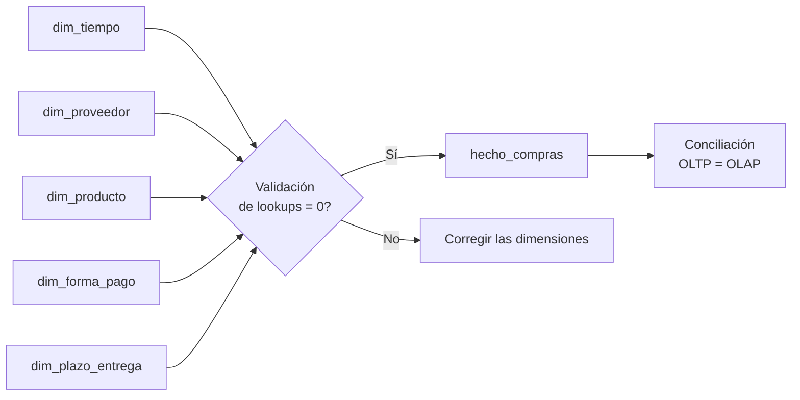

# S06 · Práctica: carga del DW

<div class="sessio-meta" markdown>
<span><strong>Fecha</strong> lu 16/11/2026</span>
<span><strong>Duración</strong> 3 h 40 min</span>
<span><span class="tag p1">Jorge · lunes</span></span>
<span><strong>RA·CA</strong> <span class="ra">RA3 b</span> <span class="ra">RA3 d</span></span>
<span><strong>Práctica</strong> [OLTP → OLAP, parte 2](../practiques/oltp-olap/index.md)</span>
</div>

!!! abstract "Qué trabajaremos"
    Cargaremos el data mart con SQL: primero las dimensiones, después una **validación**, y al final el hecho. Como origen y destino están en la misma base de datos, la transformación la hace el propio PostgreSQL con `INSERT … SELECT`: es un proceso **ELT**.

## Objetivos

- **RA3.b** · Usar DML para la carga, actualización y borrado de datos.
- **RA3.d** · Combinar instrucciones de consulta, transformación y carga para fuentes y destinos en una misma base de datos.

## 1. El orden importa



El hecho tiene FK hacia todas las dimensiones: si cargas el hecho primero, **no tendrás SK a las que apuntar**.

## 2. Cargar las dimensiones

Abre `04_load_olap.sql` y ejecuta **solo** los apartados 1 a 4. Analízalos uno a uno:

=== "dim_tiempo"

    ```sql
    INSERT INTO dw_compras.dim_tiempo (fecha, dia, mes, ...)
    SELECT f::date, EXTRACT(DAY FROM f)::smallint, ...
    FROM generate_series(
           (SELECT MIN(fecha_factura) FROM compras.factura_compra),
           (SELECT MAX(fecha_factura) FROM compras.factura_compra),
           INTERVAL '1 day') AS f
    ON CONFLICT (fecha) DO NOTHING;
    ```

    La dimensión tiempo **no viene de ninguna tabla**: se **genera**, un día por fila, entre la primera y la última factura. Así también están los días sin compras.

=== "dim_proveedor"

    ```sql
    INSERT INTO dw_compras.dim_proveedor (id_proveedor_oltp, ..., tipo_proveedor, ...)
    SELECT p.id_proveedor, ..., tp.descripcion, ...
    FROM compras.proveedor p
    LEFT JOIN compras.tipo_proveedor tp ON tp.id_tipo_proveedor = p.id_tipo_proveedor
    ON CONFLICT (id_proveedor_oltp) DO NOTHING;
    ```

    Aquí se **desnormaliza**: el JOIN con `tipo_proveedor` se hace **una vez** durante la carga, y no en cada consulta. ¿Por qué `LEFT JOIN` y no `JOIN`?

=== "ON CONFLICT DO NOTHING"

    Hace el script **reejecutable** (idempotente): si el proveedor ya existe (misma clave de negocio), no se inserta de nuevo.

    **Pero cuidado:** si el proveedor ha **cambiado** en el OLTP (se ha mudado de ciudad), el cambio **no llega** al DW. Lo resolveremos en [S07](s07-practica-scd-dcl.md) con una SCD tipo 1.

## 3. Validar los *lookups*

Antes de cargar el hecho, comprueba que **cada línea del OLTP encontrará su SK** en todas las dimensiones (apartado 5 del script). El resultado debe ser **0**.

!!! danger "Experimento: rómpelo a propósito"
    1. Borra un proveedor de la dimensión: `DELETE FROM dw_compras.dim_proveedor WHERE id_proveedor_oltp = 3;` (si ya habías cargado el hecho, vacíalo antes con `TRUNCATE dw_compras.hecho_compras;`, porque la clave foránea no te dejaría borrarlo).
    2. Vuelve a ejecutar la validación. ¿Cuántas líneas son problemáticas?
    3. Ejecuta la carga del hecho (apartado 6). **No da ningún error**, pero ¿cuántas filas se han cargado? ¿Por qué? (Pista: `JOIN` vs `LEFT JOIN`.)
    4. Vuelve a cargar la dimensión y el hecho.

    **Conclusión:** una carga que no falla no es una carga correcta. Por eso se valida.

## 4. Cargar el hecho

```sql
INSERT INTO dw_compras.hecho_compras (sk_tiempo, sk_proveedor, ..., importe_total)
SELECT dt.sk_tiempo, dpr.sk_proveedor, ...,
       ROUND(fp.cantidad * fp.precio_unitario - fp.descuento, 2)
FROM compras.factura_producto fp
JOIN compras.factura_compra fc   ON fc.id_factura = fp.id_factura
JOIN dw_compras.dim_tiempo dt    ON dt.fecha = fc.fecha_factura          -- lookup
JOIN dw_compras.dim_proveedor dpr ON dpr.id_proveedor_oltp = fc.id_proveedor
...
```

Cada `JOIN` con una dimensión es un ***lookup***: traduce la clave del OLTP en la SK del DW. Al mismo tiempo se calculan las **medidas derivadas** (`importe_bruto`, `importe_total`).

## 5. Conciliar

El apartado 7 compara las dos bases de datos. Debes obtener:

| modelo | líneas | importe bruto | descuento | importe total |
|---|---:|---:|---:|---:|
| OLTP | 1260 | 11060120.21 | 351528.85 | 10708591.36 |
| OLAP | 1260 | 11060120.21 | 351528.85 | 10708591.36 |

!!! question "¿Por qué hay facturas de 2027?"
    La consulta por años muestra 12 líneas de 2027. Búscalas en el OLTP y explica de dónde salen. (Pista: compara `fecha_pedido` y `fecha_factura`.)

## 6. Primeras consultas analíticas

Ahora responde con el DW:

1. Importe total por **tipo de proveedor** y **año**.
2. Los 5 **productos** con más unidades compradas en 2025.
3. Importe total por **día de la semana**. ¿Hay compras en fin de semana?
4. La misma consulta 1 escrita sobre el **OLTP**. ¿Cuántos JOIN necesitas en cada caso?

## 7. Antes de salir

- [ ] La validación de *lookups* devuelve 0.
- [ ] La conciliación cuadra.
- [ ] He hecho el experimento de romper la carga y he guardado las conclusiones.
- [ ] He guardado las cuatro consultas en `06_consultas.sql`.
