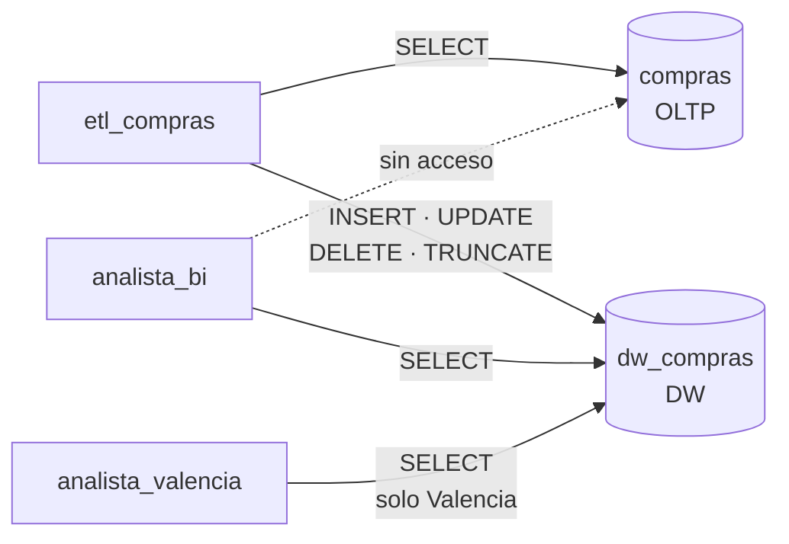

# S07 · Práctica: SCD1 y DCL

<div class="sessio-meta" markdown>
<span><strong>Fecha</strong> lu 23/11/2026</span>
<span><strong>Duración</strong> 3 h 40 min</span>
<span><span class="tag p1">Jorge · lunes</span></span>
<span><strong>RA·CA</strong> <span class="ra">RA3 b</span> <span class="ra">RA3 e</span></span>
<span><strong>Práctica</strong> [OLTP → OLAP, parte 3](../practiques/oltp-olap/index.md)</span>
</div>

!!! abstract "Qué trabajaremos"
    Dos problemas reales de un DW en producción: **qué hacemos cuando los datos del origen cambian** (dimensiones lentamente cambiantes) y **quién puede ver qué** (roles, permisos y seguridad por filas).

## Objetivos

- **RA3.b** · Usar DML para la carga, actualización y borrado de datos.
- **RA3.e** · Usar DCL para configurar roles y permisos que garanticen la confidencialidad.

## Parte 1 · Dimensiones que cambian: SCD

Un proveedor se muda de Valencia a Xàtiva. ¿Qué tiene que hacer el DW?

=== "Tipo 1 · sobrescribir"

    Se cambia el valor y **se pierde el antiguo**. Todas las compras, también las de antes de la mudanza, aparecerán en Xàtiva.

    | sk | id_oltp | ciudad |
    |---|---|---|
    | 23 | 7 | ~~Valencia~~ **Xàtiva** |

    **Cuándo:** correcciones de errores, o atributos donde el histórico no interesa.

=== "Tipo 2 · nueva fila"

    Se cierra la fila antigua y se crea una nueva con una **SK nueva**. Las compras antiguas siguen apuntando a la SK 23 (Valencia) y las nuevas, a la 51 (Xàtiva).

    | sk | id_oltp | ciudad | válido_desde | válido_hasta | actual |
    |---|---|---|---|---|---|
    | 23 | 7 | Valencia | 2024-01-01 | 2026-11-22 | no |
    | 51 | 7 | Xàtiva | 2026-11-23 | — | sí |

    **Cuándo:** el histórico es importante (análisis por zona, por categoría comercial…).

### Práctica: SCD tipo 1 con `MERGE`

Ejecuta `08_scd1_merge.sql` paso a paso y observa:

1. El `UPDATE` en el **OLTP** simula el cambio.
2. El DW todavía tiene el valor **antiguo** (por culpa del `ON CONFLICT DO NOTHING` de la carga).
3. `MERGE` compara el origen y el destino. Si la fila **existe y ha cambiado**, la actualiza (`WHEN MATCHED … THEN UPDATE`). Si **no existe**, la inserta (`WHEN NOT MATCHED … THEN INSERT`).
4. El DW ya tiene el valor **nuevo**.

```sql
MERGE INTO dw_compras.dim_proveedor AS d
USING (SELECT ... FROM compras.proveedor ...) AS o
ON d.id_proveedor_oltp = o.id_proveedor
WHEN MATCHED AND (d.ciudad, d.provincia, ...) IS DISTINCT FROM (o.ciudad, o.provincia, ...)
  THEN UPDATE SET ciudad = o.ciudad, ...
WHEN NOT MATCHED
  THEN INSERT (...) VALUES (...);
```

!!! question "¿Por qué `IS DISTINCT FROM` y no `<>`?"
    Prueba `SELECT NULL <> 'Valencia';` y `SELECT NULL IS DISTINCT FROM 'Valencia';`. ¿Qué pasaría con un proveedor que no tenía ciudad?

!!! tip "Ampliación (opcional): SCD tipo 2"
    Añade a `dim_proveedor` las columnas `valid_desde`, `valid_hasta` y `es_actual`, y escribe el proceso que cierra la fila antigua e inserta una nueva. Después, la carga del hecho tiene que buscar la SK **vigente en la fecha de la factura**.

### ¿Y el borrado?

Prueba la última instrucción comentada del script (`DELETE` de un proveedor). ¿Por qué falla? En un DW casi **nunca se borran** dimensiones referenciadas por el hecho: como mucho, se marcan como inactivas.

## Parte 2 · Quién puede ver qué: DCL

Un DW contiene información sensible. El **principio de mínimo privilegio** dice que cada usuario debe tener **solo** los permisos que necesita.



Ejecuta `09_dcl_rols.sql` y analízalo:

| Instrucción | Qué hace |
|---|---|
| `CREATE ROLE … LOGIN PASSWORD` | Crea un usuario que puede conectarse |
| `GRANT USAGE ON SCHEMA` | Permite «entrar» en el esquema |
| `GRANT SELECT ON ALL TABLES IN SCHEMA` | Permite leer las tablas **que existen ahora** |
| `REVOKE ALL ON SCHEMA compras FROM PUBLIC` | Quita el acceso por defecto a todo el mundo |
| `ENABLE ROW LEVEL SECURITY` + `CREATE POLICY` | Filtra **las filas** que ve cada rol |

Compruébalo tú:

```sql
SET ROLE analista_valencia;
SELECT provincia, COUNT(*) FROM dw_compras.dim_proveedor GROUP BY provincia;
RESET ROLE;

SET ROLE analista_bi;
SELECT * FROM compras.proveedor LIMIT 1;   -- debe fallar
RESET ROLE;
```

!!! question "Preguntas"
    1. Si mañana añades una tabla nueva a `dw_compras`, ¿podrá leerla `analista_bi`? Busca qué hace `ALTER DEFAULT PRIVILEGES` y úsalo.
    2. Conéctate desde DBeaver con el usuario `analista_valencia`. ¿Qué ves?
    3. ¿El superusuario `postgres` está afectado por la RLS? ¿Por qué es peligroso hacer las ETL con `postgres`?

## Antes de salir

- [ ] He probado la SCD tipo 1 y tengo la captura de antes y después.
- [ ] Los tres roles funcionan como se espera y tengo la captura del error de permisos.
- [ ] He respondido las preguntas y he añadido `ALTER DEFAULT PRIVILEGES` a mi script.

## Material

- :material-file-document-outline: *PostgreSQL per a Big Data.docx*: sección de roles (Aules)
- :material-web: [Documentación de PostgreSQL: MERGE](https://www.postgresql.org/docs/current/sql-merge.html) · [Row Security Policies](https://www.postgresql.org/docs/current/ddl-rowsecurity.html)
