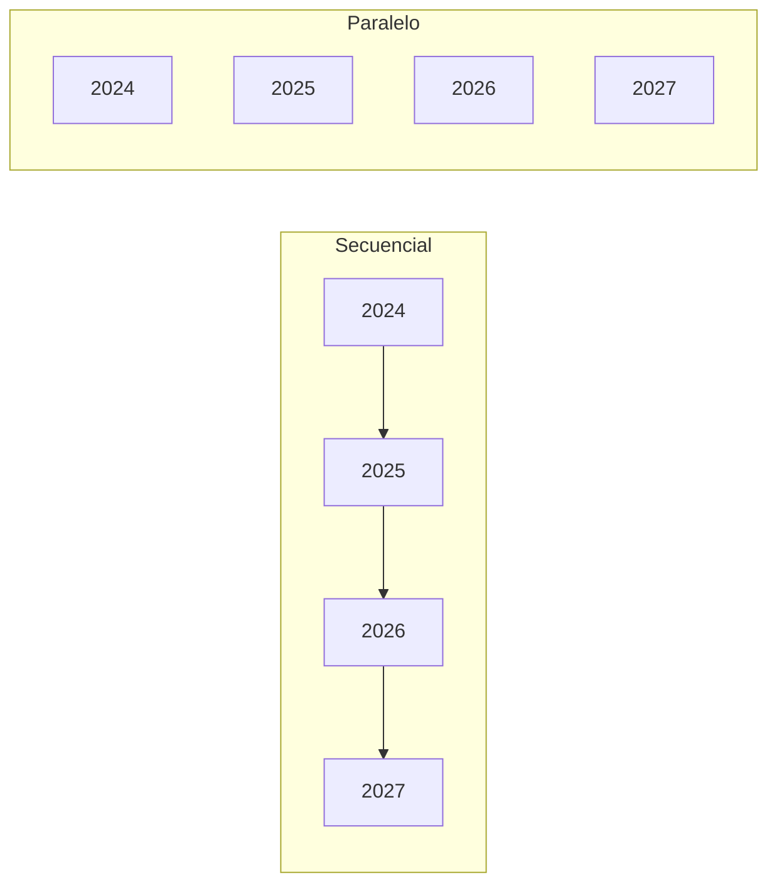

# S09 · Práctica: benchmark y paralelismo

<div class="sessio-meta" markdown>
<span><strong>Fecha</strong> lu 14/12/2026</span>
<span><strong>Duración</strong> 3 h 40 min</span>
<span><span class="tag p1">Jorge · lunes</span></span>
<span><strong>RA·CA</strong> <span class="ra">RA2 d</span> <span class="ra">RA2 e</span> <span class="ra">RA3 g</span></span>
<span><strong>Práctica</strong> [OLTP → OLAP, parte 5 · **entrega**](../practiques/oltp-olap/index.md)</span>
</div>

!!! abstract "Qué trabajaremos"
    Comprobaremos con datos si el modelo en estrella es **realmente** mejor para analizar. Aprenderemos a leer el **plan de ejecución** de PostgreSQL y acabaremos paralelizando la carga con una **tabla particionada**.

## Objetivos

- **RA2.d** · Aplicar filtros y transformaciones en origen: proyecciones, selecciones, agregaciones y ordenaciones.
- **RA2.e** · Utilizar operaciones complejas: JOIN, subconsultas, uniones, diferencia y funciones de agregación.
- **RA3.g** · Paralelizar operaciones de carga según los sistemas disponibles.

## 1. Leer un plan de ejecución

`EXPLAIN (ANALYZE, BUFFERS)` ejecuta la consulta y muestra **cómo** la ha resuelto PostgreSQL:

```text
Sort  (actual time=105.2..106.1 rows=2950 loops=1)
  Sort Key: (sum(...)) DESC
  Sort Method: external merge  Disk: 3832kB        ← (1)
  ->  HashAggregate ...
        ->  Hash Join  (rows=33800)                ← (2)
              ->  Seq Scan on factura_producto fp  ← (3)
...
Execution Time: 109.185 ms                         ← (4)
```

1. **Método de ordenación.** `quicksort Memory` significa que ha cabido en memoria. `external merge Disk` significa que **no cabía** (parámetro `work_mem`, 4 MB por defecto) y ha tenido que escribir ficheros temporales en disco: es mucho más lento.
2. Tipo de **JOIN** (*Hash*, *Merge*, *Nested Loop*) y filas estimadas o reales.
3. **Seq Scan** lee toda la tabla; **Index Scan** usa un índice.
4. **Tiempo total.** Es lo que compararemos.

Si ves `Workers Launched: 1` o más, PostgreSQL ha repartido el trabajo entre varios procesos: es **paralelismo SMP**.

## 2. Benchmark OLTP vs OLAP

Ejecuta `05_queries_oltp.sql` y `06_queries_olap.sql`. Cada consulta responde **la misma pregunta** sobre los dos modelos. Repítelas **5 veces** y quédate con la **mediana** (la primera ejecución suele ser más lenta porque los datos no están en caché).

| Consulta | Modelo | JOIN | Sort Method | Workers | Mediana (ms) |
|---|---|---:|---|---:|---:|
| Análisis 2025 | OLTP | 7 | | | |
| Análisis 2025 | OLAP | 5 | | | |

!!! warning "No generalices"
    Con 100.000 líneas, el OLAP suele ganar en la consulta de análisis porque hace menos JOIN, ordena en memoria y paraleliza. Pero **no es más rápido en todo**: una consulta de una sola factura es mejor en el OLTP. Busca un caso en el que gane el OLTP.

!!! question "Filtros en origen"
    Reescribe la consulta OLAP para que devuelva **solo** las 10 primeras filas y **solo** las columnas `categoria` e `importe_total`. Compara el plan. ¿Qué cambia? ¿Por qué es importante filtrar en origen en una ETL que lee por la red?

!!! question "Subconsultas y operaciones de conjuntos"
    1. Proveedores que han vendido en 2024 **pero no** en 2025 (`EXCEPT`).
    2. Productos cuyo importe total supera la media de su categoría (subconsulta correlacionada o función de ventana `AVG(...) OVER (PARTITION BY ...)`).

## 3. Carga en paralelo

`11_carrega_paralela.sh` crea una **tabla particionada por año** y la carga de dos formas:



El script usa `psql`, así que lo ejecutamos **dentro del contenedor**, donde ya está instalado:

```bash
docker compose exec -w /sql -e PGUSER=postgres postgres bash ./11_carrega_paralela.sh
```

Cada `\copy` es un **proceso independiente** que escribe en su partición. Como no compiten por la misma tabla, el SGBD puede ejecutarlos **a la vez**, aprovechando varias CPU (SMP).

!!! question "Preguntas"
    1. ¿Cuál es la diferencia de tiempo? ¿Por qué es tan pequeña con 100.000 filas?
    2. Modifica `07_scale_100k.sql` para llegar a **1 millón** de líneas y repítelo. ¿Qué pasa ahora?
    3. En un sistema **MPP** (Redshift, Greenplum), ¿dónde iría cada partición?
    4. Ejecuta `EXPLAIN SELECT SUM(importe_total) FROM dw_compras.hecho_part WHERE anio = 2025;`. ¿Cuántas particiones lee? Esto se llama **partition pruning**.

## 4. Entrega

Repasa la lista de [qué tienes que entregar](../practiques/oltp-olap/index.md#que-tienes-que-entregar-lu-1412) y la rúbrica. **Plazo: hoy al final de la sesión.**
