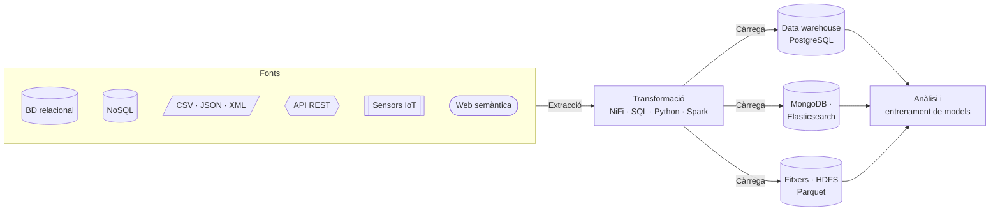

---
hide:
  - navigation
  - toc
---

# Extracció, transformació i càrrega de dades des de fonts múltiples

Mòdul 5104 del Curs d'Especialització en **Aprenentatge automàtic: gestió de dades i entrenament**. Ací trobaràs la teoria, les pràctiques, el calendari i tot el que necessites per a portar dades de qualsevol font fins a on es puguen analitzar o servir per a entrenar un model.

[Comença pel calendari :material-calendar-month:](curs/calendari.md){ .md-button .md-button--primary }
[Què aprendràs :material-target:](curs/ra-ca.md){ .md-button }

:material-database-export: Extracció<i></i>
:material-swap-horizontal: Transformació<i></i>
:material-database-import: Càrrega

<b data-n="33">33</b>sessions

<b data-n="121">121</b>hores de classe

<b data-n="8">8</b>resultats d'aprenentatge

<b data-n="51">51</b>criteris d'avaluació

## On vols anar?

-   :material-school-outline:{ .lg .middle } __El mòdul__

    ---

    Què és una ETL, com s'organitza el curs, com s'avalua i qui en fa classe.

    [:octicons-arrow-right-24: Presentació](curs/index.md)

-   :material-calendar-month-outline:{ .lg .middle } __Calendari__

    ---

    Les 33 sessions, setmana a setmana, amb un filtre per professor i el progrés del curs.

    [:octicons-arrow-right-24: Calendari](curs/calendari.md)

-   :material-database-cog-outline:{ .lg .middle } __Dilluns · Prof. 1__

    ---

    Fonts i tipus de dades, el model relacional i el data warehouse, MongoDB, Elasticsearch i visualització.

    [:octicons-arrow-right-24: Sessions de dilluns](p1/index.md)

-   :material-transit-connection-variant:{ .lg .middle } __Dimecres · Prof. 2__

    ---

    Apache NiFi, fitxers, API REST, IoT, web semàntica i Big Data amb HDFS i Spark.

    [:octicons-arrow-right-24: Sessions de dimecres](p2/index.md)

-   :material-flask-outline:{ .lg .middle } __Pràctiques__

    ---

    Enunciats, scripts per descarregar i què has de lliurar en cada pràctica.

    [:octicons-arrow-right-24: Pràctiques](practiques/index.md)

-   :material-docker:{ .lg .middle } __Entorn de treball__

    ---

    Docker, PostgreSQL, NiFi i la resta d'eines. Com muntar-ho i els errors coneguts.

    [:octicons-arrow-right-24: Entorn](curs/entorn.md)

## El viatge d'una dada en aquest curs

!!! tip "Com aprofitar aquesta web"
    - Cada sessió té una **fitxa** amb els criteris que es treballen, la teoria, la pràctica i el material.
    - Les paraules tècniques subratllades amb punts mostren una **definició** si hi passes el ratolí. Les tens totes al [glossari](recursos/glossari.md).
    - Fes servir el **cercador** (tecla ++s++) per a trobar qualsevol concepte.
