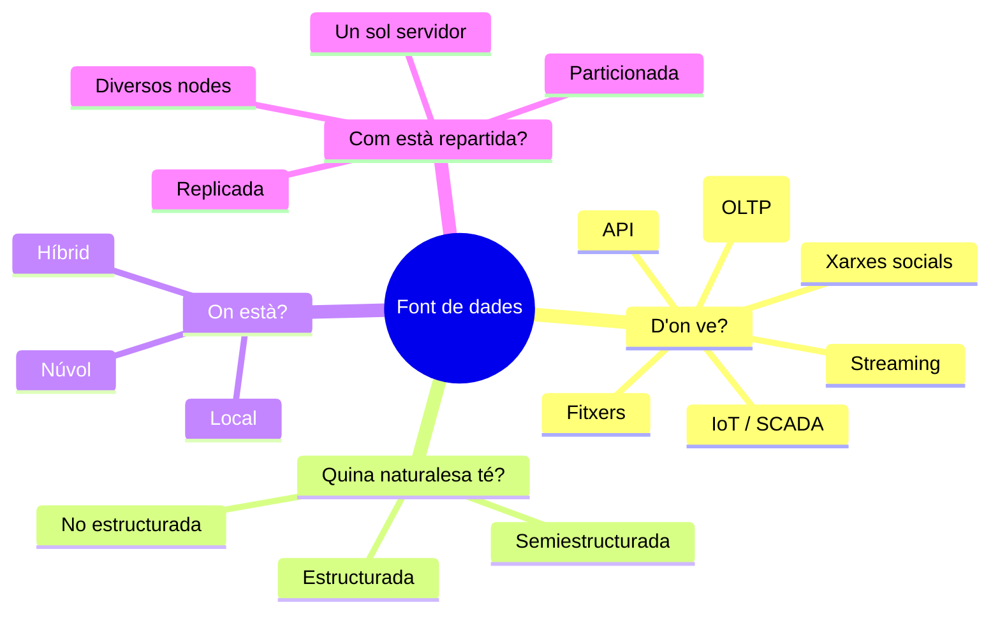

# S01 · Tipus de dades i fonts

<div class="sessio-meta" markdown>
<span><strong>Data</strong> dl 05/10/2026</span>
<span><strong>Durada</strong> 3 h 40 min</span>
<span><span class="tag p1">Prof. 1 · dilluns</span></span>
<span><strong>RA·CA</strong> <span class="ra">RA1 a</span> <span class="ra">RA1 b</span></span>
</div>

!!! abstract "Què treballarem"
    Abans de connectar-nos a cap font hem de saber **què tenim davant**: quin tipus de dada és, d'on ve, on està guardada i com està repartida. Totes les decisions d'una ETL (quina eina, quin connector, quin format de destí) depenen d'aquestes respostes.

## Objectius

- **RA1.a** · Determinar la ubicació de les fonts de dades, classificant el format en què estan emmagatzemades, la ubicació (local o núvol) i la seua distribució física.
- **RA1.b** · Classificar les fonts segons l'origen (sistemes gestors, IoT, streaming, API…), segons la naturalesa (estructurades o no) i segons siguen formals o no formals.

## 1. Dada, informació i coneixement

Una **dada** és un valor sense context: `38,2`. Quan li afegim context es converteix en **informació**: «la temperatura del sensor 4 a les 10:00 és de 38,2 °C». Quan la relacionem amb altres informacions i ens permet decidir, parlem de **coneixement**: «el sensor 4 supera els 38 °C cada dia a la mateixa hora; cal revisar la refrigeració».

Un procés ETL treballa amb dades, però el seu objectiu és fer possible que algú (una persona o un model d'aprenentatge automàtic) n'extraga informació i coneixement.

Per què s'ha de realitzar aquest procés? En el context de l'aprenentatge automàtic, la qualitat del model depèn directament de la qualitat de les dades amb què s'entrena. Abans d'aplicar qualsevol algorisme, és essencial fer una anàlisi exhaustiva de les fonts de dades. Aquest procés implica determinar on resideixen les dades, en quin format s'emmagatzemen i de quina naturalesa són. Entendre aquesta tipologia et permet dissenyar estratègies eficients d'extracció, transformació i càrrega (ETL), minimitzant el soroll i maximitzant la informació útil per a l'entrenament.

## 2. Les quatre preguntes per a classificar una font

Davant de qualsevol font, fes-te sempre aquestes quatre preguntes:



### 2.1 Segons l'origen

| Origen | Exemple | Com es pot accedir |
|---|---|---|
| **Sistema gestor de bases de dades relacional** | El programa de facturació guarda les compres en PostgreSQL | SQL, Python i NiFi amb JDBC |
| **Base de dades NoSQL** | Catàleg de productes en MongoDB | mongosh, pymongo, NiFi |
| **Fitxers** | Exportació en CSV de l'ERP, JSON d'una aplicació | Python, NiFi |
| **API** | Previsió meteorològica d'Open-Meteo | Peticions HTTP des de NiFi o Python |
| **IoT / SCADA** | Sensors de temperatura d'una nau industrial | MQTT, NiFi |
| **Plataforma de streaming** | Esdeveniments de clics d'una web en Kafka | NiFi, Spark |
| **Web i xarxes socials** | Comentaris, imatges, pàgines de la Wikipedia | API, SPARQL, scraping |

### 2.2 Segons la naturalesa

=== "Estructurades"

    Tenen un **esquema fix** definit abans de guardar-les: cada fila té les mateixes columnes i cada columna, el seu tipus.

    ```text
    id | data       | proveïdor | import
    1  | 2026-10-05 | ACME      | 120.50
    ```

    **Avantatges:** fàcils de consultar amb SQL, la integritat es pot garantir. **Inconvenients:** rígides, cal modificar l'esquema per a afegir un camp.

=== "Semiestructurades"

    Porten l'estructura **dins de la mateixa dada** (etiquetes o claus), però no totes les dades han de tindre els mateixos camps i poden estar **niades**.

    ```json
    {"id": 1, "proveidor": {"nom": "ACME", "telefons": ["961…", "962…"]},
     "linies": [{"producte": "P-01", "quantitat": 3}]}
    ```

    **Avantatges:** flexibles, ideals per a API. **Inconvenients:** cal *aplanar-les* per a carregar-les en una taula.

=== "No estructurades"

    No tenen cap esquema predefinit: text lliure, imatges, àudio, vídeo, PDF. Són més del **80 %** de les dades que generen les organitzacions.

    **Avantatges:** contenen molta informació. **Inconvenients:** cal processar-les (OCR, transcripció, models de llenguatge…) per a extraure'n dades estructurades.

### 2.3 Formals i no formals

Una font **formal** està pensada per a guardar dades amb un format controlat: una base de dades, un fitxer d'exportació, una API documentada. Una font **no formal** genera dades com a efecte secundari de la comunicació humana: un àudio de WhatsApp, una foto, un tuit, un comentari en un fòrum. Les no formals tenen molt de valor per a l'aprenentatge automàtic (anàlisi de sentiment, visió per computador), però són les més costoses d'extraure i netejar.

## 3. On està la dada: ubicació i distribució física

**Local (*on-premise*)**
:   Els servidors són de l'organització i estan en les seues instal·lacions. Hi ha control total, però també cal mantindre'ls i fer-ne les còpies de seguretat.

**Núvol**
:   La dada està en un proveïdor (AWS, Azure, Google Cloud, Supabase, MongoDB Atlas…). Hi accedim per Internet, normalment amb credencials i xifratge. Pagues pel que uses.

**Híbrid**
:   Una part en local i una altra al núvol. És el cas més habitual en empreses.

A més de **on** està, importa **com està repartida**:

- **Un sol servidor:** tota la base de dades en una màquina.
- **Replicada:** la mateixa dada copiada en diversos servidors per a no perdre-la i repartir les lectures.
- **Particionada o distribuïda:** cada servidor en guarda **una part** (per exemple, un any de factures cadascun). És la base del Big Data, que veurem a [S03](s03-entorns-arquitectures.md).

!!! question "Per què et pot importar com a enginyer o enginyera de dades?"
    Si la font està al núvol, potser la teua ETL tindrà **latència** i **costos de transferència**. Si està particionada, potser pots llegir-la **en paral·lel**. Si és un fitxer local del departament de compres, potser haurà d'arribar per correu o per una carpeta compartida. La ubicació condiciona el **connector** que necessitaràs.

## 4. Pràctica: fitxa de classificació de fonts

**Durada:** 1 h 30 min aprox. · **En parelles**

Per a cada una d'aquestes fonts, omple una fila de la taula de baix:

1. La base de dades PostgreSQL del programa de compres d'una empresa.
2. Les lectures dels sensors de temperatura del taller del centre.
3. L'API d'Open-Meteo amb la previsió per a Xàtiva.
4. Un Excel que el departament de vendes envia cada divendres per correu.
5. Els comentaris que deixen els clients a Google Maps.
6. Les gravacions de les trucades d'atenció al client.
7. El catàleg de productes d'una botiga en línia guardat en MongoDB Atlas.
8. Els registres (*logs*) d'un servidor web.
9. Wikidata.
10. Una font de la teua elecció del teu cicle o de la teua empresa de pràctiques.

| Font | Origen | Naturalesa | Formal? | Format | Ubicació | Distribució | Com t'hi connectaries? |
|---|---|---|---|---|---|---|---|
| 1 | | | | | | | |

!!! success "Què has de lliurar"
    La taula completada (pots usar el full de càlcul que trobaràs a Aules) i, per a **dues** de les fonts, un paràgraf que justifique quina dificultat principal tindria extraure-la.

## Material

- :material-web: [Introducción a BI · Visión general (alapvi)](https://alapvi.github.io/sbd/ingenieria-datos/ud1-introduccion/)
- :material-web: [Tipos de datos (alapvi)](https://alapvi.github.io/sbd/ingenieria-datos/ud1-introduccion/tipos-de-datos/)
- :material-file-document-outline: *Tipus de dades.pdf* (Aules)
- :material-cloud-outline: Núvol de conceptes inicial (Mentimeter) i infografia de BI per al debat d'inici

## Per a repassar

??? question "Una factura en PDF és una dada estructurada?"
    Per a una persona té estructura (capçalera, línies, totals), però per a un ordinador és **no estructurada**: el PDF guarda posicions de text, no camps. Cal extraure-la (amb un analitzador de PDF o OCR) per a convertir-la en dades estructurades.

??? question "Un JSON sempre és semiestructurat?"
    Sí, pel format. Però si totes les respostes d'una API tenen sempre els mateixos camps i sense nivells niats, convertir-lo en una taula és trivial: en la pràctica es comporta quasi com una dada estructurada.
