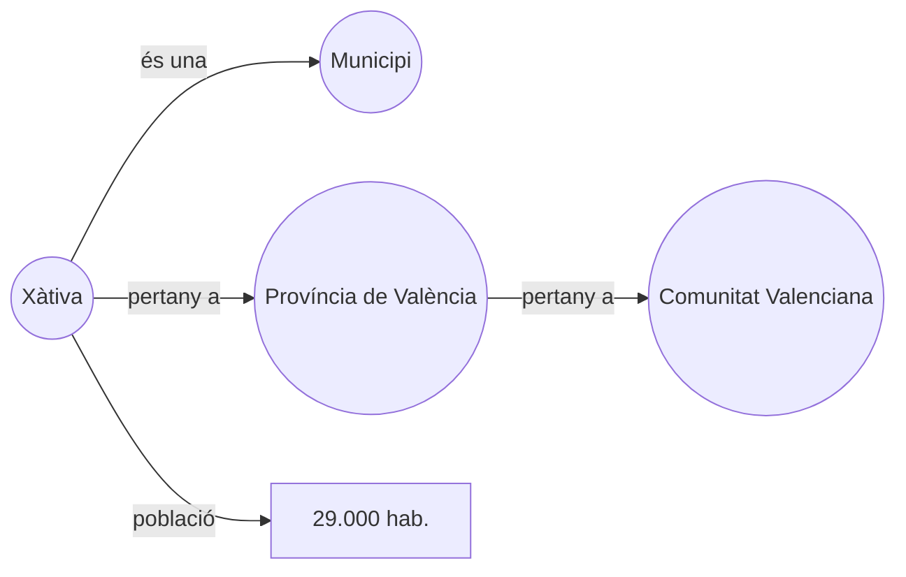

# S02 · Gestors i formats

<div class="sessio-meta" markdown>
<span><strong>Data</strong> dl 19/10/2026</span>
<span><strong>Durada</strong> 3 h 40 min</span>
<span><span class="tag p1">Prof. 1 · dilluns</span></span>
<span><strong>RA·CA</strong> <span class="ra">RA1 c</span> <span class="ra">RA1 d</span> <span class="ra">RA1 e</span> <span class="ra">RA1 f</span></span>
</div>

!!! abstract "Què treballarem"
    Coneixerem els grans tipus de **sistemes gestors** (SQL i NoSQL), els **formats de text** que usarem per a moure dades d'un lloc a un altre, les dades que generen els sistemes industrials **SCADA** i com Internet pot ser una font de dades «intel·ligent» gràcies a la **web semàntica**.

## Objectius

- **RA1.c** · Identificar les característiques de les fonts no estructurades i reconéixer Internet com a font a partir de la web semàntica i el *linked data*.
- **RA1.d** · Descriure els sistemes gestors SQL i NoSQL, les seues estructures, models i aplicacions.
- **RA1.e** · Analitzar els formats de text per a l'intercanvi de dades: fitxers plans, XML i JSON.
- **RA1.f** · Determinar el format i la utilitat de les dades de sistemes SCADA aplicats en IoT.

## 1. Sistemes gestors: SQL i NoSQL

Un **sistema gestor de bases de dades (SGBD)** és el programari que guarda les dades i en controla l'accés: qui pot llegir, com es consulta, com es garanteix que no es perden.

=== "Relacionals (SQL)"

    Organitzen les dades en **taules** relacionades per claus. L'esquema es defineix abans (`CREATE TABLE`) i es consulta amb **SQL**. Garanteixen les propietats **ACID**: cada transacció és atòmica, consistent, aïllada i durable.

    **Exemples:** PostgreSQL, MySQL/MariaDB, Oracle, SQL Server.
    **Quan:** dades molt estructurades, operacions que no poden fallar (facturació, banca).

=== "NoSQL"

    *Not only SQL*. Renuncien a part de la rigidesa relacional per guanyar **flexibilitat** i **escalabilitat horitzontal** (afegir servidors en lloc de fer-ne un de més gran).

    | Model | Com guarda | Exemple | Ús típic |
    |---|---|---|---|
    | **Clau-valor** | Una clau → un valor opac | Redis | Memòria cau, sessions |
    | **Documental** | Documents JSON/BSON | MongoDB | Catàlegs, perfils, contingut variable |
    | **Columnar** | Famílies de columnes | Cassandra, HBase | Sèries temporals, escriptura massiva |
    | **Grafs** | Nodes i relacions | Neo4j | Xarxes socials, recomanacions |
    | **Motor de cerca** | Índex invertit | Elasticsearch | Cerca de text, logs |

!!! info "No és una guerra"
    En una arquitectura real conviuen: PostgreSQL per a les compres, MongoDB per al catàleg, Elasticsearch per a cercar en els logs. Una ETL ha de saber llegir de tots. En aquest mòdul treballaràs PostgreSQL, MongoDB i Elasticsearch.

## 2. Formats de text per a l'intercanvi de dades

Quan dues aplicacions s'han de passar dades, el més habitual és fer-ho amb un **fitxer de text** en un format que tots dos entenguen. Vegem el mateix registre en tres formats:

=== "CSV"

    ```text
    id_factura;data;proveidor;producte;quantitat;preu
    105;2025-04-15;ACME S.L.;P-05;3;12,50
    105;2025-04-15;ACME S.L.;P-09;1;80,00
    ```

    - Una fila per registre i camps separats per un **delimitador** (`,` `;` tabulador).
    - **Pla:** no admet estructures niades. Per això la factura es repeteix en cada línia.
    - Compte amb el **separador decimal**, la **codificació** (UTF-8 o Latin-1) i les cometes.

=== "JSON"

    ```json
    {
      "id_factura": 105,
      "data": "2025-04-15",
      "proveidor": {"nom": "ACME S.L.", "cif": "B12345678"},
      "linies": [
        {"producte": "P-05", "quantitat": 3, "preu": 12.5},
        {"producte": "P-09", "quantitat": 1, "preu": 80.0}
      ]
    }
    ```

    - **Objectes** `{}` amb parells clau-valor i **llistes** `[]`.
    - Admet **niament**: la factura conté les seues línies.
    - Té tipus bàsics: text, número, booleà i `null`. Les dates són text.
    - És el format natural de les API REST i de MongoDB.

=== "XML"

    ```xml
    <factura id="105" data="2025-04-15">
      <proveidor cif="B12345678">ACME S.L.</proveidor>
      <linies>
        <linia producte="P-05" quantitat="3" preu="12.50"/>
        <linia producte="P-09" quantitat="1" preu="80.00"/>
      </linies>
    </factura>
    ```

    - **Etiquetes** niades amb **atributs**.
    - Molt verbós, però molt potent: es pot validar amb un esquema (**XSD**), consultar amb **XPath** i transformar amb **XSLT**.
    - Encara molt present en administració pública, banca i facturació electrònica.

| | CSV | JSON | XML |
|---|---|---|---|
| Estructura niada | :material-close: | :material-check: | :material-check: |
| Mida | Molt xicoteta | Mitjana | Gran |
| Llegible per una persona | :material-check: | :material-check: | :material-check: |
| Validació d'esquema | No estàndard | JSON Schema | XSD |
| Típic en | Exportacions, fulls de càlcul | API, NoSQL | Administració, B2B |

!!! tip "I els formats binaris?"
    En Big Data veuràs **Parquet** i **Avro**: no són de text, ocupen molt menys i es llegeixen molt més ràpid. Parquet guarda les dades **per columnes**, i això permet llegir només les columnes que necessites.

## 3. Dades de sistemes SCADA i IoT

Un **SCADA** (*Supervisory Control And Data Acquisition*) supervisa una instal·lació industrial: una depuradora, una fàbrica, una xarxa elèctrica. Recull les lectures de sensors i autòmats (PLC) i les mostra en panells.

Cada lectura sol tindre aquesta forma, anomenada **etiqueta** o *tag*:

| Camp | Exemple | Significat |
|---|---|---|
| `tag` | `Nau2.Forn1.Temperatura` | Identificador jeràrquic del punt de mesura |
| `valor` | `182.4` | La mesura |
| `timestamp` | `2026-10-19T10:15:02.120Z` | Moment exacte de la lectura |
| `qualitat` | `Good` / `Bad` / `Uncertain` | Si el sensor és fiable en aquell moment |
| `unitat` | `°C` | Unitat de mesura |

**Per què són útils?** Manteniment predictiu (anticipar una avaria), control de qualitat, eficiència energètica… Són **sèries temporals** de molt de volum: un sensor que llig cada segon genera 86.400 valors al dia.

**Com s'hi accedeix?** Amb protocols industrials com **OPC UA** o **Modbus**, o amb protocols IoT com **MQTT**, on cada sensor *publica* les lectures en un *topic* i els consumidors s'hi *subscriuen*. Ho practicaràs amb la sensòrica del centre a la sessió [D12](../p2/d12-iot.md).

## 4. Fonts no estructurades i web semàntica

La major part de la informació d'Internet està pensada per a ser llegida per persones (pàgines HTML, PDF, vídeos), no per programes. Extraure'n dades és difícil: *scraping*, OCR, models de llenguatge…

La **web semàntica** proposa publicar les dades de manera que els programes les entenguen. La idea clau és el **triple**: *subjecte – predicat – objecte*.



- **RDF** és el model que expressa les dades com a triples.
- **OWL** defineix **ontologies**: el vocabulari i les regles («un municipi pertany a una província»).
- **Linked data:** cada recurs té una URL i enllaça amb recursos d'altres llocs. Wikidata, DBpedia o el portal de dades obertes de l'Estat publiquen així.
- **SPARQL** és el llenguatge per a consultar-les, com SQL per a triples. El practicaràs a [D14](../p2/d14-sparql.md).

## 5. Pràctica: un mateix conjunt, tres formats

**Durada:** 1 h 30 min aprox.

1. A partir d'aquest JSON de dues comandes (cada comanda té un client i diverses línies), escriu-ne a mà la versió **XML** i la versió **CSV**.

    ```json
    [
      {"comanda": 1, "client": {"nom": "Anna", "ciutat": "Xàtiva"},
       "linies": [{"article": "Teclat", "q": 1}, {"article": "Ratolí", "q": 2}]},
      {"comanda": 2, "client": {"nom": "Pau", "ciutat": "Alzira"},
       "linies": [{"article": "Monitor", "q": 1}]}
    ]
    ```

2. Respon: quantes **files** té el CSV? Què has hagut de **repetir**? Quina informació **es perdria** si el CSV no tinguera una columna `comanda`?
3. Obri el [Wikidata Query Service](https://query.wikidata.org/) i executa l'exemple *Cats*. Identifica'n el subjecte, el predicat i l'objecte.
4. Mira una lectura real d'un sensor del centre (te la donarà el professor) i identifica'n els camps de la taula de l'apartat 3.

!!! success "Què has de lliurar"
    Els fitxers `comandes.xml` i `comandes.csv` i les respostes de l'apartat 2.

## Material

- :material-web: [NoSQL (alapvi)](https://alapvi.github.io/sbd/nosql/nosql/)
- :material-web: [Modelos de datos NoSQL (alapvi)](https://alapvi.github.io/sbd/nosql/moddatos/)
- :material-file-document-outline: *Presentacio_Intro_noSQL.pptx*: la part de tipologies (Aules)
