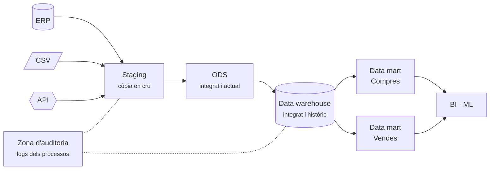

# S03 · Entorns i arquitectures

<div class="sessio-meta" markdown>
<span><strong>Data</strong> dl 26/10/2026</span>
<span><strong>Durada</strong> 3 h 40 min</span>
<span><span class="tag p1">Prof. 1 · dilluns</span></span>
<span><strong>RA·CA</strong> <span class="ra">RA1 g</span> <span class="ra">RA1 h</span> <span class="ra">RA3 c</span></span>
</div>

!!! abstract "Què treballarem"
    On viuen les dades al llarg del seu viatge: dels **sistemes operacionals** (OLTP) als **sistemes d'anàlisi** (OLAP), passant per les capes d'una arquitectura de dades. També veurem com es processen grans volums repartint la feina entre diverses CPU o diversos servidors (**SMP** i **MPP**).

## Objectius

- **RA1.g** · Descriure plataformes locals o al núvol, monolítiques i distribuïdes, que faciliten el processament massiu amb paral·lelització (SMP, MPP).
- **RA1.h** · Descriure procediments per a manejar dades massives i millorar els temps de procés, com processar prop de les fonts.
- **RA3.c** · Descriure models de dades destí segons l'objectiu d'ús, diferenciant bases de dades OLTP i OLAP.

## 1. OLTP i OLAP: dos objectius, dos dissenys

Imagina el programa de **compres** d'una empresa. Cada vegada que arriba una factura, algú l'introdueix: es fa un `INSERT` en la capçalera i un altre per cada línia. Això és un sistema **OLTP**.

Ara la directora pregunta: *«Quant hem gastat per categoria de producte i proveïdor durant 2025?»*. Per a respondre cal llegir **milers de línies** i agregar-les. Això és una consulta **OLAP**.

| | OLTP (operacional) | OLAP (analític) |
|---|---|---|
| **Objectiu** | Registrar operacions | Analitzar i decidir |
| **Operacions** | Moltes escriptures xicotetes | Poques lectures, però molt grans |
| **Model** | Normalitzat (3FN): moltes taules, sense redundància | Desnormalitzat: estrella o floc de neu |
| **Dades** | Estat actual | Històric |
| **Usuaris** | Aplicació, personal administratiu | Analistes, BI, models de ML |
| **Exemple de consulta** | `INSERT` d'una factura | `SUM(import) GROUP BY categoria, any` |

!!! warning "Per què no analitzem directament sobre l'OLTP?"
    1. Les consultes d'anàlisi **alenteixen** l'aplicació que usa tothom.
    2. El model normalitzat obliga a fer **molts JOIN** (ho mesuraràs a la pràctica: 7 JOIN en OLTP davant de 5 en OLAP).
    3. L'OLTP sol guardar només l'**estat actual**, no l'històric.
    4. Les dades estan **repartides en diversos sistemes** que cal integrar.

## 2. Les capes d'una arquitectura de dades



Staging
:   Còpia **en cru** de les fonts, sense transformar. Permet repetir la transformació sense tornar a molestar l'origen.

ODS (*Operational Data Store*)
:   Dades ja integrades de diverses fonts, però només les **actuals**.

Data warehouse
:   Magatzem **integrat i històric**, modelat per a l'anàlisi.

Data mart
:   Una part del DW centrada en un departament o procés. A la pràctica construiràs el **data mart de compres**.

### L'arquitectura *medallion* al núvol

En plataformes al núvol (Databricks, Azure, AWS) és habitual parlar de tres zones:

<div class="grid cards" markdown>

-   :material-medal:{ .lg style="color:#b45309" } __Bronze__

    ---

    Dades tal com arriben (equivalent a l'staging).

-   :material-medal:{ .lg style="color:#64748b" } __Silver__

    ---

    Dades netes, validades i amb històric.

-   :material-medal:{ .lg style="color:#ca8a04" } __Gold__

    ---

    Dades agregades i modelades, llestes per a BI o per a entrenar models.

</div>

## 3. On s'executa: local o núvol

On-premise
:   Servidors propis. Control total i costos previsibles, però cal comprar, mantindre i escalar el maquinari.

Núvol
:   Infraestructura llogada. S'escala en minuts i es paga per ús. En les plataformes modernes es **separa l'emmagatzematge del còmput**: les dades estan en un *object storage* (S3, Azure Blob) i els motors de càlcul s'engeguen només quan cal.

## 4. Processar moltes dades: SMP i MPP

Quan una consulta ha de recórrer milions de files, una sola CPU no n'hi ha prou. Hi ha dues maneres de repartir la feina:

=== "SMP · un servidor, moltes CPU"

    **Symmetric Multiprocessing.** Un sol servidor amb diverses CPU (o nuclis) que **comparteixen la mateixa memòria i el mateix disc**.

    ```mermaid
    flowchart TB
        subgraph Servidor
          C1[CPU 1] --- M[(Memòria compartida)]
          C2[CPU 2] --- M
          C3[CPU 3] --- M
          C4[CPU 4] --- M
          M --- D[(Disc)]
        end
    ```

    - **Exemple:** PostgreSQL amb *parallel query*. A la pràctica veuràs en el pla d'execució la línia `Workers Launched`.
    - **Límit:** creix fins on dona un sol servidor (escalat **vertical**).

=== "MPP · molts servidors"

    **Massively Parallel Processing.** Molts nodes independents, **cadascun amb la seua CPU, memòria i disc**. Les dades es reparteixen entre els nodes, cada node processa la seua part i un coordinador ajunta els resultats.

    ```mermaid
    flowchart TB
        Q[Coordinador] --> N1 & N2 & N3
        subgraph N1[Node 1]
          A1[CPU+RAM] --- B1[(2024)]
        end
        subgraph N2[Node 2]
          A2[CPU+RAM] --- B2[(2025)]
        end
        subgraph N3[Node 3]
          A3[CPU+RAM] --- B3[(2026)]
        end
    ```

    - **Exemples:** Amazon Redshift, Greenplum, Hive o Spark sobre Hadoop, Snowflake.
    - **Avantatge:** s'escala afegint nodes (escalat **horitzontal**).

### Processar prop de les dades

Moure dades per la xarxa és lent i car. Per això els sistemes distribuïts fan el contrari: **envien el càlcul on són les dades** (*data locality*). Hadoop executa cada tasca en el node que ja té el bloc de fitxer. Una ETL ben dissenyada aplica el mateix principi:

- **Filtrar en origen:** demana a la base de dades només les files i columnes que necessites (`WHERE`, projecció), en lloc de portar-ho tot i filtrar després.
- **Agregar en origen** quan només cal el resum.
- **Particionar** les dades (per data, per regió) per a llegir només la part necessària i poder-la processar en paral·lel.

## 5. Pràctica: quina arquitectura triaries?

**Durada:** 1 h aprox. · **En grups de tres**

Per a cada cas, decidiu el tipus de sistema (OLTP, DW o data lake), si seria local o al núvol, i si caldria SMP o MPP. Justifiqueu-ho en dues línies.

1. Una botiga de bicicletes de Xàtiva vol saber quins productes ven més cada mes. Té 2.000 factures l'any.
2. Una cadena de supermercats amb 300 botigues vol analitzar els tiquets de caixa dels últims cinc anys (2.000 milions de línies).
3. Una empresa vol guardar les lectures de 5.000 sensors cada segon per a entrenar un model de manteniment predictiu.
4. Un hospital vol integrar dades de tres programes diferents per a fer informes mensuals, però les dades no poden eixir del centre.

!!! success "Què has de lliurar"
    La taula de decisions amb la justificació. La posarem en comú al final de la sessió.

## Material

- :material-web: [Tipos de entornos y arquitectura de datos (alapvi)](https://alapvi.github.io/sbd/ingenieria-datos/tipos-entornos-arquitecturas/)
- :material-web: [Big Data (alapvi)](https://alapvi.github.io/sbd/ingenieria-datos/bigdata/): OLTP, OLAP i DW
- :material-web: [Ingeniería de datos (alapvi)](https://alapvi.github.io/sbd/ingenieria-datos/ingenieria-datos/)
- :material-file-document-outline: *Entorns i model de dades.pdf* (Aules)
- :material-file-document-outline: *1.1 Introducció a Big Data.pptx* (Aules)
