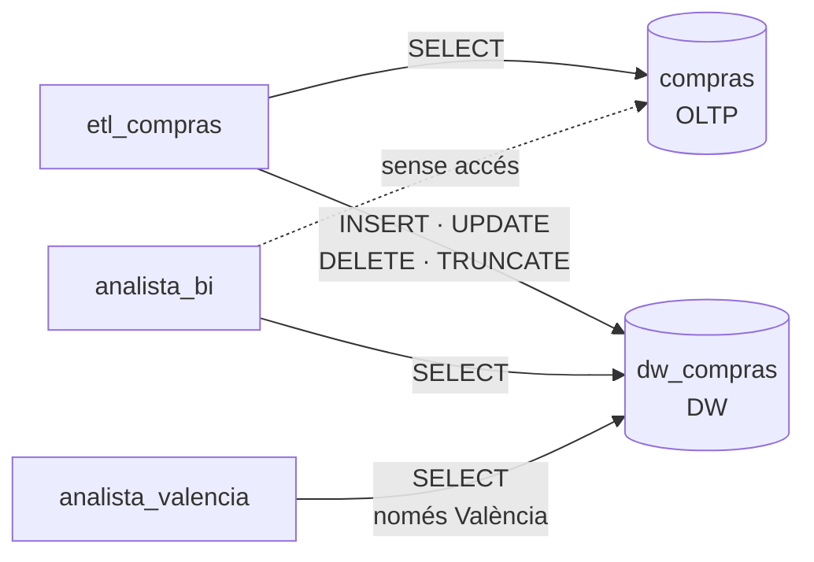

# S07 · Pràctica: SCD1 i DCL

<div class="sessio-meta" markdown>
<span><strong>Data</strong> dl 23/11/2026</span>
<span><strong>Durada</strong> 3 h 40 min</span>
<span><span class="tag p1">Prof. 1 · dilluns</span></span>
<span><strong>RA·CA</strong> <span class="ra">RA3 b</span> <span class="ra">RA3 e</span></span>
<span><strong>Pràctica</strong> [OLTP → OLAP, part 3](../practiques/oltp-olap/index.md)</span>
</div>

!!! abstract "Què treballarem"
    Dos problemes reals d'un DW en producció: **què fem quan les dades de l'origen canvien** (dimensions que canvien lentament) i **qui pot veure què** (rols, permisos i seguretat per files).

## Objectius

- **RA3.b** · Usar DML per a la càrrega, l'actualització i l'esborrat de dades.
- **RA3.e** · Usar DCL per a configurar rols i permisos que garantisquen la confidencialitat.

## Part 1 · Dimensions que canvien: SCD

Un proveïdor es muda de València a Xàtiva. Què ha de fer el DW?

=== "Tipus 1 · sobreescriure"

    Es canvia el valor i **es perd l'antic**. Totes les compres, també les d'abans de la mudança, apareixeran a Xàtiva.

    | sk | id_oltp | ciutat |
    |---|---|---|
    | 23 | 7 | ~~València~~ **Xàtiva** |

    **Quan:** correccions d'errors, o atributs on l'històric no interessa.

=== "Tipus 2 · nova fila"

    Es tanca la fila antiga i se'n crea una de nova amb una **SK nova**. Les compres antigues continuen apuntant a la SK 23 (València) i les noves, a la 51 (Xàtiva).

    | sk | id_oltp | ciutat | vàlid_des_de | vàlid_fins_a | actual |
    |---|---|---|---|---|---|
    | 23 | 7 | València | 2024-01-01 | 2026-11-22 | no |
    | 51 | 7 | Xàtiva | 2026-11-23 | — | sí |

    **Quan:** l'històric és important (anàlisi per zona, per categoria comercial…).

### Pràctica: SCD tipus 1 amb `MERGE`

Executa `08_scd1_merge.sql` pas a pas i observa:

1. L'`UPDATE` a l'**OLTP** simula el canvi.
2. El DW encara té el valor **antic** (per culpa de l'`ON CONFLICT DO NOTHING` de la càrrega).
3. `MERGE` compara l'origen i el destí. Si la fila **existeix i ha canviat**, l'actualitza (`WHEN MATCHED … THEN UPDATE`). Si **no existeix**, la insereix (`WHEN NOT MATCHED … THEN INSERT`).
4. El DW ja té el valor **nou**.

```sql
MERGE INTO dw_compras.dim_proveedor AS d
USING (SELECT ... FROM compras.proveedor ...) AS o
ON d.id_proveedor_oltp = o.id_proveedor
WHEN MATCHED AND (d.ciudad, d.provincia, ...) IS DISTINCT FROM (o.ciudad, o.provincia, ...)
  THEN UPDATE SET ciudad = o.ciudad, ...
WHEN NOT MATCHED
  THEN INSERT (...) VALUES (...);
```

!!! question "Per què `IS DISTINCT FROM` i no `<>`?"
    Prova `SELECT NULL <> 'València';` i `SELECT NULL IS DISTINCT FROM 'València';`. Què passaria amb un proveïdor que no tenia ciutat?

!!! tip "Ampliació (opcional): SCD tipus 2"
    Afig a `dim_proveedor` les columnes `valid_desde`, `valid_hasta` i `es_actual`, i escriu el procés que tanca la fila antiga i n'insereix una de nova. Després, la càrrega del fet ha de buscar la SK **vigent en la data de la factura**.

### I l'esborrat?

Prova l'última instrucció comentada de l'script (`DELETE` d'un proveïdor). Per què falla? En un DW gairebé **mai s'esborren** dimensions referenciades pel fet: com a molt, es marquen com a inactives.

## Part 2 · Qui pot veure què: DCL

Un DW conté informació sensible. El **principi de mínim privilegi** diu que cada usuari ha de tindre **només** els permisos que necessita.



Executa `09_dcl_rols.sql` i analitza'l:

| Instrucció | Què fa |
|---|---|
| `CREATE ROLE … LOGIN PASSWORD` | Crea un usuari que pot connectar-se |
| `GRANT USAGE ON SCHEMA` | Permet «entrar» a l'esquema |
| `GRANT SELECT ON ALL TABLES IN SCHEMA` | Permet llegir les taules **que existeixen ara** |
| `REVOKE ALL ON SCHEMA compras FROM PUBLIC` | Lleva l'accés per defecte a tothom |
| `ENABLE ROW LEVEL SECURITY` + `CREATE POLICY` | Filtra **les files** que veu cada rol |

Comprova-ho tu:

```sql
SET ROLE analista_valencia;
SELECT provincia, COUNT(*) FROM dw_compras.dim_proveedor GROUP BY provincia;
RESET ROLE;

SET ROLE analista_bi;
SELECT * FROM compras.proveedor LIMIT 1;   -- ha de fallar
RESET ROLE;
```

!!! question "Preguntes"
    1. Si demà afiges una taula nova a `dw_compras`, la podrà llegir `analista_bi`? Busca què fa `ALTER DEFAULT PRIVILEGES` i usa-ho.
    2. Connecta't des de DBeaver amb l'usuari `analista_valencia`. Què veus?
    3. El superusuari `postgres` està afectat per la RLS? Per què és perillós fer les ETL amb `postgres`?

## Abans d'eixir

- [ ] He provat la SCD tipus 1 i tinc la captura d'abans i després.
- [ ] Els tres rols funcionen com s'espera i tinc la captura de l'error de permisos.
- [ ] He respost les preguntes i he afegit `ALTER DEFAULT PRIVILEGES` al meu script.

## Material

- :material-file-document-outline: *PostgreSQL per a Big Data.docx*: secció de rols (Aules)
- :material-web: [Documentació de PostgreSQL: MERGE](https://www.postgresql.org/docs/current/sql-merge.html) · [Row Security Policies](https://www.postgresql.org/docs/current/ddl-rowsecurity.html)
