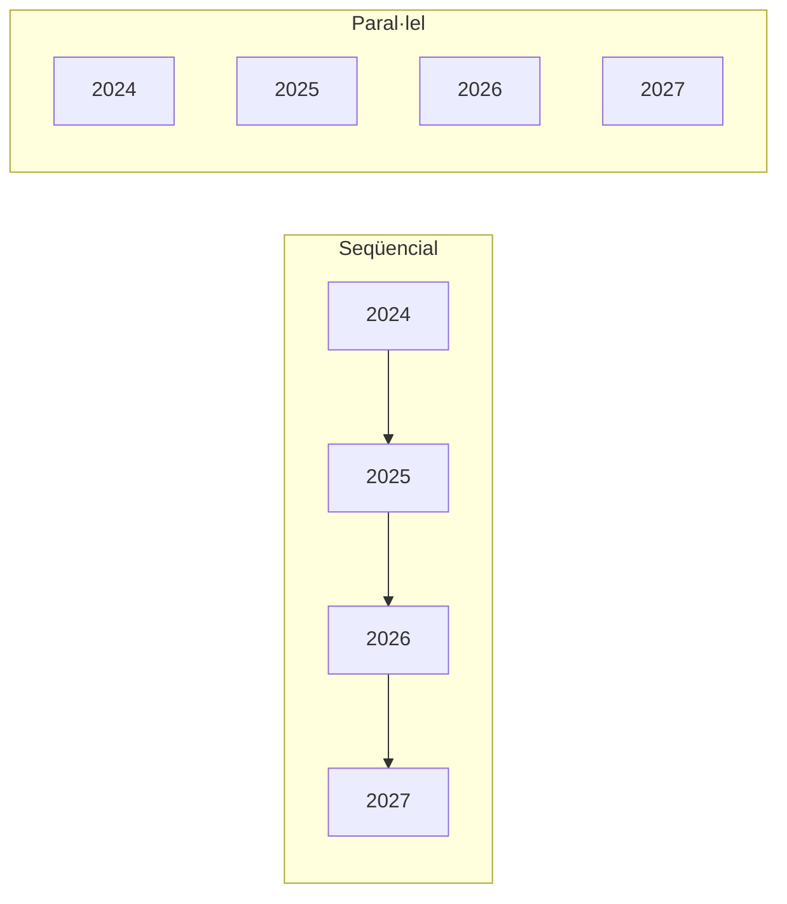

# S09 · Pràctica: benchmark i paral·lelisme

<div class="sessio-meta" markdown>
<span><strong>Data</strong> dl 14/12/2026</span>
<span><strong>Durada</strong> 3 h 40 min</span>
<span><span class="tag p1">Prof. 1 · dilluns</span></span>
<span><strong>RA·CA</strong> <span class="ra">RA2 d</span> <span class="ra">RA2 e</span> <span class="ra">RA3 g</span></span>
<span><strong>Pràctica</strong> [OLTP → OLAP, part 5 · **lliurament**](../practiques/oltp-olap/index.md)</span>
</div>

!!! abstract "Què treballarem"
    Comprovarem amb dades si el model en estrella és **realment** millor per a analitzar. Aprendrem a llegir el **pla d'execució** de PostgreSQL i acabarem paral·lelitzant la càrrega amb una **taula particionada**.

## Objectius

- **RA2.d** · Aplicar filtres i transformacions en origen: projeccions, seleccions, agregacions i ordenacions.
- **RA2.e** · Utilitzar operacions complexes: JOIN, subconsultes, unions, diferència i funcions d'agregació.
- **RA3.g** · Paral·lelitzar operacions de càrrega segons els sistemes disponibles.

## 1. Llegir un pla d'execució

`EXPLAIN (ANALYZE, BUFFERS)` executa la consulta i mostra **com** l'ha resolta PostgreSQL:

```text
Sort  (actual time=105.2..106.1 rows=2950 loops=1)
  Sort Key: (sum(...)) DESC
  Sort Method: external merge  Disk: 3832kB        ← (1)
  ->  HashAggregate ...
        ->  Hash Join  (rows=33800)                ← (2)
              ->  Seq Scan on factura_producto fp  ← (3)
...
Execution Time: 109.185 ms                         ← (4)
```

1. **Mètode d'ordenació.** `quicksort Memory` vol dir que ha cabut en memòria. `external merge Disk` vol dir que **no hi cabia** (paràmetre `work_mem`, 4 MB per defecte) i ha hagut d'escriure fitxers temporals a disc: és molt més lent.
2. Tipus de **JOIN** (*Hash*, *Merge*, *Nested Loop*) i files estimades o reals.
3. **Seq Scan** llig tota la taula; **Index Scan** usa un índex.
4. **Temps total.** És el que compararem.

Si veus `Workers Launched: 1` o més, PostgreSQL ha repartit la feina entre diversos processos: és **paral·lelisme SMP**.

## 2. Benchmark OLTP vs OLAP

Executa `05_queries_oltp.sql` i `06_queries_olap.sql`. Cada consulta respon **la mateixa pregunta** sobre els dos models. Repeteix-les **5 vegades** i queda't amb la **mediana** (la primera execució sol ser més lenta perquè les dades no estan en memòria cau).

| Consulta | Model | JOIN | Sort Method | Workers | Mediana (ms) |
|---|---|---:|---|---:|---:|
| Anàlisi 2025 | OLTP | 7 | | | |
| Anàlisi 2025 | OLAP | 5 | | | |

!!! warning "No generalitzes"
    Amb 100.000 línies, l'OLAP sol guanyar en la consulta d'anàlisi perquè fa menys JOIN, ordena en memòria i paral·lelitza. Però **no és més ràpid en tot**: una consulta d'una sola factura és millor a l'OLTP. Busca un cas en què l'OLTP guanye.

!!! question "Filtres en origen"
    Reescriu la consulta OLAP perquè torne **només** les 10 primeres files i **només** les columnes `categoria` i `importe_total`. Compara el pla. Què canvia? Per què és important filtrar en origen en una ETL que llig per la xarxa?

!!! question "Subconsultes i operacions de conjunts"
    1. Proveïdors que han venut en 2024 **però no** en 2025 (`EXCEPT`).
    2. Productes l'import total dels quals supera la mitjana de la seua categoria (subconsulta correlacionada o funció de finestra `AVG(...) OVER (PARTITION BY ...)`).

## 3. Càrrega en paral·lel

`11_carrega_paralela.sh` crea una **taula particionada per any** i la carrega de dues maneres:



L'script usa `psql`, així que l'executem **dins del contenidor**, on ja està instal·lat:

```bash
docker compose exec -w /sql -e PGUSER=postgres postgres bash ./11_carrega_paralela.sh
```

Cada `\copy` és un **procés independent** que escriu en la seua partició. Com que no competeixen per la mateixa taula, el SGBD els pot executar **alhora**, aprofitant diverses CPU (SMP).

!!! question "Preguntes"
    1. Quina és la diferència de temps? Per què és tan xicoteta amb 100.000 files?
    2. Modifica `07_scale_100k.sql` per arribar a **1 milió** de línies i repeteix-ho. Què passa ara?
    3. En un sistema **MPP** (Redshift, Greenplum), on aniria cada partició?
    4. Executa `EXPLAIN SELECT SUM(importe_total) FROM dw_compras.hecho_part WHERE anio = 2025;`. Quantes particions llig? Això s'anomena **partition pruning**.

## 4. Lliurament

Repassa la llista de [què has de lliurar](../practiques/oltp-olap/index.md#que-has-de-lliurar-dl-1412) i la rúbrica. **Termini: avui al final de la sessió.**
